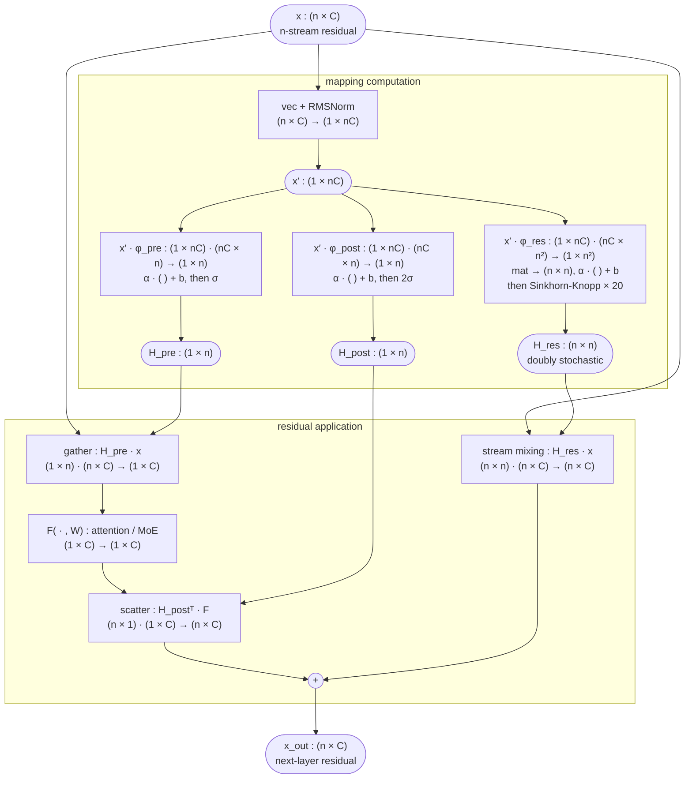
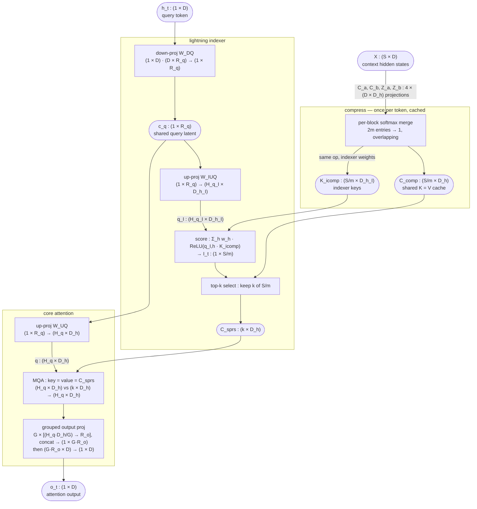
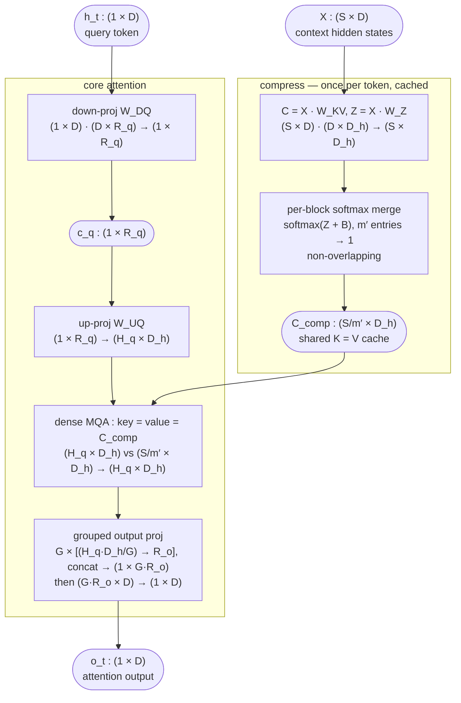

# DeepSeek-V4
[DeepSeek-V4: Towards Highly Efficient Million-Token Context Intelligence](https://arxiv.org/abs/2606.19348) containes efficient model architeture (CSA, HCA, mHC), MoE training, Muon optimizer, post training, inference, evaluation, etc. It does amazing job to make model more efficient, even though longer context length. DeepSeek-V4-Pro requires only 27% of single-token inference FLOPs and 10% of KV cache compared with DeepSeek-V3.2. 


DeepSeek-V4 published two models: Flash (284B-13BA) and Pro (1.6T-49BA)

In the rest of post, I will follow symbol to describe model architecture:
| Symbol | Meaning | DeepSeek-V4-Flash | DeepSeek-V4-Pro |
|---|---|---|---|
| $B$ | \(B\)batch size | runtime | runtime |
| $S$ | tokens in this call | prompt length, or 1 in decode | prompt length, or 1 in decode |
| $P$ | tensor-parallel world size | runtime | runtime |
| $V$ | vocabulary size | 129,280 | 129,280 |
| $D$ | hidden dimension | 4,096 | 7,168 |
| $H_c$ | hyper-connection multiplicity | 4 | 4 |
| $L$ | Transformer blocks | 43 | 61 |
| $H_q$ | attention query heads | 64 | 128 |
| $D_h$ | attention head dimension | 512 | 512 |
| $D_r$ | RoPE dimensions per head | 64 | 64 |
| $R_q$ | query low-rank dimension | 1,024 | 1,536 |
| $G$ | output projection groups | 8 | 16 |
| $R_o$ | output rank per group | 1,024 | 1,024 |
| $W$ | sliding-window size | 128 | 128 |
| $E$ | routed experts per layer | 256 | 384 |
| $K_e$ | routed experts activated/token | 6 | 6 |
| $D_{\text{ff}}$ | expert intermediate size | 2,048 | 3,072 |

Layer attention layout is:
Layers 0–1: HCA, compression ratio 128.
Layers 2–60: CSA and HCA alternate.
Even layers 2, 4, …, 60: CSA, ratio 4.
Odd layers 3, 5, …, 59: HCA, ratio 128.
Separate MTP layer 61: pure sliding-window attention.

DeepSeek also open source [reference inference code](https://huggingface.co/deepseek-ai/DeepSeek-V4-Pro/blob/main/inference/model.py). This post use this reference and tech report, and dive into details into serving DeepSeek-V4.

# mHC connection

mHC is introduced in [mHC: Manifold-Constrained Hyper-Connections](https://arxiv.org/html/2512.24880v2)

[Hyper-Connections](https://arxiv.org/html/2409.19606v3) expands the width of the residual stream and enhancing connection complexity, HC has show performance advantage by significantly without increase too much FLOPs overhead. 

In the HC formulation, the input to the $l$-th layer, $x_l \in \mathbb{R}^{1 \times C}$, is expanded by a factor of $n$ into a hidden matrix $\mathbf{x}_l = (x_{l,0}^{\top}, \ldots, x_{l,n-1}^{\top})^{\top} \in \mathbb{R}^{n \times C}$ — an $n$-stream residual. Each layer learns three mappings over these streams: $\mathcal{H}_l^{\mathrm{pre}}$ gathers the $n$ streams into a single layer input, $\mathcal{H}_l^{\mathrm{post}}$ scatters the layer output back across the streams, and $\mathcal{H}_l^{\mathrm{res}}$ mixes the streams among themselves. In effect, the identity shortcut of a vanilla residual is replaced by a learned $n \times n$ connection.

That substitution is exactly where the instability comes from. The identity shortcut is what keeps deep networks trainable: signal and gradient pass through every layer with their magnitude untouched. An unconstrained $\mathcal{H}_l^{\mathrm{res}}$ re-scales the residual at every layer, and compounded over $L = 61$ layers this surfaces as exploding or vanishing gradients. mHC's fix is geometric: project $\mathcal{H}_l^{\mathrm{res}}$ onto the manifold of doubly stochastic matrices (rows and columns sum to 1), so each mixing step is a convex combination of streams — free to route information between streams, but unable to amplify or attenuate the total signal. The gather/scatter mappings are likewise bounded by Sigmoid gates. The next subsection walks through how these mappings are computed and constrained.

## Parameterization and manifold projection

Given the input hidden matrix $\mathbf{x}_l \in \mathbb{R}^{n \times C}$ at the $l$-th layer, mHC first flattens it into a vector $\vec{\mathbf{x}}_l = \mathrm{vec}(\mathbf{x}_l) \in \mathbb{R}^{1 \times nC}$ to preserve full context information. Then, following the original HC formulation, the dynamic and static mappings are:

$$
\begin{cases}
\vec{\mathbf{x}}_l^{\prime} = \mathrm{RMSNorm}(\vec{\mathbf{x}}_l) \\
\tilde{\mathcal{H}}_l^{\mathrm{pre}} = \alpha_l^{\mathrm{pre}} \cdot \left(\vec{\mathbf{x}}_l^{\prime} \varphi_l^{\mathrm{pre}}\right) + \mathbf{b}_l^{\mathrm{pre}} \\
\tilde{\mathcal{H}}_l^{\mathrm{post}} = \alpha_l^{\mathrm{post}} \cdot \left(\vec{\mathbf{x}}_l^{\prime} \varphi_l^{\mathrm{post}}\right) + \mathbf{b}_l^{\mathrm{post}} \\
\tilde{\mathcal{H}}_l^{\mathrm{res}} = \alpha_l^{\mathrm{res}} \cdot \mathrm{mat}\left(\vec{\mathbf{x}}_l^{\prime} \varphi_l^{\mathrm{res}}\right) + \mathbf{b}_l^{\mathrm{res}},
\end{cases}
$$

where $\varphi_l^{\mathrm{pre}}, \varphi_l^{\mathrm{post}} \in \mathbb{R}^{nC \times n}$ and $\varphi_l^{\mathrm{res}} \in \mathbb{R}^{nC \times n^2}$ are linear projections for the dynamic mappings, and $\mathrm{mat}(\cdot)$ is a reshape function from $\mathbb{R}^{1 \times n^2}$ to $\mathbb{R}^{n \times n}$. 

As a result, $\tilde{\mathcal{H}}_l^{\mathrm{pre}} \in  \mathbb{R}^{1 \times n}$, $\tilde{\mathcal{H}}_l^{\mathrm{post}} \in  \mathbb{R}^{1 \times n}$, and $\tilde{\mathcal{H}}_l^{\mathrm{res}} \in  \mathbb{R}^{n \times n}$.

The final constrained mappings are obtained via:

$$
\begin{cases}
\mathcal{H}_l^{\mathrm{pre}} = \sigma\left(\tilde{\mathcal{H}}_l^{\mathrm{pre}}\right) \\
\mathcal{H}_l^{\mathrm{post}} = 2\,\sigma\left(\tilde{\mathcal{H}}_l^{\mathrm{post}}\right) \\
\mathcal{H}_l^{\mathrm{res}} = \text{Sinkhorn-Knopp}\left(\tilde{\mathcal{H}}_l^{\mathrm{res}}\right),
\end{cases}
$$

where $\sigma(\cdot)$ denotes the Sigmoid function. The $\text{Sinkhorn-Knopp}(\cdot)$ operator first makes all elements positive via an exponent operator, then alternately rescales rows and columns to sum to 1. Starting from the positive matrix $\mathbf{M}^{(0)} = \exp\left(\tilde{\mathcal{H}}_l^{\mathrm{res}}\right)$, the normalization iteration proceeds as:

$$
\mathbf{M}^{(t)} = \mathcal{T}_r\left(\mathcal{T}_c\left(\mathbf{M}^{(t-1)}\right)\right),
$$

where $\mathcal{T}_r$ and $\mathcal{T}_c$ denote row and column normalization. This converges to a doubly stochastic matrix $\mathcal{H}_l^{\mathrm{res}} = \mathbf{M}^{(t_{\max})}$ as $t_{\max} \to \infty$; DeepSeek-V4 uses $t_{\max} = 20$ (`hc_sinkhorn_iters: 20` in the model config).

The Sigmoid gates keep $\mathcal{H}_l^{\mathrm{pre}}$ and $\mathcal{H}_l^{\mathrm{post}}$ bounded, and the doubly stochastic $\mathcal{H}_l^{\mathrm{res}}$ makes stream mixing a convex combination — **signal magnitude is preserved across layers, which is exactly the manifold constraint that fixes HC's training instability**.

The full computation graph of one mHC residual connection:

To be concise, we removed subtitle $l$, i.e. $\mathbf{x}_l$ display as $\mathbf{x}$ in the diagram. Rounded nodes are tensors (with shapes), rectangles are operations annotated as `input shapes → output shape`:



Ablation study shows residual stream mixing $\mathcal{H}_l^{\mathrm{res}}$ yields the most significant performance gain. This finding underscores the critical importance of effective information exchange within the residual stream.

## mHC Connection Inference

mHC connection is applied in each layer, around both attention and MLP.
Code snippet from [DeepSeek V4 reference code](https://huggingface.co/deepseek-ai/DeepSeek-V4-Pro/blob/main/inference/model.py):

```python
class Block(nn.Module):
    """Transformer block with Hyper-Connections (HC) mixing.
    Instead of a simple residual, HC maintains `hc_mult` copies of the hidden state.
    hc_pre: reduces hc copies -> 1 via learned weighted sum (pre-weights from Sinkhorn).
    hc_post: expands 1 -> hc copies via learned post-weights + combination matrix."""
    def __init__(self, layer_id: int, args: ModelArgs):
        super().__init__()
        self.layer_id = layer_id
        self.norm_eps = args.norm_eps
        self.attn = Attention(layer_id, args)
        self.ffn = MoE(layer_id, args)
        self.attn_norm = RMSNorm(args.dim, self.norm_eps)
        self.ffn_norm = RMSNorm(args.dim, self.norm_eps)
        self.hc_mult = hc_mult = args.hc_mult
        self.hc_sinkhorn_iters = args.hc_sinkhorn_iters
        self.hc_eps = args.hc_eps
        # hc_mult is the mHC stream expansion factor n
        # There are three learnt stream mapping parameter: 
        # - H_pre, of size (n), 
        # - H_post, of size (n)
        # - H_res, of size (n^2)
        # thus, total size is (2+n)*n
        mix_hc = (2 + hc_mult) * hc_mult
        hc_dim = hc_mult * args.dim
        with set_dtype(torch.float32):
            self.hc_attn_fn = nn.Parameter(torch.empty(mix_hc, hc_dim))
            self.hc_ffn_fn = nn.Parameter(torch.empty(mix_hc, hc_dim))
            self.hc_attn_base = nn.Parameter(torch.empty(mix_hc))
            self.hc_ffn_base = nn.Parameter(torch.empty(mix_hc))
            self.hc_attn_scale = nn.Parameter(torch.empty(3))
            self.hc_ffn_scale = nn.Parameter(torch.empty(3))

    def hc_pre(self, x: torch.Tensor, hc_fn: torch.Tensor, hc_scale: torch.Tensor, hc_base: torch.Tensor):
        # x: [b,s,hc,d], hc_fn: [mix_hc,hc*d], hc_scale: [3], hc_base: [mix_hc], y: [b,s,hc,d]
        shape, dtype = x.size(), x.dtype
        x = x.flatten(2).float()
        
        # RMSNorm and mHC mapping parameter
        rsqrt = torch.rsqrt(x.square().mean(-1, keepdim=True) + self.norm_eps)
        mixes = F.linear(x, hc_fn) * rsqrt
        
        # mHC stream projection
        # use one kernel to fuse three projections
        pre, post, comb = hc_split_sinkhorn(mixes, hc_scale, hc_base, self.hc_mult, self.hc_sinkhorn_iters, self.hc_eps)
        y = torch.sum(pre.unsqueeze(-1) * x.view(shape), dim=2)
        return y.to(dtype), post, comb

    def hc_post(self, x: torch.Tensor, residual: torch.Tensor, post: torch.Tensor, comb: torch.Tensor):
        # x: [b,s,d], residual: [b,s,hc,d], post: [b,s,hc], comb: [b,s,hc,hc], y: [b,s,hc,d]
        y = post.unsqueeze(-1) * x.unsqueeze(-2) + torch.sum(comb.unsqueeze(-1) * residual.unsqueeze(-2), dim=2)
        return y.type_as(x)

    def forward(self, x: torch.Tensor, start_pos: int, input_ids: Optional[torch.Tensor]) -> torch.Tensor:
        residual = x

        # mHC stream projection
        x, post, comb = self.hc_pre(x, self.hc_attn_fn, self.hc_attn_scale, self.hc_attn_base)

        # attention
        x = self.attn_norm(x)
        x = self.attn(x, start_pos)

        # residual stream mixing
        x = self.hc_post(x, residual, post, comb)

        residual = x
        x, post, comb = self.hc_pre(x, self.hc_ffn_fn, self.hc_ffn_scale, self.hc_ffn_base)
        x = self.ffn_norm(x)
        x = self.ffn(x, input_ids)
        x = self.hc_post(x, residual, post, comb)
        return x


```

```python
@tilelang.jit(pass_configs=pass_configs)
def hc_split_sinkhorn_kernel(hc: int, sinkhorn_iters: int, eps: float):
    n = T.symbolic("n")
    mix_hc = (2 + hc) * hc
    threads = 64

    @T.prim_func
    def hc_split_sinkhorn_kernel_(
        mixes: T.Tensor[(n, mix_hc), FP32],
        hc_scale: T.Tensor[(3,), FP32],
        hc_base: T.Tensor[(mix_hc,), FP32],
        pre: T.Tensor[(n, hc), FP32],
        post: T.Tensor[(n, hc), FP32],
        comb: T.Tensor[(n, hc, hc), FP32],
    ):
        with T.Kernel(n, threads=threads) as i:
            mixes_shared = T.alloc_shared(mix_hc, FP32)
            comb_frag = T.alloc_fragment((hc, hc), FP32)
            T.copy(mixes[i, :], mixes_shared)

            for j in T.Parallel(hc):
                pre[i, j] = T.sigmoid(mixes_shared[j] * hc_scale[0] + hc_base[j]) + eps
            for j in T.Parallel(hc):
                post[i, j] = 2 * T.sigmoid(mixes_shared[j + hc] * hc_scale[1] + hc_base[j + hc])
            for j, k in T.Parallel(hc, hc):
                comb_frag[j, k] = mixes_shared[j * hc + k + hc * 2] * hc_scale[2] + hc_base[j * hc + k + hc * 2]

            row_sum = T.alloc_fragment(hc, FP32)
            col_sum = T.alloc_fragment(hc, FP32)

            # comb = comb.softmax(-1) + eps
            row_max = T.alloc_fragment(hc, FP32)
            T.reduce_max(comb_frag, row_max, dim=1)
            for j, k in T.Parallel(hc, hc):
                comb_frag[j, k] = T.exp(comb_frag[j, k] - row_max[j])
            T.reduce_sum(comb_frag, row_sum, dim=1)
            for j, k in T.Parallel(hc, hc):
                comb_frag[j, k] = comb_frag[j, k] / row_sum[j] + eps

            # comb = comb / (comb.sum(-2) + eps)
            T.reduce_sum(comb_frag, col_sum, dim=0)
            for j, k in T.Parallel(hc, hc):
                comb_frag[j, k] = comb_frag[j, k] / (col_sum[k] + eps)

            for _ in T.serial(sinkhorn_iters - 1):
                # comb = comb / (comb.sum(-1) + eps)
                T.reduce_sum(comb_frag, row_sum, dim=1)
                for j, k in T.Parallel(hc, hc):
                    comb_frag[j, k] = comb_frag[j, k] / (row_sum[j] + eps)
                # comb = comb / (comb.sum(-2) + eps)
                T.reduce_sum(comb_frag, col_sum, dim=0)
                for j, k in T.Parallel(hc, hc):
                    comb_frag[j, k] = comb_frag[j, k] / (col_sum[k] + eps)

            T.copy(comb_frag, comb[i, :, :])

    return hc_split_sinkhorn_kernel_
```


Per token and per layer, counting activation elements only (projection weights $\varphi$ and the internal I/O of the layer function $F$ are excluded; weight reads are amortized across the tokens of a batch). FLOPs use the $2mnk$ GEMM convention:

| Method | Operation | Read (elements) | Write (elements) | FLOPs |
|---|---|---|---|---|
| Residual connection | Residual merge | $2C$ | $C$ | $C$ |
| | **Total** | $2C$ | $C$ | $C$ |
| HC / mHC | Calculate $\tilde{\mathcal{H}}^{\mathrm{pre}}, \tilde{\mathcal{H}}^{\mathrm{post}}, \tilde{\mathcal{H}}^{\mathrm{res}}$ | $nC$ | $n^2 + 2n$ | $2n^3C + 4n^2C$ |
| | Apply $\mathcal{H}^{\mathrm{pre}}$ (gather) | $nC + n$ | $C$ | $2nC$ |
| | Apply $\mathcal{H}^{\mathrm{post}}$ (scatter) | $C + n$ | $nC$ | $2nC$ |
| | Apply $\mathcal{H}^{\mathrm{res}}$ (mix) | $nC + n^2$ | $nC$ | $2n^2C$ |
| | Residual merge | $2nC$ | $nC$ | $nC$ |
| | **Total** | $(5n+1)C + n^2 + 2n$ | $(3n+1)C + n^2 + 2n$ | $2n^3C + 6n^2C + 5nC$ |

Where the FLOPs come from:

- **Calculate mappings**: $\vec{\mathbf{x}}^{\prime}\varphi^{\mathrm{pre}}$ and $\vec{\mathbf{x}}^{\prime}\varphi^{\mathrm{post}}$ are $(1 \times nC)(nC \times n)$ GEMVs, $2n^2C$ FLOPs each; $\vec{\mathbf{x}}^{\prime}\varphi^{\mathrm{res}}$ is $(1 \times nC)(nC \times n^2)$, $2n^3C$ FLOPs
- **Gather**: $(1 \times n)(n \times C)$, $2nC$ FLOPs; **scatter**: $(n \times 1)(1 \times C)$, $2nC$ FLOPs; **mix**: $(n \times n)(n \times C)$, $2n^2C$ FLOPs
- **Residual merge**: $nC$ additions
- Omitted small terms: RMSNorm $O(nC)$, the $\alpha, \mathbf{b}$ affine and Sigmoid gates $O(n^2)$, and Sinkhorn-Knopp $O(t_{\max} n^2)$ — all stay in registers in the fused kernel above

Plugging in DeepSeek-V4-Pro numbers ($n = 4$, $C = 7168$): the FLOPs overhead is $2n^3C + 6n^2C + 5nC \approx 1.75$ MFLOPs per token per layer — roughly $0.1\%$ of the $\approx 1.6$ GFLOPs the layer itself costs ($\approx 49\text{B}/61$ activated parameters). The memory side is a different story: reads grow from $2C$ to $(5n+1)C + n^2 + 2n \approx 21C$, a $10.5\times$ blow-up in residual-stream traffic. Since decode is memory-bound, this — not compute — is the real serving cost of mHC, and it is why the mappings and residual merge must be fused rather than launched as separate elementwise kernels.

# Efficient Attention Kernels & KV Cache
As the context length reaches extreme scales, the attention mechanism emerges as the dominant computational bottleneck in a model. For DeepSeek-V4, we design two efficient attention architectures — Compressed Sparse Attention (CSA) and Heavily Compressed Attention (HCA) — and employ their interleaved hybrid configuration, which substantially reduces the computational cost of attention in long-text scenarios.

## Compressed Sparse Attention (CSA)

CSA integrates both compression and sparse attention strategies: it first compresses the Key-Value (KV) cache of every $m$ tokens into one entry, and then applies DeepSeek Sparse Attention (DSA) (DeepSeek-AI, 2025b) where each query token attends to only $k$ compressed KV entries.

The intuition: instead of every query token scanning every past token, CSA (1) **summarizes** each block of $m$ consecutive tokens into a single compressed KV entry, then (2) lets a lightweight **indexer** score those summaries so each query reads only the $k$ most relevant ones. At a 1M-token context with $m = 4$ and $k = 512$, core attention touches 512 entries instead of 1,048,576 tokens — a ~2000× reduction in KV reads — and the cache itself shrinks by $m\times$.

Notation follows the symbol table above ($S$, $D$, $D_h$, $H_q$, $R_q$, $G$, $R_o$), with two section-local additions: $H_q^{I}$ indexer heads of dimension $D_h^{I}$ (64 heads of 128, per the model config).

### Step 1 — Compress: every $m$ tokens become one KV entry

From the input hidden states $X \in \mathbb{R}^{S \times D}$, CSA computes two series of candidate KV entries and their per-channel compression weights:

$$
C^a = X W^{aKV}, \quad C^b = X W^{bKV}, \qquad Z^a = X W^{aZ}, \quad Z^b = X W^{bZ},
$$

where all four weight matrices are in $\mathbb{R}^{D \times D_h}$, so $C^a, C^b, Z^a, Z^b \in \mathbb{R}^{S \times D_h}$. Think of $C$ as "what each token contributes to the summary" and $Z$ as "how loudly it gets to contribute, per channel".

The $i$-th compressed entry then merges $2m$ tokens — block $i$'s entries from the $a$-series and block $i{-}1$'s from the $b$-series — with a softmax over the $2m$ candidates (per channel), shifted by learnable positional biases $B^a, B^b \in \mathbb{R}^{m \times D_h}$:

$$
[A^a_{mi:m(i+1)-1}; A^b_{m(i-1):mi-1}] = \mathrm{Softmax}_{\mathrm{row}}\left([Z^a_{mi:m(i+1)-1} + B^a;\; Z^b_{m(i-1):mi-1} + B^b]\right),
$$

$$
C^{\mathrm{Comp}}_i = \sum_{j=mi}^{m(i+1)-1} A^a_j \odot C^a_j \;+ \sum_{j=m(i-1)}^{mi-1} A^b_j \odot C^b_j,
$$

where $\odot$ is the Hadamard (elementwise) product. For $i = 0$ the $b$-series is padded ($-\infty$ in $Z^b$, zeros in $C^b$). Consecutive entries overlap: entry $i$ reads blocks $i{-}1$ and $i$, entry $i{+}1$ reads blocks $i$ and $i{+}1$ — so every token contributes to two summaries and no information sits on a hard block boundary. The result $C^{\mathrm{Comp}} \in \mathbb{R}^{\frac{S}{m} \times D_h}$ compresses the sequence length by $m\times$.

### Step 2 — Select: a lightning indexer picks top-$k$ entries

Attending to all $S/m$ compressed entries would still be expensive, so CSA applies the DSA strategy on top: a cheap scoring pass decides which $k$ entries each query actually reads.

The indexer gets its own compressed keys $K^{I\mathrm{Comp}} \in \mathbb{R}^{\frac{S}{m} \times D_h^{I}}$, produced by the same compression mechanism as Step 1. On the query side, token $t$'s hidden state $\mathbf{h}_t \in \mathbb{R}^{D}$ is first down-projected to a compressed latent, which is then up-projected into indexer queries:

$$
\mathbf{c}^Q_t = \mathbf{h}_t W^{DQ} \in \mathbb{R}^{R_q}, \qquad [\mathbf{q}^{I}_{t,1}; \ldots; \mathbf{q}^{I}_{t,H_q^{I}}] = \mathbf{c}^Q_t W^{IUQ}.
$$

Each indexer head $h$ scores each compressed entry $s$ with a ReLU'd dot product, and the heads vote with learned per-token weights $\mathbf{w}^{I}_t = \mathbf{h}_t W^{w} \in \mathbb{R}^{H_q^{I}}$:

$$
I_{t,s} = \sum_{h=1}^{H_q^{I}} w^{I}_{t,h} \, \mathrm{ReLU}\left(\mathbf{q}^{I}_{t,h} \cdot K^{I\mathrm{Comp}}_{s}\right).
$$

Only the entries with top-$k$ scores survive for core attention:

$$
C^{\mathrm{Sprs}}_t = \left\{ C^{\mathrm{Comp}}_s \;\middle|\; I_{t,s} \in \mathrm{Top}\text{-}k(I_{t,:}) \right\}.
$$

This is cheap by construction: scores are ReLU dot products (no softmax), heads are narrow ($D_h^{I} = 128$), and the scan runs over $S/m$ summaries rather than $S$ tokens.

### Step 3 — Attend: MQA where key = value

Core attention reuses the *same* compressed latent $\mathbf{c}^Q_t$ from Step 2 — one down-projection serves both the indexer and the attention queries:

$$
[\mathbf{q}_{t,1}; \ldots; \mathbf{q}_{t,H_q}] = \mathbf{c}^Q_t W^{UQ}, \qquad \mathbf{o}_{t,i} = \mathrm{CoreAttn}\left(\mathbf{q}_{t,i},\; \underbrace{C^{\mathrm{Sprs}}_t}_{\text{key}},\; \underbrace{C^{\mathrm{Sprs}}_t}_{\text{value}}\right).
$$

This is Multi-Query Attention with a twist: all $H_q$ query heads share a single KV head (`num_key_value_heads: 1`), and each compressed entry serves as **both** the key and the value. The cache stores one $D_h$-dim vector per compressed position — nothing else.

### Step 4 — Project: grouped output projection

With $H_q = 128$ heads of $D_h = 512$, concatenated head outputs span $H_q D_h = 65{,}536$ dims; projecting that straight to $D = 7{,}168$ would need a ~470M-parameter matrix (V4-Pro). CSA instead splits the heads into $G$ groups, bottlenecks each group's concat ($\frac{H_q D_h}{G}$ dims) down to $R_o$ dims, then projects the concatenated $G R_o$ dims to $D$:

$$
\mathbf{o}^{G\prime}_i = \mathbf{o}^{G}_i W^{O_1}_i \in \mathbb{R}^{R_o}, \qquad \hat{\mathbf{o}}_t = [\mathbf{o}^{G\prime}_1; \ldots; \mathbf{o}^{G\prime}_G] \, W^{O_2} \in \mathbb{R}^{D}.
$$

For V4-Pro ($G = 16$, $R_o = 1{,}024$) that is $H_q D_h R_o + G R_o D \approx 184\text{M}$ parameters — a ~2.6× reduction with a low-rank structure per group.

### The whole pipeline

Rounded nodes are tensors (with shapes), rectangles are operations, for a single query token $t$ at decode:



Three sharing tricks keep the serving cost down: the query latent $\mathbf{c}^Q_t$ is computed once and feeds both indexer and core queries; each compressed entry is simultaneously key and value, halving the cache; and the grouped output projection cuts the largest dense matrix in the attention block by ~2.6×. Per CSA layer, the cache holds $\frac{S}{m}(D_h + D_h^{I})$ elements — with $m = 4$, that is just 160 elements per raw context token.


## Heavily Compressed Attention (HCA) 

HCA is CSA's blunt sibling: it compresses the KV cache much harder — every $m'$ tokens become one entry, with $m' \gg m$ — but then skips sparsity entirely and attends **densely** to every compressed entry. No overlapping blocks, no lightning indexer, no top-$k$. In DeepSeek-V4 the HCA layers use $m' = 128$ (vs. $m = 4$ for CSA), so even a 1M-token context collapses to just $S/m' = 8{,}192$ entries — small enough that reading all of them is cheap.

| | CSA | HCA |
|---|---|---|
| Compression rate | $m = 4$ | $m' = 128$ |
| Overlapped blocks | yes ($2m$ tokens per entry) | no ($m'$ tokens per entry) |
| Sparse selection | top-$k$, $k = 512$ | none — dense over all entries |
| Entries read per query (1M ctx) | $512$ | $8{,}192$ |
| Cache per raw token | $(D_h + D_h^{I})/m = 160$ elements | $D_h/m' = 4$ elements |

### Step 1 — Compress harder: every $m'$ tokens become one entry

The mechanism is a simplified version of CSA's Step 1: a single series of candidate entries and weights (no $a$/$b$ pair, since there is no overlap):

$$
C = X W^{KV}, \qquad Z = X W^{Z},
$$

with $W^{KV}, W^{Z} \in \mathbb{R}^{D \times D_h}$, so $C, Z \in \mathbb{R}^{S \times D_h}$. Block $i$ covers tokens $m'i$ through $m'(i+1)-1$; a per-channel softmax over the $m'$ candidates (shifted by learnable positional biases $B \in \mathbb{R}^{m' \times D_h}$) decides how much each token contributes to the block's summary:

$$
A_{m'i:m'(i+1)-1} = \mathrm{Softmax}_{\mathrm{row}}\left(Z_{m'i:m'(i+1)-1} + B\right),
$$

$$
C^{\mathrm{Comp}}_i = \sum_{j=m'i}^{m'(i+1)-1} A_j \odot C_j.
$$

(As in the CSA section, we write $A$ for the paper's softmax scores $S$ to avoid clashing with the sequence length.) The result $C^{\mathrm{Comp}} \in \mathbb{R}^{\frac{S}{m'} \times D_h}$ compresses the sequence length by $m'\times$ — at $m' = 128$, the KV cache costs 4 elements per raw context token.

### Step 2 — Attend to everything: dense shared-KV MQA

With only $S/m'$ entries left, HCA does not bother selecting among them. The query path is the same low-rank two-step as CSA's:

$$
\mathbf{c}^Q_t = \mathbf{h}_t W^{DQ} \in \mathbb{R}^{R_q}, \qquad [\mathbf{q}_{t,1}; \ldots; \mathbf{q}_{t,H_q}] = \mathbf{c}^Q_t W^{UQ},
$$

and core attention is MQA over **all** compressed entries, each again serving as both key and value:

$$
\mathbf{o}_{t,i} = \mathrm{CoreAttn}\left(\mathbf{q}_{t,i},\; \underbrace{C^{\mathrm{Comp}}}_{\text{key}},\; \underbrace{C^{\mathrm{Comp}}}_{\text{value}}\right).
$$

The head outputs go through the same grouped output projection as CSA's Step 4: $H_q$ heads split into $G$ groups, each group bottlenecked to $R_o$ dims, then projected to $D$.

### The whole pipeline

Rounded nodes are tensors (with shapes), rectangles are operations, for a single query token $t$ at decode:



The two architectures are complementary, which is why V4 interleaves them (CSA on even layers 2–60, HCA on layers 0–1 and odd layers 3–59): a 128× summary cannot preserve token-level detail, but it gives every layer a cheap **global view** of the whole context; CSA's finer 4× summaries plus top-$k$ selection provide **precise retrieval** where it matters. HCA layers also dominate the cache savings — at 4 elements per token they are nearly free next to CSA's 160.


# DeepSeek MoE


# Speculative Decoding 

## MTP

## DSpark

## Quantization
NVFP4
EXL3???

TBD: quantization kernels

# Reference

1. DeepSeek-AI. "DeepSeek-V4: Towards Highly Efficient Million-Token Context Intelligence." *arXiv preprint* [arXiv:2606.19348](https://arxiv.org/abs/2606.19348), 2026.
2. DeepSeek-AI. *DeepSeek-V4-Pro: reference inference implementation* [Computer software]. [Hugging Face](https://huggingface.co/deepseek-ai/DeepSeek-V4-Pro/tree/main/inference), 2026.
3. Xie, Z., Wei, Y., Cao, H., Zhao, C., Deng, C., Li, J., Dai, D., Gao, H., Chang, J., Yu, K., Zhao, L., Zhou, S., Xu, Z., Zhang, Z., Zeng, W., Hu, S., Wang, Y., Yuan, J., Wang, L., and Liang, W. "mHC: Manifold-Constrained Hyper-Connections." *arXiv preprint* [arXiv:2512.24880](https://arxiv.org/abs/2512.24880), 2025.
4. Dai, D., Deng, C., Zhao, C., Xu, R. X., Gao, H., Chen, D., Li, J., Zeng, W., Yu, X., Wu, Y., Xie, Z., Li, Y. K., Huang, P., Luo, F., Ruan, C., Sui, Z., and Liang, W. "DeepSeekMoE: Towards Ultimate Expert Specialization in Mixture-of-Experts Language Models." *arXiv preprint* [arXiv:2401.06066](https://arxiv.org/abs/2401.06066), 2024.