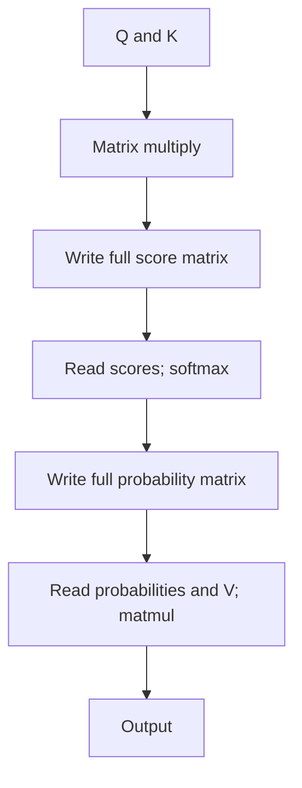
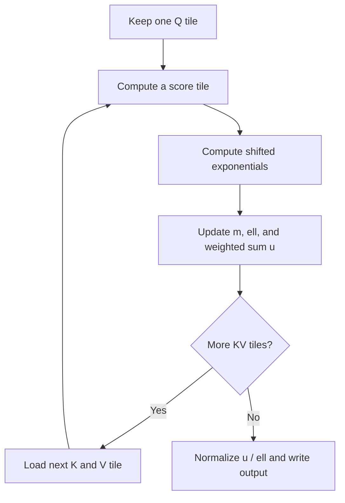

---
title: "FlashAttention from Scratch: From Softmax to Blackwell"
date: 2026-09-27
tags: ["flash-attention", "gpu-kernels", "cuda", "cute-dsl", "llm-inference"]
author: "Ryan H."
description: "A guided tutorial through attention math, online softmax, GPU tiling, backward recomputation, FlashAttention 1–4, and recent low-precision research."
summary: "Derive streaming attention, run a reference implementation, and follow the changing bottlenecks from the first FlashAttention to Hopper, Blackwell, and FP8/FP4 research."
ShowToc: true
TocOpen: true
math: true
---

FlashAttention computes attention while avoiding the large intermediate matrices that a straightforward implementation writes to GPU memory. Its central mathematical idea fits in a few equations. Understanding its modern implementations requires following those equations through a GPU's memory hierarchy, parallel execution, and numerical formats.

We will build that understanding one step at a time. First compute an attention row by hand. Then turn it into a streaming calculation, map that calculation onto GPU tiles, derive backward, and investigate why each hardware generation needs a different execution schedule.

**Research snapshot: September 27, 2026.** The path reaches FlashAttention-4, programmable attention, and the September 2026 MXFP8 and FP4 developments. “State of the art” here describes techniques and evidence available on that date; the fastest implementation depends on workload, hardware, precision, and software version.

## 1. How to use this tutorial

You need basic Python, matrix multiplication, exponentials, and sums to begin. GPU programming becomes necessary in Section 6; derivatives become necessary in Section 8. You can run the mathematical examples on a CPU with PyTorch. Keep the hardware experiments for a compatible GPU.

Each stage pairs explanations and worked examples with a checkpoint or experiment. Use the progression below to decide what to study and implement next.

| Stage | What you should be able to explain | What you produce |
|---|---|---|
| Attention, Sections 2–3 | What softmax computes and where quadratic storage comes from | A dense reference and a memory estimate |
| Streaming, Sections 4–5 | Why a row needs only a running maximum, sum, and weighted sum | A checked streaming implementation |
| GPU execution, Sections 6–7 | How tiling, fusion, and work ownership affect performance | A small forward kernel |
| Training and inference, Sections 8–9 | How to recompute gradients and merge partial attention | A backward reference and split-KV experiment |
| Modern hardware, Sections 10–11 | Which operations can overlap and what limits that overlap | An annotated Hopper/Blackwell pipeline |
| Current research, Sections 12–13 | What programmability and low precision change | An accuracy/performance study |

At each checkpoint, explain the result before optimizing it. If you cannot explain a five-token example, a profiler trace from a 32K-token workload will not resolve the confusion.

### A short historical map

| Year | Development | New question |
|---|---|---|
| 2017 | [Transformer attention](https://arxiv.org/abs/1706.03762) | How do queries use keys to mix values? |
| 2018 | [Online softmax normalization](https://arxiv.org/abs/1805.02867) | Can normalization statistics be updated while streaming? |
| 2021 | [Memory-efficient self-attention](https://arxiv.org/abs/2112.05682) | Does the operation inherently require quadratic storage? |
| 2022 | [FlashAttention](https://arxiv.org/abs/2205.14135) | How should attention exploit the GPU memory hierarchy? |
| 2023 | [FlashAttention-2](https://arxiv.org/html/2307.08691v1) | How should blocks and warps divide the work? |
| 2023 | [Flash-Decoding](https://pytorch.org/blog/flash-decoding/) and [PagedAttention](https://arxiv.org/abs/2309.06180) | What changes for generation and KV-cache management? |
| 2024 | [FlashAttention-3](https://arxiv.org/html/2407.08608v1) | How can Hopper overlap data movement, matmul, and softmax? |
| 2025 | [FlashInfer paper](https://arxiv.org/abs/2501.01005), [SageAttention3](https://arxiv.org/abs/2505.11594) | How do serving workloads and low-bit arithmetic reshape attention? |
| March 2026 | [FlashAttention-4](https://arxiv.org/html/2603.05451v1), [FlexAttention integration](https://pytorch.org/blog/flexattention-flashattention-4-fast-and-flexible/) | What becomes expensive when matrix multiplication gets much faster? |
| September 2026 | [Hardware-Aware FP4 FA4](https://arxiv.org/html/2609.04105v1), [block-scaled MXFP8 FA4](https://pytorch.org/blog/low-precision-flash-attention-4-end-to-end-block-scaled-attention-for-blackwell/) | Can precision, scale layouts, and the surrounding model be optimized together? |

Dates identify papers or announcements, not the first appearance of every implementation. FA4 code preceded its March 2026 paper, as the [author post](https://tridao.me/blog/2026/flash4/) explains. The history also has parallel branches: PagedAttention and FlashInfer solve serving problems and are not numbered successors to FA2.

## 2. Begin with one attention row

For one batch item and one head, define:

| Tensor | Shape | Meaning |
|---|---|---|
| $Q$ | $N_q\times d$ | One query vector per output position |
| $K$ | $N_k\times d$ | One key vector per available input position |
| $V$ | $N_k\times d_v$ | The information to combine |
| $S$ | $N_q\times N_k$ | Query–key scores |
| $P$ | $N_q\times N_k$ | Normalized attention weights |
| $O$ | $N_q\times d_v$ | Output vectors |

Learned projections usually produce $Q$, $K$, and $V$ from hidden states. We start after those projections. Attention is

$$
S=\frac{QK^T}{\sqrt d}+M,\qquad
P=\operatorname{softmax}_{\text{keys}}(S),\qquad O=PV.
$$

The mask $M_{ij}$ is zero for an allowed pair and $-\infty$ otherwise. Each row has its own softmax. A key receives a large weight when its score is large relative to other keys **for that query**. This is the scaled dot-product operation introduced in the [Transformer paper](https://arxiv.org/abs/1706.03762).

Why divide by $\sqrt d$? Under the illustrative assumption that query and key components are independent, zero-mean, and unit-variance, their dot product has variance $d$. Scaling by $1/\sqrt d$ keeps its variance near one. Actual learned tensors need not satisfy these assumptions exactly; the calculation explains the choice of scale.

### Work through a complete example

Let $d=2$ and use one query:

$$
q=[\sqrt 2,0],\quad
K=\begin{bmatrix}1&0\\2&0\\3&0\end{bmatrix},\quad
V=\begin{bmatrix}10\\20\\30\end{bmatrix}.
$$

After scaling, the scores are $s=[1,2,3]$. Their softmax is approximately

$$
p=[0.090031,\;0.244728,\;0.665241].
$$

The output is a weighted average:

$$
o=0.090031(10)+0.244728(20)+0.665241(30)\approx25.7521.
$$

Values need not be scalars. If each value has 64 components, the same three weights combine all 64 components independently.

### Stabilize softmax before doing anything clever

Computing $e^{s_j}$ directly can overflow. Subtracting the same constant $c$ from every score leaves the ratio unchanged:

$$
\frac{e^{s_j-c}}{\sum_k e^{s_k-c}}
=\frac{e^{s_j}}{\sum_k e^{s_k}}.
$$

Choose $c=m=\max_j s_j$. Every exponential argument is then nonpositive. For the example, compute $[e^{-2},e^{-1},1]$ and divide by their sum. For scores $[1001,1002,1003]$, compute exactly the same shifted quantities.

**Checkpoint:** Add 1000 to every score. Explain why the output is unchanged. Then mask the third key: the remaining weights must be renormalized; simply setting the old third weight to zero gives the wrong answer.

## 3. Why straightforward attention is expensive

A direct implementation writes scores, reads them for softmax, writes probabilities, and reads those probabilities for the value product:



For $B$ batch items and $H$ heads, one dense score tensor has $BHN_qN_k$ elements. With $B=1$, $H=32$, $N_q=N_k=8192$, and two bytes per element:

$$
32\times8192^2\times2=4\text{ GiB}.
$$

That is one intermediate. If scores and probabilities occupy distinct buffers, their combined storage is 8 GiB. FP32 storage doubles those numbers. By comparison, when $d=d_v=128$, each of $Q$, $K$, $V$, and $O$ occupies only 64 MiB at two bytes per element.

| GPU memory location | Useful property | Constraint |
|---|---|---|
| Global memory, typically HBM on datacenter GPUs | Large capacity | Moving data consumes bandwidth and time |
| L2 cache | Can reuse data across SMs | Residency depends on the workload |
| Shared memory | Explicitly managed storage local to a thread block | Limited capacity; bandwidth also matters |
| Registers | Hold values used by individual threads | Excess demand reduces residency or causes spills |

An **SM**, or streaming multiprocessor, executes thread blocks. A **CTA** is another name for a thread block. NVIDIA threads execute in groups of 32 called **warps**. A tensor core accelerates matrix multiply-accumulate operations, abbreviated **MMA**.

FlashAttention combines GPU-aware tiling, online normalization, and backward recomputation to avoid writing full $S$ and $P$ matrices. The operation still evaluates dense query–key interactions; eliminating quadratic intermediate storage does not eliminate quadratic arithmetic. [FlashAttention paper](https://arxiv.org/abs/2205.14135)

With equal value and key dimensions, the two matrix products require approximately

$$
F=4BHN_qN_kd
$$

floating-point operations when multiply and add count separately. Causal attention has fewer valid pairs, but still grows quadratically when both sequence dimensions grow together.

**Checkpoint:** If sequence length doubles, which tensors grow fourfold and which grow twofold? Why does this say nothing yet about how many times a kernel reads them?

## 4. Derive streaming attention

The obstacle to tiling is softmax: each probability depends on a denominator covering the whole row. We need a summary of earlier keys that can be updated when later keys arrive.

### 4.1 Maintain three quantities

For one query and the set $A$ of keys already processed, maintain

$$
m_A=\max_{j\in A}s_j,\qquad
\ell_A=\sum_{j\in A}e^{s_j-m_A},\qquad
u_A=\sum_{j\in A}e^{s_j-m_A}v_j.
$$

$m_A$ and $\ell_A$ are scalars; $u_A$ has $d_v$ components. The output over these keys is $u_A/\ell_A$.

The [online-normalizer paper](https://arxiv.org/abs/1805.02867) develops streaming softmax statistics. Adding the weighted sum $u$ makes the state useful for attention: we need the final weighted average, so earlier individual probabilities can disappear.

Suppose a new tile $T$ arrives. Set

$$
m'=\max(m_A,\max_{j\in T}s_j),\qquad \alpha=e^{m_A-m'}.
$$

Every old exponential can be expressed on the new scale:

$$
e^{s_j-m'}=e^{s_j-m_A}e^{m_A-m'}.
$$

Therefore

$$
\ell'=\alpha\ell_A+\sum_{j\in T}e^{s_j-m'},\qquad
u'=\alpha u_A+\sum_{j\in T}e^{s_j-m'}v_j.
$$

This is the entire recurrence. Both old sums receive the same correction, so they remain expressed in the same units. After the final tile, return $o=u/\ell$.

### 4.2 Stream the numerical example

Process scores $[1,2]$ first, with values $[10,20]$:

$$
m=2,\quad \ell=e^{-1}+1\approx1.367879,\quad
u=10e^{-1}+20\approx23.678794.
$$

Now score $3$ and value $30$ arrive. The maximum rises to 3, so $\alpha=e^{-1}$:

$$
\ell'=e^{-1}(1.367879)+1\approx1.503215,
$$

$$
u'=e^{-1}(23.678794)+30\approx38.710942.
$$

Dividing gives $25.7521$, matching the dense calculation. We discarded the first two scores without losing the information needed for the final weighted average.

### 4.3 Merge independently computed partitions

Given states $(m_A,\ell_A,u_A)$ and $(m_B,\ell_B,u_B)$ for disjoint key subsets, define

$$
m=\max(m_A,m_B),\quad a=e^{m_A-m},\quad b=e^{m_B-m},
$$

$$
\ell=a\ell_A+b\ell_B,\qquad u=au_A+bu_B.
$$

In exact arithmetic, different merge trees give the same result. Floating-point order can change rounding. This composition underlies split-KV decoding; the [FlashInfer attention-state tutorial](https://docs.flashinfer.ai/tutorials/recursive_attention.html) explains the recursive formulation.

If partitions return normalized outputs and natural-log normalizers $L_A=\log\sum_{j\in A}e^{s_j}$, merge with

$$
L=\operatorname{logaddexp}(L_A,L_B),\qquad
o=e^{L_A-L}o_A+e^{L_B-L}o_B.
$$

Partial outputs cannot generally be averaged equally. Each is weighted by its partition's share of total softmax mass. If both partitions are empty for a row, handle that row separately.

### 4.4 Handle the empty state deliberately

Initialize $m=-\infty$, $\ell=0$, and $u=0$. An entirely masked tile has maximum $-\infty$. Subtracting $-\infty-(-\infty)$ produces NaN, so the implementation must guard this case.

Our examples define a fully masked row to return zero output and log-sum-exp $-\infty$. This is an explicit API convention; ordinary softmax over such a row has a zero denominator. We assume all unmasked input scores are finite.

**Checkpoint:** Merge three partitions in two orders. Explain why they require an identical query and scoring rule. Shared cached keys do not make query-dependent attention outputs interchangeable between requests.

## 5. Run the math before writing a GPU kernel

This complete, CPU-compatible forward example supports one head, different query/key lengths, different value dimensions, and an optional causal mask. Copy the Python block into a file and run it with PyTorch installed. It computes in FP64 so rounding does not obscure the recurrence.

`q_start` and `k_start` are absolute token positions. Allowed causal pairs satisfy `key_position <= query_position`. This makes slicing a KV partition unambiguous.

```python
import math
import torch


def prepare(q, k, v):
    assert q.ndim == k.ndim == v.ndim == 2
    assert q.shape[1] == k.shape[1] and k.shape[0] == v.shape[0]
    assert min(*q.shape, *k.shape, *v.shape) > 0
    assert q.device == k.device == v.device
    return tuple(x.to(torch.float64) for x in (q, k, v))


def score_tile(q, k, causal, q_start, k_start):
    s = (q @ k.T) / math.sqrt(q.shape[1])
    if causal:
        qi = torch.arange(q.shape[0], device=q.device) + q_start
        kj = torch.arange(k.shape[0], device=k.device) + k_start
        s = s.masked_fill(kj[None, :] > qi[:, None], -torch.inf)
    return s


def finish(m, ell, u):
    # Our contract: zero output and -inf LSE for a fully masked row.
    denom = torch.where(ell > 0, ell, torch.ones_like(ell))
    out = u / denom[:, None]
    lse = torch.where(ell > 0, m + denom.log(), -torch.inf)
    return out, lse


def dense_attention(q, k, v, causal=False, q_start=0, k_start=0):
    q, k, v = prepare(q, k, v)
    s = score_tile(q, k, causal, q_start, k_start)
    m = s.amax(dim=-1)
    # Zero is only a computational shift for entirely masked rows.
    shift = torch.where(torch.isfinite(m), m, torch.zeros_like(m))
    p = torch.exp(s - shift[:, None])
    return finish(m, p.sum(dim=-1), p @ v)


def streaming_attention(q, k, v, block_q=32, block_k=64,
                        causal=False, q_start=0, k_start=0):
    q, k, v = prepare(q, k, v)
    assert block_q > 0 and block_k > 0
    outputs, normalizers = [], []
    for i in range(0, q.shape[0], block_q):
        qt = q[i:i + block_q]
        m = torch.full((qt.shape[0],), -torch.inf,
                       dtype=q.dtype, device=q.device)
        ell = torch.zeros_like(m)
        u = torch.zeros((qt.shape[0], v.shape[1]),
                        dtype=q.dtype, device=q.device)
        for j in range(0, k.shape[0], block_k):
            kt, vt = k[j:j + block_k], v[j:j + block_k]
            s = score_tile(qt, kt, causal, q_start + i, k_start + j)
            new_m = torch.maximum(m, s.amax(dim=-1))
            shift = torch.where(torch.isfinite(new_m), new_m,
                                torch.zeros_like(new_m))
            alpha = torch.exp(m - shift)
            p = torch.exp(s - shift[:, None])
            ell = alpha * ell + p.sum(dim=-1)
            u = alpha[:, None] * u + p @ vt
            m = new_m
        out, lse = finish(m, ell, u)
        outputs.append(out)
        normalizers.append(lse)
    return torch.cat(outputs), torch.cat(normalizers)


torch.manual_seed(7)
q = torch.randn(5, 16)
k = torch.randn(13, 16)
v = torch.randn(13, 8)
# Queries are the final five positions of a thirteen-token cache.
ref, ref_lse = dense_attention(q, k, v, causal=True, q_start=8)
out, lse = streaming_attention(q, k, v, block_q=3, block_k=4,
                                causal=True, q_start=8)
torch.testing.assert_close(out, ref, atol=1e-10, rtol=1e-10)
torch.testing.assert_close(lse, ref_lse, atol=1e-10, rtol=1e-10)
print("Streaming output and LSE match the dense reference.")
```

`p` inside the loop is an **unnormalized** exponential tile. Dividing at the end avoids repeated normalization. The largest score tile is `block_q × block_k`; the output accumulator is `block_q × d_v`.

Python loops validate the equations but do not provide GPU fusion: on CUDA, the individual PyTorch operations would launch separate kernels and store intermediates in device memory. This forward-only memory description also assumes no autograd recording; ordinary autograd through the loop may save intermediates. Section 8 explains how a designed backward avoids that.

### Rectangular causal masking is a correctness issue

For two queries that are the final positions of a five-token cache, the allowed-pair mask is

```text
             key position
             0  1  2  3  4
query 3      1  1  1  1  0
query 4      1  1  1  1  1
```

Using query positions 0 and 1 produces a different operation. PyTorch SDPA documents an upper-left rectangular `is_causal=True` mask; the FlashAttention package uses bottom-right alignment from version 2.1. Construct the desired mask explicitly when comparing them. Set SDPA's `dropout_p=0.0` for these no-dropout examples. [SDPA contract](https://docs.pytorch.org/docs/2.14/generated/torch.nn.functional.scaled_dot_product_attention.html), [FlashAttention API changelog](https://github.com/Dao-AILab/flash-attention)

**Experiment:** Change tile sizes, use odd sequence lengths, and multiply queries and keys by 20. Try `q_start=-2` so some rows are fully masked. Those outputs should be zero, their LSE should be $-\infty$, and valid rows should still match.

## 6. FlashAttention-1: make the algorithm IO-aware

The 2022 step was to exploit GPU memory: load tiles into on-chip storage, immediately consume score tiles in the value product, and retain only the statistics and partial output needed later. Read the [original paper](https://arxiv.org/abs/2205.14135) and the tiling/recomputation portion of [Tri Dao's Stanford talk, around 22–30 minutes](https://www.youtube.com/watch?v=gMOAud7hZg4&t=1320s).

### 6.1 Understand tile sizes and live storage

Let $B_r$ be the query rows and $B_c$ the key rows in a tile. One iteration computes

$$
S_t=Q_tK_t^T/\sqrt d\quad[B_r\times B_c],
$$

then updates $u$ using the exponential tile and $V_t$. For $B_r=B_c=64$ and $d=d_v=128$, a simplified inventory is:

| Live object | Elements | Illustrative storage |
|---|---:|---:|
| Query tile | $64\times128$ | 16 KiB in BF16 |
| Key tile | $64\times128$ | 16 KiB in BF16 |
| Value tile | $64\times128$ | 16 KiB in BF16 |
| Score tile | $64\times64$ | 16 KiB in FP32 |
| Output accumulator | $64\times128$ | 32 KiB in FP32 |

This is a liveness exercise, not a launch-ready shared-memory allocation. Registers and shared memory have different budgets. A kernel may overwrite scores with probabilities, retain more fragments, or double-buffer loads. Instruction layouts and compiler allocation determine actual placement.

A larger query tile reuses each KV tile across more queries but enlarges the accumulator. A larger key tile reduces loop iterations but enlarges the score tile. These are competing costs.

### 6.2 Separate the idea from the historical loop order

The original FA1 paper's forward schedule puts the KV loop outside the query loop:

```text
for each KV tile:
    load K_tile and V_tile
    for each Q tile:
        load Q_tile and its running output/statistics
        compute scores; update online attention
        store updated output/statistics
```

It avoids full score/probability storage but can move running output state repeatedly. Our reference instead keeps one query tile through the KV loop, a useful stepping stone to FA2. It is not a literal reproduction of FA1's schedule. [FA1, Algorithm 1](https://arxiv.org/abs/2205.14135)

For the query-owned traversal, the state flow looks like this:



The loop carries the small row state. Scores and exponentials are temporary tiles whose storage can be reused after consumption.

### 6.3 Build a small fused forward

Start with contiguous FP16/BF16 inputs, FP32 accumulation, one head dimension, noncausal attention, and no dropout. Assign a thread block to one query tile. Keep its accumulator and statistics on-chip through the KV loop.

```text
parallel task (batch, head, query_tile):
    load Q_tile
    initialize m, ell, u
    for each KV tile:
        load K_tile and V_tile
        S = matmul(Q_tile, transpose(K_tile)) * scale
        apply boundary and attention masks
        update m, ell, u using the online recurrence
    store u / ell
    optionally store m + log(ell)
```

This is algorithmic pseudocode. Map its lines to loads, reductions, MMA fragments, and stores using the executable [Triton fused-attention tutorial](https://triton-lang.org/main/getting-started/tutorials/06-fused-attention.html), which implements an FA2-style algorithm. Isolate its ordinary forward path before the later hardware-specific branches.

For CuTe DSL, first establish which elements belong to each thread and which layouts the two MMAs expect. Converting the first MMA accumulator into the second MMA operand is part of the work. Matrix shapes alone do not specify that layout.

If using base-2 exponentials, convert consistently:

$$
e^s=2^{s\log_2e},\qquad
s_2=(QK^T)\frac{\log_2e}{\sqrt d}.
$$

An LSE stored as $L_2=\log_2\sum_j2^{s_{2,j}}$ converts to natural-log LSE via $L=L_2\ln2$. Mixing conventions breaks backward and partition merging.

**Checkpoint:** Identify every global-memory write. There should be no full $N_q\times N_k$ score or probability output. Inputs need not be read only once: different query tiles may reload the same KV data.

## 7. FlashAttention-2: expose independent work

FA2, published in 2023, targets non-matmul arithmetic, insufficient parallelism across query tiles, and communication between warps. [FA2 paper, Section 3](https://arxiv.org/html/2307.08691v1)

### 7.1 Delay normalization

If we store a normalized partial output $o$, each update is

$$
o'=\frac{\alpha\ell o+\sum_{j\in T}e^{s_j-m'}v_j}{\ell'}.
$$

Storing $u=\ell o$ removes repeated denominator multiplications and divisions. Our reference already does this. Reductions and exponentials still exist; eliminating divisions does not eliminate all non-matmul work.

### 7.2 Parallelize output rows

The approximate number of query-tile tasks is

$$
B H_q\left\lceil\frac{N_q}{B_r}\right\rceil.
$$

One batch, eight query heads, $N_q=8192$, and $B_r=128$ provide 512 tasks. Parallelizing only batch and heads would provide eight. Query tiles need no output reduction between them because they own different rows.

More tasks can improve utilization, but register demand, shared memory, and work per task still constrain execution.

### 7.3 Divide query rows between warps

FA2 assigns distinct query rows to warps while reusing KV data. Each warp accumulates its own output rows. An earlier split-K arrangement has warps compute partial contributions to the same output, requiring communication and a reduction. FA2 avoids that within-block reduction. [FA2 work partitioning](https://arxiv.org/html/2307.08691v1)

```text
Within-block KV split:            Within-block query-row split:
warp 0: part of every output      warp 0: complete rows  0–15
warp 1: part of every output      warp 1: complete rows 16–31
warp 2: part of every output      warp 2: complete rows 32–47
warp 3: part of every output      warp 3: complete rows 48–63
         reduction needed                 disjoint output ownership
```

The row ranges illustrate ownership, not a prescribed tensor-core layout. Distinguish this from splitting KV across independent blocks during decode: that later split accepts a reduction to expose more work.

For square causal attention, classify tiles as entirely allowed, entirely masked, or crossing the diagonal. Skip masked tiles and apply elementwise masking only at the boundary. Earlier queries now have less work, creating load imbalance.

**Experiment:** Sweep tile sizes and warp count. Record latency, registers, shared memory, and spills. Explain one case where a larger tile loses despite better reuse: which resource cost increased?

## 8. Backward: spend arithmetic to save memory

Let $G=\partial\mathcal L/\partial O$ be the incoming gradient. We derive the no-dropout case with a fixed mask and scale $c=1/\sqrt d$.

From $O=PV$:

$$
dV=P^TG,\qquad dP=GV^T.
$$

The softmax Jacobian gives

$$
dS_{ij}=P_{ij}\left(dP_{ij}-\sum_tP_{it}dP_{it}\right).
$$

Define $\delta_i=\sum_tP_{it}dP_{it}$. Substituting $dP_{it}=G_i\cdot V_t$ gives

$$
\delta_i=G_i\cdot\left(\sum_tP_{it}V_t\right)=G_i\cdot O_i.
$$

We can compute $\delta$ from the saved output and incoming gradient. Finally,

$$
dS=P\odot(dP-\delta[:,\mathrm{None}]),\qquad
dQ=c\,dS K,\qquad dK=c\,dS^TQ.
$$

For an allowed pair, reconstruct probabilities from a saved row normalizer:

$$
L_i=\log\sum_j e^{S_{ij}},\qquad P_{ij}=e^{S_{ij}-L_i}.
$$

Save $O$ and row statistics, retain or recover inputs, and reconstruct one probability tile at a time. The [FA1 paper](https://arxiv.org/abs/2205.14135) introduces the recomputation strategy; [FA2](https://arxiv.org/html/2307.08691v1) develops the LSE and gradient formulation further.

### A backward implementation you can check

Append this block after the forward example. It uses sequential accumulation to make gradient ownership easy to understand.

```python
def backward_reference(q, k, v, out, lse, grad_out,
                       block_q=32, block_k=64,
                       causal=False, q_start=0, k_start=0):
    q, k, v = prepare(q, k, v)
    out, lse, grad_out = (x.to(torch.float64)
                          for x in (out, lse, grad_out))
    assert block_q > 0 and block_k > 0
    dq, dk, dv = torch.zeros_like(q), torch.zeros_like(k), torch.zeros_like(v)
    delta = (out * grad_out).sum(dim=-1)
    scale = 1.0 / math.sqrt(q.shape[1])
    for i in range(0, q.shape[0], block_q):
        rows = slice(i, i + block_q)
        qt, gt = q[rows], grad_out[rows]
        li = lse[rows]
        # For a fully masked row, exp(-inf - 0) is safely zero.
        shift = torch.where(torch.isfinite(li), li, torch.zeros_like(li))
        for j in range(0, k.shape[0], block_k):
            cols = slice(j, j + block_k)
            kt, vt = k[cols], v[cols]
            s = score_tile(qt, kt, causal, q_start + i, k_start + j)
            p = torch.exp(s - shift[:, None])
            dp = gt @ vt.T
            ds = p * (dp - delta[rows, None])
            dq[rows] += scale * (ds @ kt)
            dk[cols] += scale * (ds.T @ qt)
            dv[cols] += p.T @ gt
    return dq, dk, dv


# Compare with autograd through an ordinary dense softmax.
torch.manual_seed(8)
qg = torch.randn(5, 7, dtype=torch.float64, requires_grad=True)
kg = torch.randn(9, 7, dtype=torch.float64, requires_grad=True)
vg = torch.randn(9, 3, dtype=torch.float64, requires_grad=True)
s = score_tile(qg, kg, causal=True, q_start=4, k_start=0)
og = torch.softmax(s, dim=-1) @ vg
g = torch.randn_like(og)
expected = torch.autograd.grad(og, (qg, kg, vg), g)
with torch.no_grad():
    o, l = streaming_attention(qg, kg, vg, block_q=3, block_k=4,
                               causal=True, q_start=4)
    actual = backward_reference(qg, kg, vg, o, l, g,
                                block_q=3, block_k=4,
                                causal=True, q_start=4)
for result, reference in zip(actual, expected):
    torch.testing.assert_close(result, reference, atol=1e-10, rtol=1e-10)
print("Recomputed backward matches dense autograd.")
```

A GPU backward must handle competing ownership requirements. A query-owned block can finish $dQ$ locally, but its $dK$ and $dV$ contributions overlap with other blocks. A KV-owned block can finish $dK$ and $dV$, but $dQ$ needs a reduction across KV blocks. Choose ownership, workspace, and synchronization deliberately.

Recomputing backward has five matrix products: reconstruct scores, compute $dP$, compute $dV$, compute $dQ$, and compute $dK$. More arithmetic can still be faster when it avoids enough memory traffic. This is an attention-specific instance of activation recomputation.

Dropout requires backward to reproduce the same random decisions and scaling. GQA requires accumulating contributions from several query heads into shared KV heads. Neither feature is implemented here.

**Checkpoint:** Derive $\delta_i=G_i\cdot O_i$ without constructing $dP$. Draw the reduction axes for $dQ$, $dK$, and $dV$ before studying FA4's backward pipeline.

## 9. The inference branch: decode, GQA, and paged KV

Prefill processes many prompt queries, often with $N_q\approx N_k$. Ordinary single-token decode has $N_q=1$ and a growing $N_k$. Query-tile parallelism largely disappears for each head during decode.

### 9.1 Split the long dimension that remains

Flash-Decoding splits the KV sequence into independent partitions. Each task computes a partial output and normalization statistics; a reduction combines them using Section 4's merge. The extra tasks can occupy otherwise idle SMs. They also introduce partial-result storage and reduction overhead, so the split count must depend on workload. [Flash-Decoding](https://pytorch.org/blog/flash-decoding/)

Append this runnable example after the forward block. The two partitions have different absolute key offsets, which matters for causal masking.

```python
def merge_outputs(oa, la, ob, lb):
    l = torch.logaddexp(la, lb)
    shift = torch.where(torch.isfinite(l), l, torch.zeros_like(l))
    wa, wb = torch.exp(la - shift), torch.exp(lb - shift)
    return wa[:, None] * oa + wb[:, None] * ob, l


torch.manual_seed(9)
q = torch.randn(2, 8)
k = torch.randn(11, 8)
v = torch.randn(11, 5)
oa, la = streaming_attention(q, k[:4], v[:4], causal=True, q_start=9)
ob, lb = streaming_attention(q, k[4:], v[4:], causal=True,
                             q_start=9, k_start=4)
merged, merged_lse = merge_outputs(oa, la, ob, lb)
ref, ref_lse = dense_attention(q, k, v, causal=True, q_start=9)
torch.testing.assert_close(merged, ref, atol=1e-10, rtol=1e-10)
torch.testing.assert_close(merged_lse, ref_lse, atol=1e-10, rtol=1e-10)
print("Split-KV merge matches full attention.")
```

This demonstrates the reduction's mathematics. Its Python calls are sequential; a GPU implementation supplies the parallel execution.

### 9.2 GQA changes the reuse opportunity

Multi-head attention normally has one KV head per query head. Grouped-query attention, or GQA, shares a KV head across $r=H_q/H_{kv}$ query heads. Multi-query attention is the case $H_{kv}=1$.

For equal-sized groups, query head $h$ maps to KV head $\lfloor h/r\rfloor$. A reference can repeat KV tensors to check the result, but a performance implementation should reuse the original storage.

For one-token decode with equal key/value dimensions and $s$ bytes per KV element, an idealized traffic model gives

$$
F\approx4BH_qN_kd,\qquad
\text{KV bytes}\approx2BH_{kv}N_kds,
$$

$$
\text{arithmetic intensity}\approx\frac{2r}{s}
\quad\text{FLOPs per byte}.
$$

At two bytes per element and $r=1$, that is only one FLOP per KV byte. GQA increases the opportunity for reuse, but the kernel must realize it. Packing query heads that share KV into one work tile can help fill a matrix instruction's otherwise mostly empty query dimension. This is illustrated in [the FA3/CUTLASS lecture, around 40–44 minutes](https://www.youtube.com/watch?v=JwUcZwPOCpA&t=2400s).

The estimate excludes repeated loads, metadata, scale tensors, outputs, and cache effects. It explains why a compute-efficient prefill kernel can still be a poor decode choice.

### 9.3 Paging changes where keys live

A serving system need not allocate one contiguous maximum-length cache per request. With page size $P$, logical token $t$ maps to

$$
\text{physical page}=\text{page\_table}[\lfloor t/P\rfloor],\qquad
\text{offset}=t\bmod P.
$$

PagedAttention concerns allocation and access to these KV blocks, including memory sharing and fragmentation. A FlashAttention-style computation can consume a paged cache. Paging and streaming softmax address different problems. [PagedAttention paper](https://arxiv.org/abs/2309.06180)

FlashInfer provides inference kernels and planning interfaces for workload-dependent layouts and execution. A backend family name does not uniquely identify a single kernel. Measure the selected implementation and separate planning from execution. [FlashInfer paper](https://arxiv.org/abs/2501.01005), [KV layout tutorial](https://docs.flashinfer.ai/tutorials/kv_layout.html)

**Experiment:** First permute physical pages while preserving the logical page table; outputs must remain unchanged. Then benchmark different split counts at several batch sizes and context lengths. Find a case where split-KV overhead exceeds its parallelism benefit.

## 10. FlashAttention-3: overlap work on Hopper

Before this stage, learn double buffering with a small matrix multiplication: while consuming one input buffer, fill another. The mathematical dependency stays unchanged; independent work moves earlier in time.

FA3, introduced in 2024, develops this idea for Hopper. Its main ingredients are asynchronous data movement, asynchronous tensor-core execution, and careful overlap with softmax. Study the [FA3 paper](https://arxiv.org/html/2407.08608v1), [author explanation](https://tridao.me/blog/2024/flash3/), and [CUTLASS lecture](https://www.youtube.com/watch?v=JwUcZwPOCpA).

### 10.1 Learn the hardware vocabulary

| Mechanism | What it does | What your program must establish |
|---|---|---|
| TMA, Tensor Memory Accelerator | Moves tensor tiles asynchronously, including global-to-shared transfers | The destination is available and the transfer finishes before use |
| WGMMA | Issues asynchronous matrix operations cooperatively across a warpgroup | Inputs remain valid and results are complete before consumption |
| Warpgroup | Four contiguous warps, or 128 threads | Threads participate according to the instruction contract |
| Warp specialization | Assigns different work to different groups of warps | Producers and consumers coordinate buffer ownership |

These are Hopper mechanisms; consult the [Hopper tuning guide](https://docs.nvidia.com/cuda/hopper-tuning-guide/index.html). An asynchronous instruction can return control before its data is ready. Issuing an MMA and consuming its accumulator are separate events.

### 10.2 Draw dependencies before drawing overlap

For one KV tile, the dependency is unavoidable:

```text
K ready → QK matmul complete → softmax complete → PV matmul complete
                                                   ↑
                                                V ready
```

For different tiles or query work, other operations can proceed concurrently. A conceptual schedule might look like this:

| Interval | Data movement | Tensor cores | Scalar/vector work |
|---|---|---|---|
| A | Load future KV | Compute scores for tile $j$ | Finish work from earlier tiles |
| B | Continue future loads | Compute another ready score tile | Softmax for tile $j$ |
| C | Refill a released buffer | Multiply $P_jV_j$ | Softmax for another ready tile |

This is a dependency sketch, not a cycle-accurate FA3 schedule. The running output must be rescaled at the correct time before accumulating contributions on a new scale. A shared-memory slot cannot be reused while an asynchronous operation still reads it.

FA3 uses producer/consumer specialization and overlap both across and within consumer warpgroups. Additional in-flight score state increases register demand, so deeper pipelines can lose their advantage through spills or reduced residency. [FA3 pipeline design](https://arxiv.org/html/2407.08608v1)

### 10.3 Treat FP8 as a second lesson

FA3 also studies FP8, including block quantization and incoherent processing to reduce outlier-related error. The latter can transform $Q$ and $K$ with the same orthogonal matrix $R$:

$$
(QR)(KR)^T=QRR^TK^T=QK^T.
$$

Before rounding, scores are unchanged. After quantization, spreading a large component across coordinates can change the error distribution. Layout restrictions and converting intermediate probabilities into valid MMA operands add implementation work. FP8 therefore changes both arithmetic and data preparation. [FA3 numerical techniques](https://tridao.me/blog/2024/flash3/)

**Checkpoint:** Annotate an actual Hopper mainloop with “issued,” “ready,” “consumed,” and “safe to reuse.” Then disable one supported overlap mechanism and measure its effect. A timeline explanation should identify the dependency that became exposed.

## 11. FlashAttention-4: optimize the resources left behind

The FA4 paper appeared in March 2026 and focuses on datacenter Blackwell. Its premise is asymmetric scaling: matrix throughput grows faster than exponential throughput and shared-memory bandwidth. The algorithm and pipeline must account for the resources that have become relatively more expensive. [FA4 paper](https://arxiv.org/html/2603.05451v1)

### 11.1 Build a resource model before changing the kernel

Suppose a tile has $M$ queries, $N$ keys, and equal key/value dimension $d$. Count roughly $4MNd$ matrix FLOPs and $MN$ exponentials. If matrix throughput is $R_{\mathrm{mma}}$ and exponential throughput is $R_{\exp}$, estimate

$$
T_{\mathrm{mma}}=\frac{4MNd}{R_{\mathrm{mma}}},\qquad
T_{\exp}=\frac{MN}{R_{\exp}}.
$$

Their ratio is

$$
\frac{T_{\exp}}{T_{\mathrm{mma}}}
=\frac{R_{\mathrm{mma}}}{4dR_{\exp}}.
$$

This gives a useful prediction: faster tensor cores or a smaller head dimension make exponentials relatively more significant. Increasing both sequence tile dimensions does not, by itself, change this simplified ratio.

Using the FA4 paper's illustrative B200 rates of 8192 BF16 matrix FLOPs/cycle/SM and 16 exponentials/cycle/SM, a $128^3$ tile needs about 1024 cycles for its two matrix products and another 1024 cycles of exponential throughput. Its simplified MMA operand reads require about 768 shared-memory cycles. These are resource lower bounds, not a measured kernel duration. [FA4 resource analysis, Section 3.1.1](https://arxiv.org/html/2603.05451v1)

Overlap can move execution toward the largest resource demand instead of their sum, but dependencies, reductions, loads, and barriers limit that ideal.

### 11.2 TMEM changes intermediate placement

Datacenter Blackwell introduces tensor memory, **TMEM**, used by its `tcgen05` tensor-core operations. Accumulators can live there rather than occupying the issuing threads' registers. TMEM is a distinct on-chip storage space with instruction-specific access and synchronization rules. It is neither global memory nor interchangeable with shared memory. [Blackwell tuning guide](https://docs.nvidia.com/cuda/blackwell-tuning-guide/index.html)

FA4 overlaps two query tiles, assigns specialized work to load, MMA, softmax, and output-correction roles, and reuses TMEM regions as intermediates retire. Some exponentials run through polynomial evaluation on ordinary arithmetic units alongside hardware exponential instructions. [Colfax FA4 explanation](https://research.colfax-intl.com/flashattention-4-algorithm-and-kernel-pipelining-co-design-for-asymmetric-hardware-scaling/)

The general exponential identity is

$$
2^x=2^{\lfloor x\rfloor}2^{x-\lfloor x\rfloor}.
$$

The fractional argument lies in $[0,1)$, where a polynomial can approximate the second factor. This spends additional arithmetic and registers to reduce pressure on the exponential unit. It is useful only if those other resources have room and the resulting numerical error is acceptable.

### 11.3 Derive conditional rescaling correctly

FA4 also avoids many output rescaling operations. To understand why this can work, return to softmax's freedom to choose an offset. The maximum is a safe choice, but any common finite reference $r$ gives the same exact-arithmetic ratio:

$$
\ell_r=\sum_j e^{s_j-r},\qquad u_r=\sum_j e^{s_j-r}v_j,
\qquad o=u_r/\ell_r.
$$

Here is a teaching formulation using natural exponentials. For a new tile with maximum $t$, retain $r$ while $t-r\leq\tau$; otherwise move the reference up. Both accumulated quantities always use the same reference:

```text
r_new = r                           if t - r <= tau
        max(r, t)                   otherwise
a = exp(r - r_new)
p = exp(scores - r_new)
ell_new = a * ell + sum(p)
u_new   = a * u   + p @ V_tile
```

Initialize the reference from the first valid tile; handle empty tiles separately. If $r$ does not change, $a=1$, so the correction multiply can be skipped. For example, changing scores from maximum 2 to maximum 3 does not require a new reference: exponentials of up to $e^1$ are perfectly finite. The final ratio is still correct if numerator and denominator both retain reference 2.

The threshold limits how far exponentials can grow above one. If scores use base 2, a threshold of 8 means a factor of $2^8=256$; the same factor corresponds to $8\ln2$ with natural exponentials. Thresholds and warp-level decisions depend on formats and implementation. See the rescaling discussion in [Ted Zadouri's FA4 talk, around 14–17 minutes](https://www.youtube.com/watch?v=kPKKvBqQoFI&t=840s).

Do not update the denominator to a new scale while leaving the numerator on the old one. Final division cannot repair that inconsistency. This derivation explains the invariant; it does not reproduce every detail of the production correction pipeline.

### 11.4 Backward makes shared-memory traffic visible

Backward needs five matrix products and several differently oriented intermediates. FA4 arranges transposed probability and score-gradient tiles so some MMA operands can remain in TMEM. Its paired-CTA backward design reduces shared-memory operand traffic, while exchanging data between CTAs to satisfy the $dQ$ reduction. It also reduces global atomic accumulation work. [Colfax FA4 backward explanation](https://research.colfax-intl.com/flashattention-4-algorithm-and-kernel-pipelining-co-design-for-asymmetric-hardware-scaling/)

Use Section 8's equations to make an original storage-lifetime table:

| Quantity | Who produces it? | Last consumer to identify |
|---|---|---|
| $S$ | Score MMA | Probability reconstruction |
| $P$ | Exponential stage | $dV$ MMA and softmax derivative |
| $dP$ | $GV^T$ MMA | Softmax derivative |
| $dS$ | Elementwise derivative | Both $dQ$ and $dK$ MMAs |
| $dK,dV$ | Gradient MMAs | Final output stores |

Two objects can share physical storage only when their lifetimes do not overlap. An asynchronous instruction can extend a lifetime past the line that issued it. When an optimized kernel stalls, investigate whether it is waiting for data, a free buffer, or completion of an operation that still owns storage.

### 11.5 Scheduling and implementation language matter

Causal query tiles have unequal work. Launching long tiles earlier can reduce the tail where only a few SMs remain busy. Variable-length batches add another source of imbalance. Persistent kernels let a physical block process multiple logical work tiles, making scheduling a separate design choice.

FA4 is implemented in CuTe DSL. Python is its authoring language; compiled GPU instructions execute the kernel. Inspect the upstream dispatch and architecture-specific implementations instead of assuming a package name specifies one pipeline. The author post also notes that newer cuDNN versions incorporated related techniques, so benchmark current eligible cuDNN paths. [FA4 author post](https://tridao.me/blog/2026/flash4/)

**Experiment:** Pick one tile configuration and make a table of matrix work, exponentials, shared-memory traffic, and live storage. Predict the effect of one change before measuring it. An unsuccessful optimization is useful if its regression follows your resource model.

## 12. Programmable attention: FlexAttention meets FA4

Once the base kernel works, models ask for variations: a positional bias, a sliding window, or isolation between packed documents. Two changes cover many cases:

1. Modify a score before softmax: $S'_{ij}=f(S_{ij},i,j,\ldots)$.
2. Specify which query–key pairs are allowed.

For example, a causal window of width $w$ permits

$$
0\leq i-j<w.
$$

Within the online algorithm, apply the score transformation before row maxima and exponentials. For rectangular inputs, use absolute positions in the mask. The recurrence then computes the newly specified operation.

There are two distinct savings to consider. A fused score modifier avoids a separate kernel and intermediate tensor. A block mask can additionally tell the kernel to skip entirely absent tiles. Merely setting individual scores to $-\infty$ after computing every score does not save the matrix arithmetic. The [Colfax FlexAttention guide](https://research.colfax-intl.com/a-users-guide-to-flexattention-in-flash-attention-cute-dsl/) explains full, partial, and skipped blocks and their metadata.

The 2026 integration lets PyTorch compile supported modifiers into the FA4 CuTe DSL pipeline. The documented backend selector is `kernel_options={"BACKEND": "FLASH"}` in a compatible compiled setup. Older examples use different options, so match the installed versions. Captured tensors requiring gradients, block granularity, and deterministic sparse backward have separate support constraints. [PyTorch FlexAttention + FA4 announcement](https://pytorch.org/blog/flexattention-flashattention-4-fast-and-flexible/)

Backward needs the modifier's derivative. If $S'=f(S)$, Section 8 computes $dS'$ through softmax, then the chain rule gives

$$
dS=dS'\odot f'(S).
$$

A constant additive bias has derivative one. A nonlinear modifier may require retaining or recomputing the original scores. A small API change can therefore alter the kernel's storage lifetimes.

**Experiment:** Implement a causal sliding-window predicate, compare it with a dense explicit mask, and measure both block-mask construction and execution. Check whether any construction cost can be amortized across layers or calls. Sparse attention is exact for its specified mask, but choosing a window changes the model operation relative to full causal attention.

## 13. The current frontier: precision and the surrounding pipeline

“Exact attention” means evaluating the specified attention pattern without a sparse or low-rank approximation. It does not mean bitwise equality across reduction orders. FP16/BF16 rounding, approximate exponentials, FP8/FP4 operands, and quantization policies introduce different numerical effects that must be evaluated separately.

### 13.1 First understand block scaling

A basic quantizer represents a block approximately as

$$
x\approx a_B\,\operatorname{round}_{\mathcal F}(x/a_B),
$$

where $\mathcal F$ is a low-precision format and $a_B$ is a shared scale. Smaller groups can adapt to local ranges but require more scale storage and computation. A format includes both the element representation and its scaling rules; MXFP8, MXFP4, and NVFP4 are not interchangeable names for small numbers.

The contraction dimension matters. In $QK^T$, products reduce over head components. In $PV$, products reduce over key positions. A convenient scale layout for the first product need not suit the second. Backward introduces transposes and more contraction directions.

Consider three unnormalized weights $[0.1,0.2,0.7]$ and values $[0,0,1]$. Exact output is $0.7$. If a toy quantizer produces $[0,0.25,0.75]$, renormalizing gives $0.75$. Normalization preserves a weighted-average structure, but it does not recover the original weights. Low-precision attention needs more than checking that weights sum to one.

### 13.2 FP4 FA4: fast probability construction, bounded evidence

The September 3 preprint **Hardware-Aware FP4 FlashAttention-4**, by Robert Hu, studies a separate FP4 extension. Its Direct-P path maps scores to FP4 probability codes and normalizes using the represented weights consumed by the value product. It reports up to **2.13× BF16 forward throughput on GB200** for noncausal inference, with an accuracy tradeoff. Its causal training work reuses forward quantization state in backward. The retained distributed training configuration uses FP8 probabilities and values: every tested MXFP4 P/V training trajectory diverged. These are author-reported, workload-specific results; they do not establish a universal full-FP4 training replacement. [FP4 preprint, Sections 4–8](https://arxiv.org/html/2609.04105v1)

**Reading exercise:** Keep three columns of evidence: isolated operator error, repeated model execution, and training trajectories. A result in one column does not fill the others. Also identify preparation work excluded from a kernel-only timing.

### 13.3 MXFP8 FA4: optimize beyond the attention call

A September 16 PyTorch post, updated September 23, describes an MXFP8 FA4 extension with forward and backward support, used in Meta's GEM training workloads. It addresses TMEM scale-factor placement, uses square block quantization to reuse payloads across transposed gradient products, and fuses quantization into preceding normalization and projection kernels. For jagged inputs, activation data remains compact while scale metadata gets hardware-compatible layouts. [Block-scaled FA4 report](https://pytorch.org/blog/low-precision-flash-attention-4-end-to-end-block-scaled-attention-for-blackwell/)

The report's GB300 module example improves from **1.00× at 4096 KV tokens to 1.30× at 16384**, illustrating how kernel throughput gains depend on surrounding work. It also excludes a numerically discrepant cuDNN MXFP8 backward result from accuracy-qualified comparisons. These details make the evaluation more useful than a peak FLOP/s number alone. [Measurements and numerics](https://pytorch.org/blog/low-precision-flash-attention-4-end-to-end-block-scaled-attention-for-blackwell/)

**Implementation exercise:** Draw the complete path from normalization through Q/K/V projections, quantization, attention, and output processing. Mark every full-tensor read and write. Compare separate quantization against producing the required format in the preceding kernel's output stage. Count scale traffic as well as payload traffic.

### 13.4 Related low-precision work is a parallel branch

[SageAttention3](https://arxiv.org/abs/2505.11594) studies microscaling FP4 inference on consumer Blackwell and explores 8-bit training. Its pretraining and fine-tuning outcomes differ. [Attn-QAT](https://arxiv.org/abs/2603.00040) studies quantization-aware training for 4-bit attention and reports instability from naively combining a low-precision forward with a mismatched higher-precision backward.

These works ask a broader question: should a model be trained to tolerate the attention arithmetic used at inference? They belong after the exact-arithmetic derivations because they change the numerical contract. Consumer Blackwell results also do not establish datacenter Blackwell performance.

**Checkpoint:** For any “FP4 attention” result, write down the formats of Q, K, V, probability operands, accumulators, outputs, and gradients separately. Record scale granularity and the precision of surrounding projections. Then state which quality measurements accompany the speed result.

## 14. Choose hardware and read production code progressively

| Platform | Useful learning target |
|---|---|
| CPU | All mathematical examples and gradient checks |
| A100, SM80 | FA1/FA2-style tiling, `mma.sync`, asynchronous copies |
| H100/H200, SM90 | Hopper TMA/WGMMA and FA3 pipeline experiments |
| B200/GB200, SM100; B300/GB300, SM103 | Datacenter Blackwell TMEM and FA4 mechanisms |
| DGX Spark/GB10, SM121 | Compatible teaching kernels and inference experiments; check the actual implementation path |

Architecture identifiers come from [NVIDIA's compute-capability table](https://developer.nvidia.com/cuda/gpus). Spark's architecture is not the SM100 target used by the FA4 paper. The upstream [SM120-family forward implementation](https://github.com/Dao-AILab/flash-attention/blob/main/flash_attn/cute/flash_fwd_sm120.py) uses an SM80-style `mma.sync` path, distinct from the datacenter TMEM implementation. Inspect dispatch for your installed release and feature combination.

Use this source-reading sequence, pinned to a specific commit when doing experiments:

1. [Triton fused softmax](https://triton-lang.org/main/getting-started/tutorials/02-fused-softmax.html): learn row reductions and fusion.
2. [Triton fused attention](https://triton-lang.org/main/getting-started/tutorials/06-fused-attention.html): find the score tile, maximum, correction, denominator, and output accumulator.
3. [FA2 forward kernel](https://github.com/Dao-AILab/flash-attention/blob/main/csrc/flash_attn/src/flash_fwd_kernel.h): trace one supported shape through tiling and masking.
4. [Hopper mainloop](https://github.com/Dao-AILab/flash-attention/blob/main/hopper/mainloop_fwd_sm90_tma_gmma_ws.hpp): track issued work, waits, and buffer ownership.
5. [CuTe interface and dispatch](https://github.com/Dao-AILab/flash-attention/blob/main/flash_attn/cute/interface.py), then [SM100 forward](https://github.com/Dao-AILab/flash-attention/blob/main/flash_attn/cute/flash_fwd_sm100.py): connect a supported call to its architecture-specific pipeline.
6. [MXFP8 extension](https://github.com/facebookresearch/ads_model_kernel_library/tree/main/lp_fa4): trace payload and scale layouts across operator boundaries.

Paths can move. Search within the pinned checkout rather than assuming a filename is stable.

For each kernel, answer five questions before following every helper function: Who owns an output tile? Where do scores live? Who produces and consumes probabilities? What prevents premature buffer reuse? Which quantities survive a loop iteration?

### Where the original draft's references fit

All six original references remain part of this route. The video reading used their available English captions, with technical claims checked against papers and implementation documentation.

| Original reference | When to study it | What to extract |
|---|---|---|
| [Tri Dao's FlashAttention Stanford talk](https://www.youtube.com/watch?v=gMOAud7hZg4) | After Sections 3–4 | IO-aware tiling and backward recomputation; start around 22 minutes |
| [Lecture 36: CUTLASS and Flash Attention 3](https://www.youtube.com/watch?v=JwUcZwPOCpA) | After Sections 7–10 | Producer/consumer separation around 10–30 minutes; source walkthrough from roughly 44 minutes |
| [FlashAttention-4 by Ted Zadouri × GPU MODE](https://www.youtube.com/watch?v=kPKKvBqQoFI) | Alongside Section 11 | Conditional correction around 14 minutes; backward ownership from roughly 16 minutes |
| [Colfax FA4 article](https://research.colfax-intl.com/flashattention-4-algorithm-and-kernel-pipelining-co-design-for-asymmetric-hardware-scaling/) | After the FA4 resource model | Map functional units and memory traffic to pipeline choices |
| [Colfax FlexAttention guide](https://research.colfax-intl.com/a-users-guide-to-flexattention-in-flash-attention-cute-dsl/) | Section 12 | Score/mask functions and block metadata; check newer API syntax |
| [Hardware-Aware FP4 FA4](https://arxiv.org/html/2609.04105v1) | Section 13 | Probability construction, numerical tradeoffs, and limits of training evidence |

## 15. Finish with evidence you can reproduce

Start with a modest experiment grid: $N_q\in\{1,128,2048\}$, $N_k\in\{128,2048,8192\}$, a few batch sizes, head dimensions 64 and 128, and causal/noncausal attention. Add GQA, paging, and low precision only after the basic cases are trustworthy.

Keep three kinds of evidence separate:

| Evidence | Required checks |
|---|---|
| Mathematical correctness | Dense versus tiled outputs/LSE, partition merges, gradients, partial tiles, rectangular masks, extreme finite scores, fully masked rows |
| Kernel performance | GPU model, library commit, selected kernel, shape, dtype, mask, latency distribution, memory use, register/shared-memory use, profiler explanation |
| Application impact | Preparation and conversion costs, attention-layer time, prefill/decode latency, model-output checks, training quality where applicable |

Compile and warm up before steady-state timing. Use GPU-aware timing and synchronization. Separate kernel-only execution from allocations, planning, cache updates, and conversions. Report eager execution and CUDA graph replay separately. Profiling changes execution overhead, so collect ordinary timing independently.

Compare low-precision outputs against higher-precision arithmetic on the **same already-quantized input values** to isolate kernel error. Separately compare with the original unquantized inputs to measure total numerical error. Record maximum absolute error, RMS error, and a relative metric with a sensible floor near zero. For training, check gradients and loss trajectories; for inference, inspect fixed-input layer outputs or logits before using free-running generated text as evidence.

When reporting TFLOP/s, state what its numerator counts. For unequal dimensions, the two dense products cost approximately

$$
2BH_qN_qN_k(d+d_v).
$$

For causal or sparse attention, distinguish valid-pair work from extra work in partial tiles. A kernel can report high matrix FLOP/s while spending significant time on operations absent from that count.

Finally connect kernel speed to model speed. If attention occupies fraction $f$ of baseline time and becomes $s$ times faster, the ideal overall speedup is

$$
\frac{1}{(1-f)+f/s}.
$$

If $f=0.3$ and $s=2$, the model improves by about $1.18\times$. Measure $f$ for the workload; it changes with context, batching, and model architecture.

**Capstone:** Produce one forward kernel you understand, a checked mathematical backward, and a report explaining one performance reversal. Then extend the project with either Hopper/Blackwell pipeline work or serving integration. The final report should state the hypothesis, numerical contract, reproducible setup, measured result, and the shapes where the optimization loses.

### Validation status

All three Python blocks were executed on CPU with PyTorch 2.14.0. Additional checks passed for 120 forward configurations, 30 partition merges, seven gradient cases against dense autograd, and three conditional-rescaling cases. They cover odd dimensions, uneven tiles, rectangular causal positions, large finite scores, and fully masked rows. Hugo's draft build passed; browser checks found no math-rendering errors, and both diagrams rendered in light and dark modes.

These checks validate the teaching mathematics and code. The $10^{-10}$ tolerance is for the FP64 examples, not a general FP16/BF16 acceptance threshold. No CUDA device was available for validation. GPU pipeline modifications, hardware-specific benchmarks, and serving experiments remain exercises; published speedups above are attributed to their sources rather than presented as local measurements.
