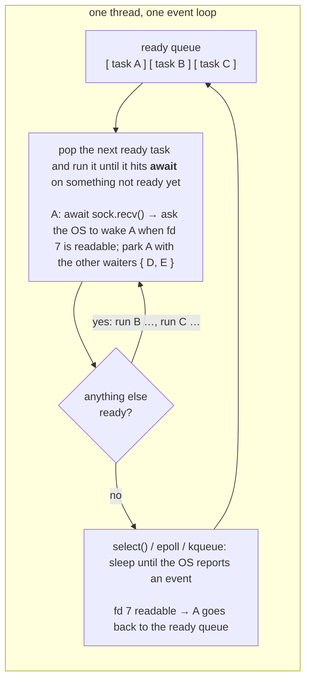

# Why `asyncio`

Most server-side and data-plane Python programs spend the bulk of their wall-clock time *waiting*: for a socket to deliver bytes, for an HTTP response, for a database row, for an object in blob storage. The CPU is idle during those waits, and a program that performs them one at a time has its throughput capped by latency — 1,000 requests at 50 ms each is 50 seconds of mostly doing nothing.

Throughput therefore comes from *overlap*: keeping many operations in flight and reacting to each as it completes. The classic tool for overlap is threads, and Python threads do work for I/O, but they are a poor fit for *high* concurrency: each thread costs memory and kernel scheduling, shared state needs locks, and the GIL means threads never speed up the Python code itself. Ten thousand connections cannot be ten thousand threads. Detailed analysis of threads memory and context-switch overhead is in [appendix](#appendix-measuring-threads-vs-asyncio).

`asyncio` is the standard library's answer: one thread, one event loop, and tens of thousands of cheap *tasks* that hand control to one another at exactly the points where they would otherwise block. That is why it has become the default concurrency model for high-throughput Python — web servers and clients (FastAPI/Starlette, aiohttp, httpx), database drivers (asyncpg), object-storage clients, LLM API clients and inference gateways, crawlers, and the data-loading and orchestration layers of ML systems are all built on it.

The hard part is not the idea but the API. `asyncio` has been redesigned twice since 2014 and the module still carries every generation. Most tutorials online freeze a random point in that history. This post review the **modern** API as of Aug 2026 (Python 3.11+) as a small number of groups rather than a long list of functions. What to expect:

1. **The mental model** — how the event loop schedules tasks, and why that makes waiting free.
2. **The API map** — eight groups (run, define, schedule, wait, bound, coordinate, escape, I/O) and which to reach for when.
3. **The core groups in detail** — coroutines and tasks; waiting for many (`gather` vs. `TaskGroup` vs. `as_completed` vs. `wait`); timeouts and cancellation; synchronization primitives; blocking code and threads.
4. **Design patterns** — bounded fan-out, worker pools, pipelines, races, retries, rate limiting, micro-batching, graceful shutdown.
5. **Three complete programs** — a prefetching data loader, a staged pipeline, and a request-batching server. I work on ML infrastructure, so the examples lean that way; the patterns are the same for any I/O-heavy service.
6. **A legacy → modern translation table**, plus a curated reading and exercise list.
7. **An appendix that measures threads vs. asyncio** — per-waiter memory, context-switch cost, the concurrency cliff, the GIL convoy effect, and a quantitative tipping point.

Everything targets **Python 3.11+** (a couple of 3.13 conveniences are called out); all snippets were run on 3.14.

---

## Python concurrency: the GIL and `asyncio`

Python gives you three concurrency tools. Pick by what your work is *bound by*.

| Your work is bound by | Use | Why |
|---|---|---|
| Waiting on I/O (network, disk, RPC) | `asyncio` | One thread juggles thousands of waits with no thread-switch cost and no locks around shared state |
| A blocking library you cannot change | threads, via `asyncio.to_thread()` | The GIL is released while a thread blocks inside a C call (socket, file, `sleep`), so blocking waits overlap |
| CPU (decode, tokenization, numerics) | processes (`ProcessPoolExecutor`), native code that releases the GIL (NumPy, PyTorch), or a free-threaded build | The GIL lets one thread execute Python bytecode at a time, so threads add no CPU parallelism |

The **Global Interpreter Lock** is why "just add threads" disappoints: only one thread runs Python bytecode at any instant. Threads *do* help for I/O because the GIL is released during blocking system calls — but each thread costs stack memory and OS scheduling, and shared state needs locks. 

`asyncio` flips the model. Instead of the OS switching between threads at arbitrary instructions, **one thread runs an event loop that switches between tasks only at explicit `await` points**.

[Appendix](#appendix-measuring-threads-vs-asyncio) contains detailed analysis of [the concurrency cliff](#3-scaling-n-waiters-each-doing-10--10-ms-of-io), and [the resulting tipping point](#the-tipping-point) between threads and `asyncio`.

### How the event loop works



Three consequences worth internalizing:

1. **Concurrency, not parallelism.** Exactly one task runs at a time. Two tasks never touch the same object simultaneously, so plain dicts and lists are safe *between* awaits.
2. **Switches happen only at `await`.** Code between two awaits is atomic with respect to other tasks. The flip side: a task that never awaits — a CPU loop, `time.sleep()`, a blocking `requests.get()` — freezes *everyone*.
3. **Waiting is free.** A parked task costs a few KB and zero CPU. Ten thousand idle connections are fine.

### `asyncio.run()`: the entry point

```python
import asyncio

async def main():
    ...

if __name__ == "__main__":
    asyncio.run(main())
```

`asyncio.run()` creates the loop, runs `main()` to completion, cancels leftover tasks, and closes the loop. Call it **once, at the program boundary**. Inside the loop you never call it again — you `await` things.

---
# Basics of `asyncio`

## The `asyncio` API map

The module exposes well over a hundred names, but almost everything you will use falls into eight groups. This table *is* the mental model; the rest of the post walks through the groups in order.

| Group | APIs | Reach for it when |
|---|---|---|
| **1. Run the loop** | `asyncio.run()` | Once, at the top of the program |
| **2. Define work** | `async def`, `await`, `async with`, `async for` | Everything that executes inside the loop |
| **3. Schedule work** | `asyncio.create_task()`, `asyncio.TaskGroup`, `asyncio.Task` | You want two things to make progress at the same time |
| **4. Wait for many** | `TaskGroup`, `gather()`, `as_completed()`, `wait()` | Collect results, react as they finish, or race |
| **5. Bound time, cancel** | `asyncio.timeout()`, `timeout_at()`, `wait_for()`, `Task.cancel()`, `shield()` | Deadlines, retries, clean shutdown |
| **6. Coordinate** | `Queue`, `Semaphore`, `Lock`, `Event`, `Condition`, `Barrier` | Limit concurrency, hand work off, apply backpressure |
| **7. Leave the loop** | `to_thread()`, `loop.run_in_executor()`, `run_coroutine_threadsafe()` | Blocking libraries, CPU work, other threads |
| **8. Talk to the world** | streams (`open_connection`, `start_server`), `create_subprocess_exec`; third-party `aiohttp`/`httpx`/`aiofiles`/`asyncpg` | Sockets, processes, real I/O |

Plus one row for **observing**: `asyncio.run(debug=True)` / `PYTHONASYNCIODEBUG=1`, `asyncio.all_tasks()`, and in 3.14 `python -m asyncio ps <pid>` / `pstree <pid>` to dump a live process's task tree.

Groups 1–4 are the whole story for most programs: *run → define → schedule → wait*. Groups 5–6 are control. Group 7 is the escape hatch. Group 8 is where the bytes actually move — and in practice mostly means a third-party async-native library.

---

## Coroutines and tasks

### Coroutines: pausable functions

`async def` defines a **coroutine function**. Calling it does *not* run it — it returns a **coroutine object**, a frozen frame holding the code, its locals, and an instruction pointer. `await` is what runs it:

```python
async def fetch(name: str, delay: float) -> str:
    await asyncio.sleep(delay)      # stand-in for network / disk I/O
    return name.upper()

async def main():
    coro = fetch("a", 0.1)          # nothing has run yet
    result = await coro             # runs here, until fetch() returns
```

`await x` does two things: it drives `x` forward, and whenever `x` has to wait, it yields control to the loop so other tasks can run. Only *awaitables* can be awaited: coroutines, Tasks, Futures, and objects that define `__await__`.

The most common beginner bug is forgetting the `await`. Python tells you — `RuntimeWarning: coroutine 'fetch' was never awaited` — and nothing runs.

### Tasks: coroutines scheduled on the loop

`await coro` runs one thing and waits for it, so chaining awaits is *sequential*. To get concurrency you wrap coroutines in **Tasks**, which the loop runs independently:

```python
async def sequential():
    a = await fetch("a", 1.0)
    b = await fetch("b", 1.0)                   # 2.0 s total

async def concurrent():
    ta = asyncio.create_task(fetch("a", 1.0))   # scheduled; starts at the next await
    tb = asyncio.create_task(fetch("b", 1.0))
    a = await ta                                # ~1.0 s total
    b = await tb
```

`create_task()` schedule coroutine on to event loop queue, and returns a `Task` immediately; A `Task` is a coroutine plus a handle with methods: `.result()`, `.exception()`, `.done()`, `.cancel()`, `.cancelled()`, `.get_name()`, `.add_done_callback()`.  Two rules:

- **Keep a reference.** The loop holds only weak references; an un-referenced task can be garbage-collected mid-flight. `TaskGroup` (next section) does this for you.
- **A task that raises does not crash your program by itself.** The exception is stored in the task and re-raised when you `await` it; if you never do, you get a "Task exception was never retrieved" log at garbage collection. Again, `TaskGroup` fixes this.

Three awaitables to keep straight:

| | What it is | Where you get one |
|---|---|---|
| **coroutine** | A paused function; nothing runs until awaited | Calling an `async def` |
| **Task** | A coroutine scheduled on the loop, with a handle | `create_task()`, `TaskGroup.create_task()` |
| **Future** | Low-level promise: a slot a result will be set into. `Task` is a subclass | `loop.run_in_executor()`, `loop.create_future()` — rarely use in application program |

---

## Waiting for many tasks and handling errors

Four APIs wait for a group of tasks. They differ in what they return and, more importantly, in what happens when one task fails.

| API | Returns | On first exception | Cancels the others? | Use when |
|---|---|---|---|---|
| `await t1; await t2` | Each value in turn | Raises at that await | — | Sequential steps depend on each other |
| `asyncio.gather(*aws)` | List, **in input order** | Raises immediately (`return_exceptions=True` → exceptions become list items) | **No** — siblings keep running | You need an ordered list of results |
| `asyncio.TaskGroup` | Nothing; read `task.result()` | Cancels siblings, waits for them, raises `ExceptionGroup` | **Yes** | Default for any group of related work |
| `asyncio.as_completed(aws)` | Iterator, **in completion order** | Raises when you await that item | No | Stream results as they arrive |
| `asyncio.wait(tasks)` | `(done, pending)` sets | Never raises; you inspect `done` | No | Races, "first N", custom policies |

### `gather()`: ordered results

```python
results = await asyncio.gather(fetch("a", 0.3), fetch("b", 0.1), fetch("c", 0.2))
# ['A', 'B', 'C'] — input order, even though b finished first
```

Its failure mode is the surprise: with defaults, the first exception is raised to you, but **the other coroutines keep running unsupervised** — they are now orphans that may finish, fail silently, or hold resources. `return_exceptions=True` turns exceptions into values in the list, which is useful for "try everything, report what failed" but easy to abuse: a `ValueError` sitting in a list of results is trivially ignored.

### `TaskGroup`: structured concurrency (your default)

Added in 3.11, `TaskGroup` is a scope that *owns* the tasks created inside it. The `async with` block does not exit until every task has finished, and if one fails, the rest are cancelled first:

```python
async def main():
    try:
        async with asyncio.TaskGroup() as tg:
            tg.create_task(boom(0.1))                   # raises ValueError
            tg.create_task(fetch("slow-sibling", 0.3))  # gets cancelled
    except* ValueError as eg:                           # 3.11: matches inside the ExceptionGroup
        print("failed:", eg.exceptions)
```

Errors arrive as an `ExceptionGroup` (several tasks can fail at once), which is why the handler uses `except*`. Nothing is orphaned, nothing leaks. This is the same "structured concurrency" idea Trio pioneered: a task's lifetime is bounded by the block that created it, the way a local variable's lifetime is bounded by its function.

`TaskGroup` does not collect results for you. Keep the task handles and read them after the block — the order is whatever order you kept them in:

```python
async with asyncio.TaskGroup() as tg:
    tasks = [tg.create_task(fetch(name, d)) for name, d in jobs]
results = [t.result() for t in tasks]      # same order as `jobs`, like gather()
```

### `as_completed()`: react as they finish

When early results are useful — show progress, start downstream work — iterate in completion order. Since 3.13 it is an async iterator that yields your original task objects:

```python
tasks = [asyncio.create_task(fetch(n, d)) for n, d in [("slow", .3), ("fast", .1), ("medium", .2)]]
async for task in asyncio.as_completed(tasks):
    print("received:", task.result())      # fast, medium, slow
```

### `wait()`: races and custom policies

`wait()` never raises; it hands you `done` and `pending` sets so you decide what to do. The canonical use is a race — first response wins, cancel the rest:

```python
tasks = {asyncio.create_task(fetch("replica-1", 0.3)),
         asyncio.create_task(fetch("replica-2", 0.1))}

done, pending = await asyncio.wait(tasks, return_when=asyncio.FIRST_COMPLETED)
winner = done.pop().result()
for t in pending:
    t.cancel()
await asyncio.gather(*pending, return_exceptions=True)   # let the cancellations land
```

`return_when` is `FIRST_COMPLETED`, `FIRST_EXCEPTION`, or `ALL_COMPLETED` (default). Since 3.11 `wait()` requires Tasks — passing bare coroutines is a `TypeError`.

**Rule of thumb:** `TaskGroup` first. `gather()` when you specifically want an ordered list and understand its failure semantics. `as_completed()` to stream. `wait()` to race.

---

## Timeouts and cancellation

### `asyncio.timeout()`: a deadline for a block

The modern form (3.11) is a context manager that bounds *everything inside the block*, not just one call:

```python
async def get_data():
    try:
        async with asyncio.timeout(2.0):
            header = await fetch("header", 0.5)
            body = await fetch("body", 1.0)         # the 2.0 s budget covers both
            return header, body
    except TimeoutError:                            # builtin; asyncio.TimeoutError is a deprecated alias
        return None
```

`asyncio.timeout_at(when)` takes an absolute loop-time deadline (`loop.time() + 2`), handy when a deadline must be threaded through several calls. The older `asyncio.wait_for(aw, timeout)` still works for a single awaitable and is now implemented on top of `timeout()`.

### How cancellation works

Cancellation is *cooperative*. `task.cancel()` does not kill anything; it arranges for `CancelledError` to be raised inside the task **at its next `await`**. From there the exception unwinds through the task's frames like any other, running `finally` blocks and `async with` exits on the way out. That is what makes `finally` the right place for cleanup:

```python
async def worker():
    resource = await open_resource()
    try:
        await resource.process()
    except asyncio.CancelledError:
        log.info("worker cancelled")      # optional: observe it ...
        raise                             # ... but always re-raise
    finally:
        await resource.close()            # runs on success, error, and cancellation
```

Three facts make cancellation safe to reason about:

1. `CancelledError` derives from `BaseException` (since 3.8), so a broad `except Exception:` will **not** swallow it. Only an explicit `except CancelledError` or a bare `except:` can.
2. `TaskGroup` and `asyncio.timeout()` are *implemented with* cancellation: a timeout cancels the task, then converts the `CancelledError` into `TimeoutError` at the block's exit. If your code swallows the `CancelledError`, the block simply runs to completion and no `TimeoutError` is ever raised — the timeout silently stops working. The same swallowing breaks a `TaskGroup`'s ability to shut down siblings.
3. For work that must finish even if the caller gives up (a commit, a final flush), wrap it in `asyncio.shield(coro)`. The outer timeout still fires, but the shielded coroutine keeps running to completion.

---

## Coordinating tasks: synchronization primitives

Because only one task runs at a time, you do **not** need locks to mutate a dict or append to a list. You need primitives for four situations, and each has one obvious tool:

| Situation | Primitive | Idiom |
|---|---|---|
| Limit how many tasks do X at once (connections, threads, API quota) | `asyncio.Semaphore(n)` | `async with sem:` |
| A *check → await → act* sequence must not interleave with another task's | `asyncio.Lock()` | `async with lock:` |
| One task announces "it happened"; many wait for it | `asyncio.Event()` | `await ev.wait()` / `ev.set()` |
| Hand work between producers and consumers, with backpressure | `asyncio.Queue(maxsize)` | `await q.put()` / `await q.get()` |

`Condition` and `Barrier` (3.11) exist for the rare cases the four above cannot express. None of these are thread-safe — they coordinate tasks *within* one loop.

### `Semaphore`: bounded concurrency

The single most useful primitive in an I/O program. Creating 10,000 tasks is cheap; opening 10,000 connections is not. Let all the tasks exist but only `n` proceed at a time:

```python
sem = asyncio.Semaphore(16)

async def bounded_fetch(url):
    async with sem:                        # at most 16 in flight
        return await fetch(url)

async with asyncio.TaskGroup() as tg:
    tasks = [tg.create_task(bounded_fetch(u)) for u in urls]   # 10,000 is fine
```

### `Lock`: protect check-then-act across an `await`

Without a lock, five tasks that all find the cache empty will all refresh the token. The interleaving happens at the `await` inside the `if`:

```python
lock, cache = asyncio.Lock(), {}

async def get_token():
    async with lock:                       # without this: 5 concurrent callers → 5 refreshes
        if "token" not in cache:
            cache["token"] = await refresh_token()
        return cache["token"]
```

Note what this lock is *for*. In threaded code a lock guards against hazards at the level of memory: two threads can be inside the same statement at the same instant, so even `counter += 1` needs protection. That hazard does not exist in asyncio — exactly one task runs at a time, and it can only be interrupted at an `await`. What `asyncio.Lock` provides instead is *isolation for a multi-step operation that spans awaits*: it serializes the whole read → await → write sequence so that no other task's run of the same sequence can interleave with it — a transaction, not a memory barrier. The rule that follows is simple: a critical section needs a lock exactly when it contains an `await`; a sequence with no `await` in it is already atomic.

### `Event`: one-shot broadcast

"Model loaded", "config ready", "shutdown requested". Waiters park on `wait()`; one `set()` wakes them all:

```python
ready = asyncio.Event()

async def worker(i):
    await ready.wait()                     # parks until set()
    ...

async def loader():
    await load_model()
    ready.set()                            # releases every waiter at once
```

### `Queue`: producer/consumer with backpressure

`maxsize` is the backpressure knob: when the queue is full, `put()` suspends the producer until a consumer takes an item, so a fast producer cannot bury a slow consumer in memory. Since 3.13, `shutdown()` gives a clean way to end the stream: consumers drain what is left, then `get()` raises `QueueShutDown`.

```python
q: asyncio.Queue[int] = asyncio.Queue(maxsize=8)

async def producer():
    for item in source():
        await q.put(item)                  # blocks while 8 items are waiting
    q.shutdown()                           # 3.13+: "no more items"; pre-3.13, put a None sentinel per consumer

async def consumer():
    while True:
        try:
            item = await q.get()
        except asyncio.QueueShutDown:
            return                         # queue drained and closed
        await process(item)
        q.task_done()

async with asyncio.TaskGroup() as tg:
    tg.create_task(producer())
    for _ in range(4):
        tg.create_task(consumer())         # 4 consumers share one queue = a worker pool
```

---

## Blocking code: `to_thread()` and executors

Everything above assumes the code you `await` is *async-native* — it yields to the loop when it waits. A lot of code is not: `boto3`, `requests`, `open().read()`, `time.sleep()`, most database drivers. Call one of those inside a coroutine and the whole loop stalls until it returns:

```python
async def bad():
    time.sleep(5)              # every other task freezes for 5 s
    requests.get(url)          # same
```

The fix is `asyncio.to_thread()` (3.9): run the blocking function in a worker thread and `await` its result. The thread blocks; the loop does not.

```python
def read_shard(path: str) -> bytes:        # blocking SDK call
    return s3.get_object(path)["Body"].read()

async def main():
    # four blocking reads overlap: ~1× the latency, not 4×
    async with asyncio.TaskGroup() as tg:
        tasks = [tg.create_task(asyncio.to_thread(read_shard, p)) for p in paths]
```

Three things to know:

1. **It shares one default thread pool**, sized `min(32, cpu_count + 4)`. Ten thousand `to_thread()` calls do not spawn ten thousand threads; they queue. Bound them yourself with a `Semaphore`, or install a bigger pool with `loop.set_default_executor(ThreadPoolExecutor(max_workers=64))`.
2. **It does not speed up CPU-bound Python.** Threads share the GIL. For example, four 0.3 s CPU calls took 1.1 s via `to_thread()` and 0.37 s via a process pool. For CPU work use `loop.run_in_executor(ProcessPoolExecutor(), fn, *args)`, native code that releases the GIL (NumPy, PyTorch, PIL decode), or a free-threaded (`python3.14t`) build where `to_thread()` does parallelize — if your dependencies support it.
3. **The reverse direction exists.** From a plain thread (a callback from a C library, say) you cannot `await`; use `asyncio.run_coroutine_threadsafe(coro, loop)` to hand a coroutine to the loop, or `loop.call_soon_threadsafe(fn)` for a plain function. These are the thread-safe entry points into a running loop; nearly everything else in `asyncio` is not thread-safe.

For code with blocking CPU work use `loop.run_in_executor(ProcessPoolExecutor(), fn, *args)` to run it in python process with separate GIL:

```python
loop = asyncio.get_running_loop()
with ProcessPoolExecutor() as pool:
    results = await asyncio.gather(*(loop.run_in_executor(pool, cpu_bound, n) for n in inputs))
```

---

# Design patterns for concurrent `asyncio`

The primitives compose into a small number of recurring shapes. Recognizing them is most of the skill.

| Pattern | Problem | Built from |
|---|---|---|
| **Bounded fan-out** | Do N things concurrently without opening N connections | `TaskGroup` + `Semaphore` |
| **Worker pool** | Fixed concurrency, natural backpressure, no per-item task | `Queue` + K identical consumer tasks |
| **Staged pipeline** | Different stages need different concurrency (I/O vs CPU) | Worker pools chained by bounded `Queue`s |
| **Ordered prefetch** | Preserve input order with bounded memory | Sliding window of tasks + `Queue` |
| **Race / hedging** | Cut tail latency by asking two replicas | `wait(FIRST_COMPLETED)` + cancel losers |
| **Retry with backoff** | Survive transient failures without a thundering herd | `timeout()` per attempt + exponential sleep + jitter |
| **Rate limiting** | Respect an external QPS quota | Token bucket guarded by a `Lock` |
| **Micro-batching** | Amortize a fixed cost (GPU launch, DB round trip) across requests | `Queue` of `(item, Future)` + a batch worker |
| **Graceful shutdown** | Finish or flush in-flight work on SIGTERM | Signal handler → cancel → `TaskGroup` unwinds → `finally` |

Bounded fan-out and the worker pool appeared in previous section; the pipeline and ordered prefetch are worked in full in the next section. Here are the other five.

### Retry with backoff and a per-attempt timeout

Each attempt gets its own deadline; delays grow exponentially with jitter so a thousand clients do not retry in lockstep. Because `CancelledError` is a `BaseException`, the `except` tuple cannot accidentally retry a cancellation.

```python
async def retry(fn, *, attempts=5, base=0.1, cap=2.0, per_try=1.0,
                retry_on=(ConnectionError, TimeoutError)):
    for attempt in range(1, attempts + 1):
        try:
            async with asyncio.timeout(per_try):
                return await fn()
        except retry_on:
            if attempt == attempts:
                raise
            delay = min(cap, base * 2 ** (attempt - 1)) * random.uniform(0.5, 1.5)
            await asyncio.sleep(delay)
```

### Rate limiting: token bucket

Tokens refill at `rate` per second up to `burst`; each call takes one or waits for it. The `Lock` makes waiters take turns instead of all waking at once.

```python
class RateLimiter:
    def __init__(self, rate: float, burst: int):
        self.rate, self.burst = rate, burst
        self.tokens, self.updated = float(burst), time.monotonic()
        self.lock = asyncio.Lock()

    async def acquire(self):
        async with self.lock:
            now = time.monotonic()
            self.tokens = min(self.burst, self.tokens + (now - self.updated) * self.rate)
            self.updated = now
            if self.tokens < 1:
                await asyncio.sleep((1 - self.tokens) / self.rate)
                self.tokens, self.updated = 0.0, time.monotonic()
            else:
                self.tokens -= 1
```

With `RateLimiter(rate=5, burst=2)`, six concurrent calls run at t = 0, 0, 0.2, 0.4, 0.6, 0.8 s.

### Micro-batching: request coalescing

A GPU forward pass costs about the same for 1 input as for 16, so a server that runs one forward per request wastes most of the GPU. The batcher lets callers `await submit(x)` as if it were a per-item call, while a single worker collects concurrent submissions into batches. This is the one place a `Future` is the right tool: each caller gets a receipt that the worker later fills in.

```python
class Batcher:
    def __init__(self, run_batch, *, max_size=16, max_wait=0.005):
        self.run_batch, self.max_size, self.max_wait = run_batch, max_size, max_wait
        self.queue: asyncio.Queue = asyncio.Queue()

    async def submit(self, item):
        fut = asyncio.get_running_loop().create_future()    # the caller's receipt
        await self.queue.put((item, fut))
        return await fut

    async def worker(self):
        while True:
            items, futs = [], []
            item, fut = await self.queue.get()               # wait for the first request ...
            items.append(item); futs.append(fut)
            try:
                async with asyncio.timeout(self.max_wait):   # ... then fill the batch briefly
                    while len(items) < self.max_size:
                        item, fut = await self.queue.get()
                        items.append(item); futs.append(fut)
            except TimeoutError:
                pass
            try:
                for f, r in zip(futs, await self.run_batch(items)):
                    f.set_result(r)
            except Exception as e:
                for f in futs:
                    f.set_exception(e)
```

Twenty concurrent `submit()` calls against a 50 ms "model" finished in 0.17 s using 3 batches, versus 1.0 s one at a time. `max_wait` is the latency you are willing to trade for throughput.

### Race / hedged requests

Send the same request to two replicas, take the first answer, cancel the other. This is the `wait(FIRST_COMPLETED)` snippet from earlier; the important detail is to `await` the cancelled losers so their cleanup actually runs before you move on.

### Graceful shutdown

Structured concurrency makes this almost free. Cancel the main task on SIGTERM; the cancellation propagates down through every `TaskGroup`, each worker's `finally` runs, and the groups wait for them before the program exits. `asyncio.run()` already does this for SIGINT.

```python
async def worker(i):
    try:
        while True:
            await do_work()
    finally:
        await flush_and_close()             # runs on cancellation

async def main():
    loop = asyncio.get_running_loop()
    loop.add_signal_handler(signal.SIGTERM, asyncio.current_task().cancel)
    try:
        async with asyncio.TaskGroup() as tg:
            for i in range(3):
                tg.create_task(worker(i))
    except asyncio.CancelledError:
        log.info("shutdown complete")      # every worker has flushed
```

For queue-fed workers, prefer *drain then exit* over cancellation: stop the producers, call `queue.shutdown()`, and let consumers finish what is queued.

---

# Put it together

Three complete programs that compose the pieces. Each ran as shown; the stand-in `time.sleep()` calls play the role of real network and GPU latency.

### Parallel data loader

Goal: feed a training loop from object storage using a blocking SDK, keep shards in order, bound memory, and never let the GPU wait. Pattern: **ordered prefetch** — a sliding window of `window` in-flight `to_thread()` reads, results forwarded in order into a bounded queue that the trainer consumes.

```python
import asyncio, itertools, time
from collections import deque

def read_shard(shard_id: int) -> bytes:
    """Stand-in for boto3 / fsspec: blocks its thread on the network (~100 ms)."""
    time.sleep(0.1)
    return b"..."

def gpu_step(batch: bytes) -> None:
    time.sleep(0.02)                                    # H2D copy + forward/backward

async def load_shard(shard_id: int) -> bytes:
    return await asyncio.to_thread(read_shard, shard_id)

async def prefetch(shard_ids, out: asyncio.Queue, window: int) -> None:
    """Ordered, bounded prefetch: keep at most `window` shards in flight."""
    ids = iter(shard_ids)
    async with asyncio.TaskGroup() as tg:
        inflight = deque(tg.create_task(load_shard(i)) for i in itertools.islice(ids, window))
        while inflight:
            await out.put(await inflight.popleft())     # blocks if the trainer is slow -> backpressure
            if (nxt := next(ids, None)) is not None:
                inflight.append(tg.create_task(load_shard(nxt)))
    out.shutdown()                                      # tell the trainer we're done

async def train(inp: asyncio.Queue) -> int:
    steps = 0
    while True:
        try:
            batch = await inp.get()
        except asyncio.QueueShutDown:
            return steps
        await asyncio.to_thread(gpu_step, batch)        # a blocking call, so off the loop
        steps += 1

async def main():
    q = asyncio.Queue(maxsize=8)                        # prefetch depth
    async with asyncio.TaskGroup() as tg:
        tg.create_task(prefetch(range(32), q, window=16))
        trainer = tg.create_task(train(q))
    print(trainer.result(), "steps")

asyncio.run(main())
```

Sequential `read → step` took **4.2 s** for 32 shards; the prefetching version took **0.89 s**, close to the 0.64 s floor set by the GPU alone. The loader has disappeared from the critical path, which is the whole goal. Memory is bounded by `window + maxsize` shards regardless of dataset size, and a failure in any read cancels everything cleanly via the `TaskGroup`.

### Producer/consumer pipeline

Goal: download → decode → upload, where downloading is I/O (wants many workers), decoding is CPU (wants a few threads, or a process pool), and uploading is I/O again. Pattern: **staged pipeline** — one generic `stage()` worker pool, chained by bounded queues, with shutdown propagating stage to stage.

```python
async def download(url: str) -> bytes:        # async-native I/O (aiohttp / httpx)
    ...

def decode(raw: bytes) -> "Tensor":           # CPU: image decode, tokenization
    ...

async def upload(item) -> None:
    ...

async def stage(inp: asyncio.Queue, out: asyncio.Queue | None, fn, workers: int) -> None:
    """A worker pool: pull from `inp`, apply async `fn`, push to `out`.
    When `inp` is shut down and drained, shut `out` down so the next stage finishes too."""
    async def worker():
        while True:
            try:
                item = await inp.get()
            except asyncio.QueueShutDown:
                return
            result = await fn(item)
            if out is not None:
                await out.put(result)

    async with asyncio.TaskGroup() as tg:
        for _ in range(workers):
            tg.create_task(worker())
    if out is not None:
        out.shutdown()

async def main():
    urls, raws, decoded = asyncio.Queue(), asyncio.Queue(maxsize=16), asyncio.Queue(maxsize=16)
    for u in list_urls():
        urls.put_nowait(u)
    urls.shutdown()

    async with asyncio.TaskGroup() as tg:
        tg.create_task(stage(urls, raws, download, workers=16))
        tg.create_task(stage(raws, decoded, lambda r: asyncio.to_thread(decode, r), workers=4))
        tg.create_task(stage(decoded, None, upload, workers=8))
```

Forty items that would take ~6.8 s sequentially finished in **0.39 s**. Each stage's `workers` is tuned independently — 16 for the network-bound download, 4 threads for CPU-bound decode — and the `maxsize=16` queues keep a fast stage from flooding a slow one. To scale decode past the GIL, swap `to_thread` for `loop.run_in_executor(process_pool, decode, r)`; nothing else changes.

### Async web server

Goal: an inference server where one task per connection handles requests, per-request deadlines are enforced, and the "model" runs on batches, not single items. Pattern: **streams + micro-batching** — `asyncio.start_server()` spawns `handle()` per connection; every handler awaits `Batcher.submit()`, and one worker feeds the GPU.

```python
def model_forward(batch: list[str]) -> list[str]:
    time.sleep(0.05)                                     # one GPU forward for the whole batch
    return [s.upper() for s in batch]

async def handle(reader: asyncio.StreamReader, writer: asyncio.StreamWriter, batcher: Batcher):
    """One task per connection. Idle connections cost nothing."""
    try:
        while line := await reader.readline():           # one request per line; b"" at EOF
            async with asyncio.timeout(2.0):
                result = await batcher.submit(line.decode().rstrip())
            writer.write(f"{result}\n".encode())
            await writer.drain()                         # backpressure if the client reads slowly
    except (TimeoutError, ConnectionResetError):
        pass
    finally:
        writer.close()
        await writer.wait_closed()

async def main():
    batcher = Batcher(lambda items: asyncio.to_thread(model_forward, items), max_size=16, max_wait=0.005)
    server = await asyncio.start_server(lambda r, w: handle(r, w, batcher), "127.0.0.1", 0)
    async with server, asyncio.TaskGroup() as tg:
        tg.create_task(batcher.worker())
        await server.serve_forever()
```

Fifty concurrent connections, one request each, were served in **0.23 s using 4 GPU batches** — versus 2.5 s if each request ran its own forward pass. In production you would put FastAPI/Starlette + uvicorn in place of `start_server()`, but the shape is identical: a task per connection, `await` on I/O, and a batcher between the handlers and the accelerator.

---

# Reference

### Official documentation

- [High-level API index](https://docs.python.org/3.14/library/asyncio-api-index.html) — one page listing everything worth knowing, grouped the same way as the map above.
- [Coroutines and Tasks](https://docs.python.org/3.14/library/asyncio-task.html) — the page to actually read: `run`, `create_task`, `TaskGroup`, `gather`, `timeout`, `wait`, `as_completed`, `to_thread`, and the cancellation section.
- [Queues](https://docs.python.org/3.14/library/asyncio-queue.html) · [Synchronization Primitives](https://docs.python.org/3.14/library/asyncio-sync.html) · [Streams](https://docs.python.org/3.14/library/asyncio-stream.html)
- [Developing with asyncio](https://docs.python.org/3.14/library/asyncio-dev.html) — debug mode, the "never awaited" and "exception was never retrieved" warnings, and thread-safety rules.
- What's New: [3.11](https://docs.python.org/3/whatsnew/3.11.html#asyncio) (TaskGroup, timeout, Runner), [3.12](https://docs.python.org/3/whatsnew/3.12.html#asyncio) (performance, eager tasks), [3.13](https://docs.python.org/3/whatsnew/3.13.html#asyncio) (`Queue.shutdown`, async `as_completed`), [3.14](https://docs.python.org/3/whatsnew/3.14.html#asyncio) (introspection, free-threading).

### Tutorials and talks, in reading order

Everything here was checked for which API generation it teaches. The docs and the first three entries are enough to become productive; the rest deepen specific corners.

1. [A Conceptual Overview of asyncio](https://docs.python.org/3/howto/a-conceptual-overview-of-asyncio.html) — official HOWTO (new in the 3.13/3.14 docs). The best short explanation of the event loop, coroutines vs. tasks, and the subtle point that awaiting a bare coroutine does *not* yield to the loop while awaiting a task does. Part 2 builds a homemade `asyncio.sleep` from `__await__` and Futures.
2. Hynek Schlawack, [Waiting in asyncio](https://hynek.me/articles/waiting-in-asyncio/) (updated 2023) — a systematic comparison of `await`, `create_task`, `gather`, `wait_for`, `as_completed`, `wait`, `TaskGroup`, and `asyncio.timeout()`. The single best article on choosing a waiting primitive; its conclusion matches this post's.
3. Łukasz Langa, [import asyncio: Learn Python's AsyncIO](https://www.youtube.com/playlist?list=PLhNSoGM2ik6SIkVGXWBwerucXjgP1rHmB) — six episodes by the core developer who now steers asyncio: the async ecosystem, the event loop, coroutines, coroutines under the hood, the standard library "batteries", and a Starlette web app. Predates `TaskGroup` (2020–21) but is `asyncio.run()`-era throughout.
4. Nathaniel J. Smith, [Notes on structured concurrency, or: Go statement considered harmful](https://vorpus.org/blog/notes-on-structured-concurrency-or-go-statement-considered-harmful/) and [Timeouts and cancellation for humans](https://vorpus.org/blog/timeouts-and-cancellation-for-humans/) (2018) — the Trio essays that produced nurseries and cancel scopes, which asyncio later adopted as `TaskGroup` and `timeout()`. Read these to understand *why* those two APIs behave as they do.
5. Junya Fukuda, [Asyncio Evolved: Enhanced Exception Handling with TaskGroup in Python 3.11](https://www.youtube.com/watch?v=FvWXyAXyb4Q) (EuroPython 2023, 26 min) — `gather`'s failure modes vs. `TaskGroup` + `except*`. Pair with Langa's [How Exception Groups Will Improve Error Handling in AsyncIO](https://www.youtube.com/watch?v=Lfe2zsGS0Js) for the PEP 654 motivation.
6. Brett Cannon, [How the heck does async/await work in Python 3.5?](https://snarky.ca/how-the-heck-does-async-await-work-in-python-3-5/) (2016) and David Beazley, [Build Your Own Async](https://www.youtube.com/watch?v=Y4Gt3Xjd7G8) (PyCon India 2019, [code](https://gist.github.com/dabeaz/f86ded8d61206c757c5cd4dbb5109f74)) — the mechanics: generators → `send()` → a toy scheduler → `async`/`await`. Neither uses asyncio; both explain what it is doing underneath.
7. Lynn Root, [asyncio: We Did It Wrong](https://www.roguelynn.com/words/asyncio-we-did-it-wrong/) (2018–19, nine parts) — graceful shutdown and signals, exception handling, mixing in threads, testing, debugging, profiling. Pre-`TaskGroup`, so the shutdown code is more manual than it needs to be today, but nothing else covers the production concerns this thoroughly.
8. Kumar Aditya, [Scaling asyncio on Free-Threaded Python](https://labs.quansight.org/blog/scaling-asyncio-on-free-threaded-python) (2025) and the official [asyncio and free-threaded Python](https://docs.python.org/3/library/asyncio-threading.html) page (3.14) — one event loop per thread, `asyncio.run()` per thread, hand off with `queue.Queue`. The 2026 answer to "threads or asyncio?".
9. Guido van Rossum, [Reasoning about asyncio.Semaphore](https://neopythonic.blogspot.com/2022/10/reasoning-about-asynciosemaphore.html) (2022) — fairness and cancellation bugs in the semaphore, and how they interact with `TaskGroup`/`timeout()` cancellation. Advanced; read after you have built a rate-limited client.
10. Books: Matthew Fowler, [*Python Concurrency with asyncio*](https://www.manning.com/books/python-concurrency-with-asyncio) (Manning, 2022) is the best book-length treatment of exactly this post's use case — high-throughput I/O with aiohttp, asyncpg, thread and process pools — but it is 3.10-era (`gather`/`wait_for`, no `TaskGroup`). Jason Brownlee's [Python Asyncio: The Complete Guide](https://superfastpython.com/python-asyncio/) is an exhaustive, `TaskGroup`-aware API-by-example reference; verbose, not a narrative.

Two popular resources to read with care: Real Python's [Python's asyncio: A Hands-On Walkthrough](https://realpython.com/async-io-python/) was rewritten in 2025 yet still teaches `gather` everywhere and never mentions `TaskGroup`, `asyncio.timeout()`, or `to_thread()` — fine as a gentle first read, not as a model for new code. The 500 Lines chapter [A Web Crawler With asyncio Coroutines](https://aosabook.org/en/500L/a-web-crawler-with-asyncio-coroutines.html) (Davis & van Rossum) is superb pedagogy — non-blocking sockets → callbacks → generators → Futures and Tasks — but its code is Python 3.4 (`@asyncio.coroutine`, `yield from`, `run_until_complete`); read it for the concepts and do not copy the code.

### Exercises

- [asyncio_puzzles](https://github.com/martianlantern/asyncio_puzzles) — twenty fill-in-the-`TODO` puzzles with pytest tests and a `solutions` branch, progressing from `sleep(0)` yielding through tasks, timeouts, cancellation cleanup, `Semaphore`, `Queue` pipelines, executors, TCP streams, signal shutdown, `TaskGroup` vs `gather`, `shield`, and retry with backoff. Young and lightly reviewed, but the best-structured asyncio exercise set available and modern-API throughout.
- **Port the 500 Lines crawler** to `TaskGroup` + `asyncio.timeout()` + `httpx.AsyncClient`. mCoding's [Intro to async Python: Writing a Web Crawler](https://www.youtube.com/watch?v=ftmdDlwMwwQ) ([code](https://github.com/mCodingLLC/VideosSampleCode/tree/master/videos/117_hello_async)) is a modern reference solution.
- **Build your own scheduler.** Work through Beazley's "Build Your Own Async" gist *before* watching the talk, then compare. The fastest route to really understanding `send()`, Futures, and cancellation.
- **Build a Redis clone** with `asyncio.start_server()` — CodeCrafters' [Build your own Redis](https://app.codecrafters.io/courses/redis/overview) stages are readable for free; the first several (RESP parsing, concurrent clients) are the asyncio-relevant part.
- **Extend this post's programs.** (a) Give the data loader a `RateLimiter` and a per-shard `retry()`, then read Guido's semaphore post. (b) Implement the S3 bulk read three ways — `to_thread(boto3)`, `aiobotocore`, `obstore` — and benchmark them. (c) Move the pipeline's decode stage onto a `ProcessPoolExecutor`. (d) Add SIGTERM handling and `Queue.shutdown()` to the server so in-flight batches finish. (e) Reproduce the "swallowed `CancelledError` defeats `asyncio.timeout()`" bug from the cancellation section, then fix it with `uncancel()`-free code.

### Libraries worth knowing

Async-native (they speak to the event loop directly):

- [aiohttp](https://docs.aiohttp.org/en/stable/) — HTTP client and server; the default for high-throughput fetching. [httpx](https://www.python-httpx.org/async/) — sync + async client with the nicer API and HTTP/2; slightly slower for bulk.
- [aiobotocore](https://github.com/aio-libs/aiobotocore) / [aioboto3](https://github.com/terricain/aioboto3) — async AWS clients (S3 is the best-supported service); [s3fs](https://s3fs.readthedocs.io/en/latest/) builds fsspec on top of aiobotocore. [obstore](https://developmentseed.org/obstore/latest/) — Rust `object_store` bindings for S3/GCS/Azure with sync and async APIs; currently the fastest option for concurrent small object reads and the one to evaluate first for data loading.
- [asyncpg](https://github.com/MagicStack/asyncpg) — PostgreSQL driver speaking the binary protocol natively. [uvloop](https://github.com/MagicStack/uvloop) — libuv-based drop-in event loop, 2–4× faster; `asyncio.run(main(), loop_factory=uvloop.new_event_loop)`.
- [anyio](https://anyio.readthedocs.io/en/stable/) — task groups and cancel scopes over asyncio *or* Trio; what Starlette and httpx are built on. [Trio](https://trio.readthedocs.io/en/stable/) — the alternative runtime `TaskGroup` borrowed from; a separate ecosystem.
- [Starlette](https://www.starlette.io/) / [FastAPI](https://fastapi.tiangolo.com/async/) / [uvicorn](https://uvicorn.dev) — the ASGI stack that consumes asyncio. FastAPI's [Concurrency and async/await](https://fastapi.tiangolo.com/async/) page is a good non-intimidating intro, and its rule that sync `def` endpoints run in a thread pool is `to_thread()` in disguise.

Thread-backed (blocking underneath, async on top): [aiofiles](https://github.com/Tinche/aiofiles) for local files (portable non-blocking disk I/O does not exist, so it delegates to a thread pool), and `asyncio.to_thread()` around `boto3`, `google-cloud-storage`, or any synchronous driver — simple and correct, at the cost of one OS thread per in-flight call instead of thousands of cheap coroutines.

---

# Appendix: 

## Modern vs. legacy API

Most of the fragmentation in asyncio tutorials comes from the API having been redesigned twice: `async`/`await` replaced generator coroutines in 3.5, and 3.7–3.11 replaced explicit loop management with `asyncio.run()`, `create_task()`, `TaskGroup`, and `timeout()`. If a tutorial's first line is `loop = asyncio.get_event_loop()`, it predates the modern API. The translation table:

| If you see (legacy) | Write instead (modern) | Since |
|---|---|---|
| `loop = asyncio.get_event_loop()`<br>`loop.run_until_complete(main())` | `asyncio.run(main())` | 3.7 (`get_event_loop()` raises with no loop in 3.14) |
| `@asyncio.coroutine` + `yield from` | `async def` + `await` | 3.5; decorator removed in 3.11 |
| `asyncio.ensure_future(coro)` | `asyncio.create_task(coro)` or `tg.create_task(coro)` | 3.7 / 3.11 |
| `asyncio.gather(*coros)` as the default fan-out | `async with asyncio.TaskGroup() as tg:` | 3.11 |
| `await asyncio.wait_for(coro, t)` | `async with asyncio.timeout(t): await coro` | 3.11 |
| `loop.run_in_executor(None, fn, *args)` | `await asyncio.to_thread(fn, *args, **kwargs)` | 3.9 |
| `asyncio.get_event_loop()` inside a coroutine | `asyncio.get_running_loop()` | 3.7 |
| `asyncio.wait([coro1, coro2])` | `asyncio.wait([task1, task2])` — coroutines are a `TypeError` | 3.11 |
| `for f in as_completed(aws): await f` | `async for t in as_completed(tasks): t.result()` | 3.13 |
| `q.put(None)` sentinels to stop consumers | `q.shutdown()` → consumers see `QueueShutDown` | 3.13 |
| `asyncio.TimeoutError` | builtin `TimeoutError` (the alias is deprecated) | 3.11 |
| `some_api(..., loop=loop)` | drop `loop=` — high-level APIs find the running loop | removed 3.10 |
| `asyncio.set_event_loop_policy(...)` | `asyncio.run(main(), loop_factory=...)` (e.g. `uvloop.new_event_loop`) | 3.12; policies deprecated 3.14, removed 3.16 |

Two practical notes on versions. **3.12** made asyncio substantially faster (task creation, `current_task()` in C, an opt-in eager task factory). **3.14** added first-class free-threading support and the `python -m asyncio ps <pid>` / `pstree <pid>` introspection commands, which show the live task tree of a running process — the first good answer to "what is my program waiting on?".


## Compare threads vs. `asyncio`

The introduction asserted that threads are a poor fit for high concurrency. This appendix shows how to *measure* that claim on your own machine, and what the measurements look like on mine: Python 3.14.7, macOS, 14 cores, GIL enabled, default 5 ms switch interval. Every number below comes from [one ~270-line script](/python-asyncio-bench.py); each case runs in a fresh subprocess so memory and context-switch counters start clean.

### What to measure, and with what

| Quantity | How to read it | What it tells you |
|---|---|---|
| Wall time | `time.perf_counter()` | Throughput and latency as the user sees them |
| CPU time, split user / system | `resource.getrusage(RUSAGE_SELF).ru_utime`, `.ru_stime` — process-wide, all threads | **System time ≫ user time in an I/O program is the thread tax**: the kernel is scheduling threads and handing off the GIL instead of running your code |
| Context switches | `ru_nvcsw` + `ru_nivcsw`; Linux also `/proc/<pid>/status`, `perf stat -e context-switches`, `vmstat 1` (`cs`) | Every thread wake-up or GIL handoff is one; an event loop does almost none |
| Memory | current RSS via `ps -o rss= -p <pid>` (or `/proc/self/statm`); peak via `ru_maxrss` (bytes on macOS, KB on Linux). `tracemalloc` does **not** see thread stacks | Per-thread vs. per-task footprint |
| GIL behaviour | `sys.getswitchinterval()` (5 ms default) | The latency an I/O thread pays whenever a CPU-bound thread holds the GIL |
| Live concurrency | `threading.active_count()`, `asyncio.all_tasks()`, `python -m asyncio ps <pid>` (3.14), `py-spy dump` | What is actually in flight |
| OS limits | `sysctl kern.num_taskthreads` (macOS), `ulimit -u` / `/proc/sys/kernel/threads-max` (Linux), `ulimit -n` for sockets | The hard ceilings |

All of it fits in one context manager, which every benchmark below uses:

```python
import gc, os, resource, subprocess, time

def rss_kb():
    return int(subprocess.run(["ps", "-o", "rss=", "-p", str(os.getpid())],
                              capture_output=True, text=True).stdout)   # Linux: /proc/self/statm

class Meter:
    def __enter__(self):
        gc.collect()
        self.rss0 = rss_kb()
        r = resource.getrusage(resource.RUSAGE_SELF)
        self.u0, self.s0, self.v0, self.i0 = r.ru_utime, r.ru_stime, r.ru_nvcsw, r.ru_nivcsw
        self.t0 = time.perf_counter()
        return self

    def __exit__(self, *exc):
        self.wall = time.perf_counter() - self.t0
        r = resource.getrusage(resource.RUSAGE_SELF)
        self.user, self.sys = r.ru_utime - self.u0, r.ru_stime - self.s0
        self.switches = (r.ru_nvcsw - self.v0) + (r.ru_nivcsw - self.i0)
        self.rss_mb = (rss_kb() - self.rss0) / 1024
```

### 1. Footprint: what a parked waiter costs

Start N threads that block on a `threading.Event`, or N tasks that `await` an `asyncio.Event`, and measure creation time and resident memory once they are all parked.

| Parked waiters | Threads: time, RSS | Tasks: time, RSS |
|---|---|---|
| 1,000 | 22.7 ms, 35 MB — **23 µs and 36 KB each** | 1.1 ms, 1.1 MB — **1.1 µs and 1.1 KB each** |
| 5,000 | 241 ms, 176 MB — 48 µs each (creation slows as the count grows) | 5.6 ms, 5.5 MB |
| 10,000 | `RuntimeError: can't start new thread` after 9,215 (`kern.num_taskthreads` = 9,216) | 11 ms, 10.5 MB |
| 100,000 | — | 157 ms, 104 MB |

A task is roughly **30× cheaper in memory and 20–40× cheaper to create** than a thread, and there is no OS ceiling on tasks. The 36 KB is *touched* memory; on Linux each thread also reserves an 8 MB virtual stack, so 10,000 threads means 80 GB of address space before they do anything.

### 2. Context switch: what one handoff costs

The classic measurement is ping-pong: two workers alternate through a pair of semaphores, so every round trip is exactly two switches. The thread and task versions are line-for-line identical, which makes them a fair comparison:

```python
def thread_pingpong(rounds):                       # asyncio version: same code with
    a, b = threading.Semaphore(0), threading.Semaphore(0)   # asyncio.Semaphore and `await x.acquire()`
    def pong():
        for _ in range(rounds): b.acquire(); a.release()
    t = threading.Thread(target=pong); t.start()
    with Meter() as m:
        for _ in range(rounds): b.release(); a.acquire()
    t.join()
    return m.wall / (2 * rounds)                   # seconds per switch
```

Run P independent pairs at once, keeping the total at 200,000 switches, and the two models move in opposite directions:

| Concurrent pairs | Threads: per switch, total CPU | Tasks: per switch, total CPU |
|---|---|---|
| 1 | **3.8 µs**, 0.8 s (56% system) | **14.8 µs**, 0.76 s |
| 4 | 5.6 µs, 2.1 s | — |
| 16 | 5.8 µs, 2.3 s | 1.6 µs, 0.19 s |
| 64 | 6.4 µs, 2.7 s | — |
| 256 | 9.2 µs, 4.1 s (85% system) | **0.87 µs**, 0.17 s |
| 4,096 | — | 1.0 µs, 0.20 s |

Two things worth understanding here:

- **One-on-one, a thread handoff is faster than an asyncio handoff — on macOS.** A thread switch is one kernel context switch plus a GIL handoff, about 4 µs. An asyncio switch that empties the ready queue has to go back through the selector — a `kqueue` syscall here — before the next task runs, and with only one runnable task there is nothing to share that syscall with. (`await asyncio.sleep(0)` measures 7.4 µs for the same reason.) On Linux, `epoll_wait` with a zero timeout is about a microsecond and the penalty vanishes; see the cross-check below.
- **Under load the ordering flips.** The event loop runs *every* ready task per iteration and then polls once, so the syscall is amortized: by 16 concurrently runnable pairs a task switch costs 1.6 µs and by 256 it is under 1 µs, almost all of it user-space Python. Threads go the other way: more runnable threads means more scheduler work and more GIL contention, and the system-time share climbs to 85%.

On macOS the crossover is at a handful of runnable workers; on Linux asyncio is ahead from the first pair. Either way, past a few runnable tasks asyncio wins and keeps widening. A faster loop implementation (uvloop) lowers the asyncio side further.

### 3. Scaling: N waiters, each doing 10 × 10 ms of "I/O"

`time.sleep()` releases the GIL and blocks in the kernel exactly like a socket read, so a thread that sleeps ten times for 10 ms is a fair stand-in for a connection doing ten 10 ms round trips. Ideal wall time is 100 ms regardless of N.

```python
def thread_sweep(n, iters=10, ms=10):
    def work():
        for _ in range(iters): time.sleep(ms / 1000)
    threads = [threading.Thread(target=work) for _ in range(n)]
    with Meter() as m:
        for t in threads: t.start()
        for t in threads: t.join()
    return m                                       # asyncio: TaskGroup + asyncio.sleep
```

| N | Threads: wall, CPU (system share) | Tasks: wall, CPU |
|---|---|---|
| 10 | 119 ms, 2.6 ms | 110 ms, 1.1 ms |
| 100 | 127 ms, 31 ms (90%) | 111 ms, 2.8 ms |
| 1,000 | 146 ms, **394 ms** (92%) | 118 ms, 23 ms |
| 2,000 | **26.6 s, 345 s** (99.7%) | 119 ms, 23 ms |
| 3,000 | 31.4 s, 406 s | 119 ms, 24 ms |
| 5,000 | 38.1 s, 486 s — 13 cores busy in the kernel | 122 ms, 110 ms |
| 9,000 | 41.4 s, 522 s | 199 ms, 199 ms |
| 10,000 | 36.2 s, 450 s (only ran because early threads exited before the cap was hit) | 224 ms, 223 ms |

Read the table row by row:

- **Up to 100** the two are indistinguishable in wall time. Threads already burn 10× the CPU, but 31 ms is nothing.
- **At 1,000** threads still hit the latency target (+46%) but spend **394 ms of CPU to do 100 ms of waiting**, 92% of it in the kernel. That is the thread tax made visible: 2.7 cores busy so that one core can wait.
- **Between 1,000 and 2,000 threads there is a cliff.** Wall time goes from 146 ms to 26 seconds — 260× the ideal — and 13 cores are saturated with kernel work. Nothing in the program changed except N.
- **asyncio is flat** at ~110–120 ms through 5,000 tasks, then rises to 224 ms at 10,000 because the *loop itself* is now CPU-bound: 100,000 timer wake-ups in 223 ms is 2.2 µs each on one core. That is asyncio's own ceiling — roughly **half a million events per second per loop** with the stdlib loop on this machine — and it degrades linearly, not off a cliff.

### 4. Is it thread count or wake-up rate?

Hold the total work per waiter constant and vary the shape:

| Configuration | Wake-ups | Threads: wall, CPU | Tasks: wall, CPU |
|---|---|---|---|
| 5,000 × (1 × 100 ms) | one burst of 5,000 | **23.1 s**, 300 s | 116 ms, 21 ms |
| 100 × (100 × 1 ms) | 100 k/s | 129 ms, 215 ms | 120 ms, 22 ms |
| 1,000 × (10 × 10 ms) | 100 k/s | 146 ms, 394 ms | 118 ms, 23 ms |
| 1,000 × (100 × 1 ms) | 1 M/s | 1.03 s, 8.3 s | 188 ms, 182 ms |
| 2,000 × (10 × 10 ms) | 200 k/s | 26.6 s, 345 s | — |

The cliff is governed by **how many threads want the GIL at the same moment**, not by the wake-up rate. A thousand threads at a million wake-ups per second degrade gracefully (10× ideal); two thousand at a fifth of that rate fall off the cliff; five thousand that wake *once* fall off the cliff. The mechanism is the GIL's wait protocol: every thread waiting for the GIL sleeps on a condition variable with a `switchinterval` timeout and, on timeout, forces the holder to release. With thousands of waiters the kernel spends its time on condition-variable and scheduler traffic and almost none on Python. These are macOS numbers. On Linux the same sweep shows no cliff at all up to 10,000 threads — the tax stays linear, about 0.4 ms of CPU per thread — because futex-based GIL waits and the Linux scheduler degrade gracefully where macOS collapses (see the cross-check below).

### 5. Real sockets, not `sleep()`

To confirm the simulation is honest, repeat it with real I/O. An asyncio echo server runs in a separate process. N clients each open one connection and perform 20 request/response round trips, so **N connections = 20 × N round trips**; the client side is implemented once with a thread per connection and once with a task per connection, and only the client process is measured. CPU per round trip is simply total CPU ÷ round trips.

| | 100 connections<br>(2,000 round trips) | 1,000 connections<br>(20,000 round trips) | 4,000 connections<br>(80,000 round trips) |
|---|---|---|---|
| **Wall time** — threads | 72 ms | 348 ms | 1.45 s |
| **Wall time** — tasks | 27 ms | 131 ms | 624 ms |
| ratio | 2.7× | 2.7× | 2.3× |
| **CPU time** (system share) — threads | 44 ms (84%) | 1.19 s (90%) | 4.69 s (90%) |
| **CPU time** (system share) — tasks | 21 ms (54%) | 131 ms (44%) | 620 ms (45%) |
| ratio | 2.1× | 9.1× | 7.6× |
| **CPU per round trip** — threads | 22 µs | 60 µs | 59 µs |
| **CPU per round trip** — tasks | 10 µs | 6.5 µs | 7.7 µs |
| **Context switches** — threads | 4,678 | 108,819 | 436,488 |
| **Context switches** — tasks | 608 | 33 | 369 |

The picture matches the `sleep()` simulation. Take the 4,000-connection column as a worked example — both versions did the identical 80,000 round trips:

- **Threads:** 1.45 s of wall time but 4.69 s of CPU time. CPU exceeds wall because the work was spread over many cores. 4.21 s of that CPU (90%) is *system* time — the kernel switching between 4,000 threads (436,488 context switches) and handing the GIL from one to the next — not the program's own work.
- **Tasks:** 624 ms of wall time and 620 ms of CPU time: one thread, one core, fully busy, 369 context switches in total.
- **Per round trip** (CPU ÷ 80,000): 59 µs with threads, 7.7 µs with tasks. The ~50 µs difference is the price of waking a thread and re-acquiring the GIL for every single response.

The other two columns tell the same story at smaller scale: threads take 2.3–2.7× the wall time at every size; their CPU overhead is 2× at 100 connections and 8–9× from 1,000 up; and their context switches grow with connections × round trips while asyncio's stay in the hundreds.

Two details are worth spelling out:

- **asyncio still shows ~45% system time.** That is the actual `send`/`recv` syscalls — the I/O itself — which any implementation must pay. Threads pay those too; the *extra* system time that pushes them to 90% is scheduling and GIL traffic.
- **At 4,000 connections the task version has wall ≈ CPU** (624 ≈ 620 ms). That means the client was CPU-bound on its single event-loop thread: 80,000 round trips in 0.62 s is as fast as this loop goes, and more connections would not have finished sooner. When you see wall ≈ CPU in an asyncio service, the loop is the bottleneck; the remedy is more loops (more processes, or one loop per thread on a free-threaded 3.14 build) or a faster loop (uvloop). The thread version's wall time is *lower* than its CPU time for the opposite reason: it spreads mostly-wasted work across many cores.

### 6. The GIL convoy: what one CPU-bound thread does to I/O latency

Measure the wake-up latency of `time.sleep(0.001)` in an I/O thread while K other threads run pure Python loops:

| CPU-bound threads alongside | p50 extra latency | p99 | max |
|---|---|---|---|
| 0 | 0.26 ms | 0.36 ms | 0.49 ms |
| 1 | **6.5 ms** | 6.6 ms | 6.6 ms |
| 2 | 5.3 ms | **24 ms** | 24 ms |

A single CPU-bound thread adds roughly one `switchinterval` (5 ms) to *every* I/O wake-up in the process, because the woken thread must wait for the GIL holder to be forced off it. This is why "just run the decode in a background thread" quietly ruins tail latency for every request in the same process — and why the pipeline example moves CPU stages to a process pool. (In asyncio the equivalent mistake is worse — a CPU-bound task stops the loop entirely — which is what `to_thread()` and executors are for.)

### Cross-check on Linux

The same script, run in a `python:3.14` container (Docker Desktop's Linux VM, kernel 7.0, aarch64, 14 CPUs — so kernel costs include some virtualization overhead):

| Measurement | Threads | Tasks |
|---|---|---|
| Parked waiter (n = 1,000 / 5,000) | 84–101 µs, **21 KB** each | 1.4 µs, 1.1 KB each |
| Switch, 1 pair | **15.9 µs** (63% system) | **1.35 µs** |
| Switch, 16 / 256 pairs | 17.2 / 18.1 µs | 0.87 / 1.08 µs |
| Sweep n = 1,000 (10 × 10 ms) | 276 ms wall, 378 ms CPU (82% system) | 137 ms, 26 ms |
| Sweep n = 2,000 | 541 ms, 1.06 s | 126 ms, 50 ms |
| Sweep n = 5,000 | 1.11 s, 2.15 s | 134 ms, 123 ms |
| Sweep n = 10,000 | **2.08 s, 4.02 s** (80% system) — no cap hit | 263 ms, 263 ms |
| Convoy, 1 CPU-bound thread | +6.1 ms p50 (vs 0.16 ms) | — |

Three differences from macOS, all worth knowing:

- **The one-on-one asyncio penalty disappears.** `epoll_wait` with a zero timeout is about a microsecond, so a task switch costs 1.35 µs even with a single runnable task — 12× cheaper than a thread switch in the same VM. The macOS result above is a kqueue artifact, not an asyncio property.
- **There is no cliff and no cap** up to 10,000 threads; instead a steady linear tax of roughly 0.2 ms of wall time and 0.4 ms of CPU per thread, 80% of it system time. At 10,000 threads that is 20× the ideal wall time and 16× asyncio's CPU. Linux's futex-based GIL waits and its scheduler simply degrade gracefully where macOS collapses.
- **Everything else is the same shape.** Thread footprint 20× a task's, switch cost 15× and rising with concurrency versus asyncio's falling, the convoy effect identical to the millisecond.


### The tipping point

Putting the measurements into a cost model:

| | Thread | asyncio task |
|---|---|---|
| Memory per parked waiter | ~36 KB resident (+8 MB virtual on Linux) | ~1 KB |
| Creation | 25–50 µs | ~1 µs |
| Wake-up / switch | 4–18 µs, mostly kernel time, **rising** with concurrency | ~1 µs of user time under load (15 µs one-on-one on macOS's kqueue, 1.3 µs on Linux), **falling** with concurrency |
| Scaling law | Linear CPU tax (~0.4 ms CPU per thread on Linux); on macOS a cliff past ~1–2 k runnable threads and a hard cap at 9 k | Linear until one core saturates (~0.5 M events/s per loop); no cap |
| Neighbour effects | Any CPU-bound thread adds ~5 ms to every I/O wake-up | Any CPU-bound task stops everything |

Which gives a decision rule with two axes — **how many operations are in flight**, and **how much Python CPU each event needs**:

1. **Fewer than ~100 concurrent blocking operations.** Threads are fine. They burn ~10× the CPU of asyncio, but 30 ms of CPU is not worth an architecture. Choose by ecosystem: if your libraries are synchronous, a `ThreadPoolExecutor` (or `asyncio.to_thread()` from an async program) is the pragmatic answer.
2. **~100 to ~1,000.** Threads still meet latency targets but the tax is now real — hundreds of milliseconds of system CPU per second of waiting, scaling with wake-up rate, plus 36 KB and 40 µs per connection. Prefer asyncio when the I/O libraries are async-native; otherwise run asyncio with `to_thread()` behind a `Semaphore` of 32–256 so the *thread* count stays in the safe range while the *task* count does not matter.
3. **More than ~1,000–2,000 simultaneously active threads.** On macOS you are off the cliff and near the OS cap; on Linux you are paying 10–20× the wall time and 15× the CPU of asyncio and it keeps growing linearly. Either way asyncio is the only single-process option; 10,000–100,000 tasks are routine and cost ~1 KB each.
4. **Whatever the count, if Python CPU per event × events per second approaches one core** — heavy parsing, decoding, tokenization per message — neither threads nor a single event loop can help, because both are bounded by one GIL. Shard across processes (or across loops on a free-threaded build), or push the work into native code that releases the GIL.

How to tell where you are in production: in a thread-based I/O service, **system CPU time approaching or exceeding user time** and **context switches in the hundreds of thousands per second** mean you are paying the tax; in an asyncio service, **wall time ≈ CPU time on one core** means the loop is the bottleneck and you need more loops. Both are two lines of `getrusage` away.
