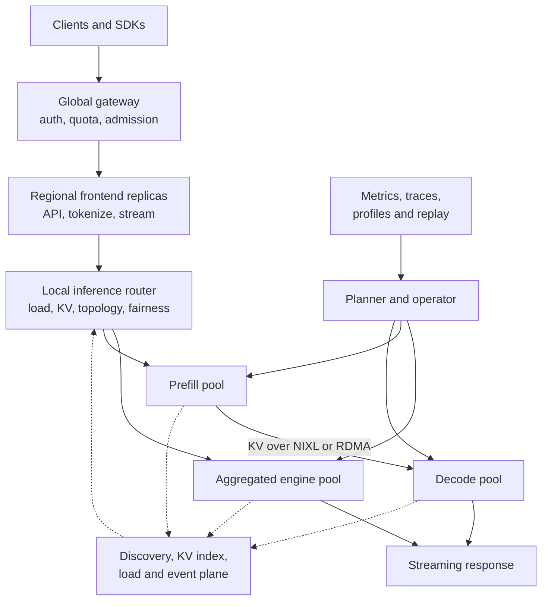

ChatGPT Summary over Dynamo doc and issues: https://chatgpt.com/share/e/6a7e3692-aa3c-8331-b58a-0e1586988c86

# SOTA LLM Inference Serving System Architecture

**Architecture study and design guide**  
**Reference system:** NVIDIA Dynamo  
**Investigation date:** August 13, 2026

## Executive summary

A state-of-the-art LLM inference platform should be built as three cooperating planes:

1. A minimal, latency-critical **request plane** for admission, routing, inference, and streaming.
2. An eventually consistent **state and event plane** for worker load, KV-cache visibility, and cache movement.
3. A slower, declarative **control plane** for deployment, topology, capacity planning, autoscaling, rollout, and recovery.

The recommended starting topology is aggregated serving, where one engine performs prefill and decode. Add prefill/decode disaggregation selectively when workload traces show that phase isolation and independent scaling outweigh KV-transfer and operational costs.

The core engineering principles are:

- Optimize **SLO-compliant goodput**, not raw token throughput.
- Use the smallest tensor-parallel degree that fits the model and meets latency targets; use remaining GPUs for replicas.
- Make admission queues bounded in requests, tokens, bytes, and time.
- Propagate one absolute deadline and cancellation signal through every stage.
- Treat cache metadata as an optimization: uncertainty falls back to recomputation.
- Give each mutable scaling target exactly one controller.
- Separate serving-worker identity, cache-owner identity, and publisher incarnation.
- Make control operations absolute, idempotent, observable, and recoverable after controller restart.
- Preserve backend- and scheduler-native semantics instead of hiding them behind a misleading universal abstraction.

NVIDIA Dynamo uses a similar architectural split: the Frontend, Router, prefill workers, and decode workers form the request path; the Planner, Operator, and discovery system form the control path; KV Events, KVBM, and NIXL form the cache state and movement path. The Dynamo documentation used here describes its current `dev` release as beta. Many referenced GitHub Dynamo Enhancement Proposals (DEPs) are designs or work in progress rather than guaranteed released capabilities.

## 1. Define the optimization contract first

There is no universally optimal serving topology. Before choosing an engine, GPU, parallelism strategy, or disaggregation model, define the workload and SLO envelope.

### Workload dimensions

- Input-sequence-length distribution, including the long tail.
- Output-sequence-length distribution.
- Open-loop request arrival rate and burstiness.
- Closed-loop concurrency, if applicable.
- Prefix and session reuse distribution.
- Model count, size, revision, and adapter/LoRA mix.
- Tool calls, multimodal preprocessing, and agent-session behavior.
- Streaming versus unary responses.
- Tenant mix, priorities, fairness, and isolation.
- Region, data-residency, and availability constraints.
- Container startup, weight loading, compilation, and warm-up time.

### Primary service metrics

- Time to First Token (TTFT), especially p95 and p99.
- Inter-Token Latency (ITL), also called Time per Output Token (TPOT) in some systems.
- End-to-end request latency.
- Request goodput and token goodput.
- Tokens per GPU-second.
- Cost per SLO-compliant request or output token.
- Queue time by execution stage.
- KV hit rate by memory tier.
- KV-transfer latency and bytes.
- Rejection, timeout, cancellation, retry, and migration rates.
- Cold-start and scale-convergence time.

The preferred capacity objective is goodput:

$$
\text{goodput} =
\frac{\text{requests satisfying TTFT, ITL, and E2E SLOs}}
{\text{second}}
$$

A configuration that produces more total tokens but causes p99 ITL or TTFT violations can have lower useful capacity.

## 2. Recommended reference architecture

### Plane ownership

| Plane | Owns | Must not own |
| --- | --- | --- |
| Request plane | API handling, validation, routing, inference RPC, streaming, deadlines, cancellation | Slow reconciliation, durable search history, cluster-wide placement decisions |
| State/event plane | KV events, load reports, cache index, sequence tracking, snapshots, event recovery | Client-visible correctness; stale state must not make results incorrect |
| Control plane | Desired capacity, deployment, topology, rollout, scaling, model lifecycle | Per-token scheduling and blocking work on the request path |
| Observability plane | Metrics, traces, logs, profiles, audit and replay records | Backpressure that delays inference |

### Component recommendations

| Component | Recommended starting point | Important alternatives |
| --- | --- | --- |
| Edge gateway | Stateless gateway with authentication, tenant quota, rate limiting, and global region/model routing | Add inference-aware global routing only for region/model selection, not worker-level KV decisions |
| Frontend | Replicated and mostly stateless; OpenAI-compatible API; deadline and cancellation propagation | Backend-owned preprocessing improves engine compatibility but duplicates protocol and CPU work |
| Router | One local router per frontend or availability zone with replicated state | A central router is simpler but is a bottleneck and larger failure domain |
| Execution | Aggregated engine pool by default | Disaggregated prefill/decode for long prompts, P:D imbalance, or decode interference |
| Engine integration | Integrated adapter for full feature coverage | Sidecar preserves a stock engine interface and isolates dependencies, but may lag features |
| Request transport | Direct TCP or gRPC-like RPC | Brokered request transport improves decoupling but adds latency and another overload boundary |
| Event transport | Peer-to-peer for small/local deployments; managed broker for larger fan-out | Broker durability does not replace epochs, snapshots, and state reconciliation |
| Discovery | Kubernetes EndpointSlices/CRDs on Kubernetes; leased etcd records elsewhere | DNS alone lacks fast removal and rich worker metadata |
| KV storage | HBM prefix cache first, pinned host memory second | Add NVMe or remote tiers only when reuse value exceeds offload and recall cost |
| Orchestration | Kubernetes Operator plus topology/gang-aware scheduling | Bare metal removes Kubernetes layers but requires custom lifecycle and placement systems |
| Autoscaling | Predictive capacity floor plus faster reactive correction | HPA/KEDA for simple components such as frontends |
| Configuration API | Typed stable concepts plus versioned provider/backend extensions | Lowest-common-denominator schemas hide essential backend semantics |

## 3. Frontend, preprocessing, and API design

The frontend should terminate public protocols and keep backend workers independent of API dialects.

### Responsibilities

- Authentication, authorization, and tenant identity.
- OpenAI-compatible request validation.
- Model and revision resolution.
- Chat-template application and tokenization, when centralized.
- Requested-token and context-limit checks.
- Quota and admission enforcement.
- Creation of request ID, trace context, and absolute deadline.
- Streaming response framing and client-disconnect cancellation.
- Tool-call and structured-output processing when not engine-native.

### Central versus engine-side tokenization

**Central tokenization** provides consistent accounting, early admission, KV-prefix hashing, and simpler workers. It also creates a CPU hotspot and requires exact tokenizer/template version alignment with the engine.

**Engine-side tokenization** follows the backend’s native behavior and reduces compatibility mismatches. It duplicates work across workers, makes request-size admission less precise, and can make cache-aware routing harder.

A practical design centralizes tokenization but attaches a tokenizer/template revision fingerprint. The engine validates that fingerprint and rejects incompatible input instead of silently proceeding.

## 4. Aggregated versus disaggregated serving

### Aggregated serving

One engine performs both prompt prefill and output decode.

Advantages:

- No cross-worker KV transfer.
- One worker selection and fewer partial-failure states.
- Simpler continuous batching, cache accounting, and graceful shutdown.
- Usually best for short prompts, low QPS, balanced P:D work, and weaker networks.

Costs:

- Long prefills can delay active decode iterations and hurt ITL.
- Prefill and decode cannot scale independently.
- One tensor-parallel and batch configuration must serve both phases.
- Shifts in input/output mix can produce poor utilization.

### Prefill/decode disaggregation

Dedicated prefill workers compute prompt KV state. Decode workers receive the KV state and generate output tokens. Dynamo uses backend-specific transfer metadata and NIXL for direct worker-to-worker transfer.

Advantages:

- Isolates decode latency from large prompt work.
- Independently scales prefill and decode pools.
- Permits different TP, batching, kernels, and even GPU types per phase.
- Improves elasticity when the input/output ratio changes.

Costs:

- KV transfer consumes fabric bandwidth and adds synchronization.
- Every request has more routing and failure transitions.
- Prefill and decode cache layouts must be compatible.
- Cancellation, drain, retry, rollout, and accounting become harder.
- Poor physical placement can remove the performance benefit.

Approximate KV bytes per token:

$$
\text{KV bytes/token} =
2 \times L \times H_{kv} \times D_{head} \times \text{dtype bytes}
$$

Approximate fabric demand:

$$
\text{required fabric bandwidth} \approx
\lambda \times \text{transferred KV tokens/request}
\times \text{KV bytes/token}
$$

Disaggregation is justified when:

$$
\text{queue and interference reduction}
+ \text{phase-specialization gain}
>
\text{KV-transfer cost}
+ \text{extra routing and failure cost}
$$

### Recommended hybrid policy

Eventually support three execution policies:

1. Aggregated for short prompts and simple workloads.
2. Disaggregated for long prompts or overloaded decode pools.
3. Conditional prefill bypass when a compatible decode worker already holds enough prefix state.

Start with static, model-level topology selection. Conditional per-request disaggregation is powerful but greatly increases routing, cache, and benchmarking complexity.

## 5. Routing, admission, and fairness

A production router should solve a constrained cost problem rather than merely choosing the least-loaded GPU.

One useful score is:

$$
\begin{aligned}
score(w) ={}&
\alpha \cdot queue\_cost
+ \beta \cdot new\_prefill\_blocks \\
&+ \gamma \cdot decode\_pressure
+ \delta \cdot network\_cost \\
&- \epsilon \cdot compatible\_cache\_overlap
+ fairness\_penalty
\end{aligned}
$$

### Routing alternatives

| Strategy | Strength | Weakness |
| --- | --- | --- |
| Random or round robin | Minimal coordination | Ignores request size, load, and cache locality |
| Least queue/load | Good balance | Can destroy prefix locality; load reports may be stale |
| Power of two choices | Strong balance with low overhead | Requires a useful, comparable load metric |
| Prefix/consistent hashing | Scalable locality and affinity | Hot-prefix skew and poor failure redistribution |
| KV-aware cost routing | Reduces recomputation and TTFT | Needs event processing, compatibility checks, and stale-state recovery |
| Session affinity | Valuable for agents and multi-turn workloads | Pins capacity and couples sessions to worker lifecycle |
| Central router | Globally consistent selection | Throughput, latency, and availability bottleneck |
| Replicated local routers | Low latency and horizontal scalability | Eventually consistent indexes and cross-router coordination |

The recommended router has:

- A local active-request ledger updated synchronously when work is assigned.
- An asynchronously updated KV-prefix index.
- Power-of-two candidate sampling for very large worker pools.
- Tenant weighted-fair queuing and priority classes.
- Topology and capability filtering before cost scoring.
- A confidence state for KV data; uncertain entries receive no reuse credit.

Dynamo’s router combines potential new prefill work, potential decode blocks, active requests, and KV-overlap credit. More cache credit can improve TTFT but concentrate load and worsen ITL.

### Admission and backpressure

Bound every queue by:

- Number of requests.
- Estimated input and maximum output tokens.
- Memory or KV blocks.
- Buffered bytes.
- Maximum wait time.

Admission should consider tenant budget, current prefill and decode queues, estimated KV reservation, transfer capacity, deadline feasibility, and priority/fairness debt.

When capacity is exhausted, reject early with retry information instead of allowing unlimited queueing. Overload rejection is a reliability mechanism: it prevents a temporary burst from causing a system-wide latency collapse.

## 6. Engine scheduling and batching

The in-engine scheduler is often more performance-sensitive than the cluster-level scheduler.

### Continuous batching

Continuous batching admits and completes sequences between decode iterations.

- Larger batches increase throughput.
- Smaller batches improve per-request ITL.
- A maximum batched-token limit protects memory but can strand compute.
- A maximum sequence limit protects decode latency but can underfill prefill kernels.

### Chunked prefill

Long prompts are split into chunks and interleaved with decode work.

- Smaller chunks protect ITL and fairness.
- Larger chunks improve prefill arithmetic intensity.
- Very small chunks add scheduling and kernel-launch overhead.
- Cache matching must work across every chunk, not only the first.

Dynamo issue [#13188](https://github.com/ai-dynamo/dynamo/issues/13188) illustrates the last point: its mock SGLang scheduler matched prefix cache only on the first prefill chunk, so long prompts lost cache benefit.

### Preemption

| Method | Benefit | Cost |
| --- | --- | --- |
| Recompute | Simple and uses no swap space | Wastes prior GPU compute |
| Host swap | Preserves generated state | Consumes PCIe/NVLink bandwidth and pinned memory |
| Priority preemption | Protects latency-critical traffic | Can starve batch traffic |

Use separate latency-sensitive and batch queues, plus aging to prevent starvation.

## 7. Tensor parallelism, replicas, and distributed execution

### What tensor parallelism is for

Tensor parallelism (TP) primarily serves two purposes:

1. Make a model fit across multiple GPUs.
2. Reduce latency for one model instance or request by using multiple GPUs together.

TP can increase the throughput of a single model instance, but it often reduces throughput **per GPU** because GPUs communicate and synchronize during transformer layers and decode tokens.

For a fixed pool of eight GPUs:

| Layout | Typical result |
| --- | --- |
| One TP=8 replica | Lower single-request latency, fewer concurrent replicas, high communication |
| Two TP=4 replicas | Balanced latency and aggregate throughput |
| Four TP=2 replicas | More concurrency and often better aggregate throughput |
| Eight TP=1 replicas | Usually best aggregate throughput if one GPU can hold the model and KV cache |

The practical rule is:

> Use the smallest TP degree that fits the model and meets the latency SLO. Spend remaining GPUs on replicas for throughput.

Nuances:

- During prefill, TP can reduce latency for compute-heavy prompts, but collective communication limits scaling.
- During decode, TP aggregates memory bandwidth and may lower per-token latency, but synchronization occurs for every generated token.
- TP may be mandatory when weights do not fit on one GPU.
- Lower service time can improve goodput indirectly by reducing queueing and SLO violations.

### Other parallelism strategies

| Technique | Best use | Principal cost |
| --- | --- | --- |
| Replica/data parallelism | Aggregate throughput and independent failure domains | Duplicates weights; each replica has a smaller local traffic/cache population |
| Tensor parallelism | Model fit and lower instance latency | Frequent collectives and topology sensitivity |
| Pipeline parallelism | Models spanning many GPUs/nodes | Pipeline bubbles and complex scheduling |
| Expert parallelism | Mixture-of-Experts models | All-to-all traffic and fabric sensitivity |
| Context/sequence parallelism | Very long contexts | Communication and uneven backend maturity |
| Phase-specific TP | Separate P and D optimization | Cache-layout compatibility and operational complexity |

Guidelines:

- Prefer replicas until memory or latency requires intra-model parallelism.
- Keep TP inside NVLink/NVSwitch domains when possible.
- Use cross-node TP only for model fit or a measured latency gain.
- Place expert-parallel groups according to all-to-all fabric topology.
- Use gang scheduling when a distributed instance cannot progress with missing ranks.
- Require stable coordinator/rank identity and deterministic scale-down ordering for elastic engines.

## 8. KV-cache architecture

### Compatibility fingerprint

A KV block is reusable only when all correctness-relevant dimensions match. Include at least:

- Model name and immutable revision.
- Tokenizer and chat-template revision.
- LoRA or adapter identity.
- RoPE and scaling configuration.
- KV dtype and quantization.
- Attention and KV layout.
- TP/PP partitioning and block geometry.
- Backend cache-format version.
- Tenant or cache-sharing policy salt.

### Block size

- Smaller blocks reduce internal fragmentation and improve partial-prefix matching.
- Larger blocks reduce metadata, hashing, index, and transfer overhead.
- Select block size using actual prefix and prompt distributions.

### Memory tiers

Dynamo KVBM describes four tiers: GPU memory, pinned host memory, local NVMe, and remote storage.

For a candidate block, compare:

$$
P(\text{reuse}) \times \text{recompute cost}
\quad\text{against}\quad
\text{offload} + \text{retention} + \text{recall cost}
$$

Practical policy:

- Keep hot and soon-reused blocks in HBM.
- Move valuable, reusable long prefixes to pinned host memory.
- Use NVMe for expensive-to-recompute, lower-frequency prefixes.
- Use remote KV only when reuse is high and network/storage latency is predictable.
- Deduplicate immutable completed blocks using a salted sequence hash.
- Never advertise partial or uncommitted blocks as reusable state.

### Cache-state correctness

Treat the KV event plane as an eventually consistent optimization service:

- Sequence every publisher stream.
- Include producer incarnation and lifecycle epoch.
- Detect gaps and request a snapshot or replay.
- Fence late events from old epochs.
- Scope reset events to a worker, cache owner, or memory tier.
- Separate serving-worker identity from durable cache-owner identity.
- Use leases and explicit decommission rules for persistent state.

If cache metadata is missing or ambiguous, continue ordinary serving without the cache credit. Stale state may reduce performance; it must not produce an incorrect result or route to a non-serving component.

### Programmatic cache control

The router and engine have different information:

- The distributed serving layer knows global placement, session history, worker load, remote copies, and cluster pressure.
- The engine owns radix structures, reference counts, memory tiers, transfer connectors, and request safety.

Therefore, the serving layer should send typed cache intent such as prefetch, demote, or dereference. The engine validates capability and applies the action through native cache machinery. The serving layer should not mutate backend cache structures directly.

This ownership boundary is proposed in Dynamo issue [#13010](https://github.com/ai-dynamo/dynamo/issues/13010), whose current-work section references shared hint-path PR [#13134](https://github.com/ai-dynamo/dynamo/pull/13134).

## 9. Engine and kernel optimizations

| Optimization | Benefit | Trade-off |
| --- | --- | --- |
| Weight quantization | Lower HBM footprint and memory bandwidth | Potential quality loss; hardware/kernel constraints |
| KV quantization | More context and concurrency; less transfer volume | Attention-quality risk and conversion overhead |
| Speculative decoding | Higher decode speed when acceptance is high | Draft-model cost, verification, and extra KV state |
| CUDA graphs | Lower launch overhead | Memory reservation and preference for stable shapes |
| Kernel fusion/compilation | Better device efficiency | Warm-up, portability, and version-specific validation |
| Prefix caching | Large win for repeated prompts and sessions | Consumes capacity when reuse estimates are wrong |

Expose these features through capability negotiation. Do not assume that vLLM, SGLang, TensorRT-LLM, and future backends support identical semantics.

## 10. Communication and discovery

Keep request transport separate from events:

- Use direct RPC for request and token-stream traffic.
- Use a separate publish/subscribe event path for cache and load events.
- Bound buffers per destination.
- Propagate downstream backpressure to the client.
- Version payload schemas and negotiate capabilities.
- Encrypt every cross-node transport.

Dynamo currently documents direct TCP and NATS for the request plane, and ZMQ or NATS for the event plane. Direct transport minimizes overhead; brokered transport adds infrastructure but simplifies fan-out, buffering, and reconnection.

### Discovery choices

**Kubernetes-native discovery** integrates with pod lifecycle, EndpointSlices, RBAC, and automatic cleanup.

**etcd discovery** is portable outside Kubernetes and provides watchable, leased endpoint records. Lease TTL must balance fast failure removal against false endpoint loss during scheduler pauses, CPU stalls, or network partitions.

Make discovery state include:

- Ephemeral serving instance ID.
- Stable logical role and model identity.
- Backend and capability set.
- KV-format compatibility identity.
- DP/TP rank metadata.
- Topology location.
- Readiness, draining, and overload state.
- Lease generation or incarnation.

## 11. Autoscaling and placement

### Dual-loop autoscaling

Use two control horizons:

1. A slower predictive loop estimates sustained demand using traffic history and profiled performance.
2. A faster reactive loop responds to current TTFT, ITL, queue depth, forward-pass metrics, and runtime-model error.

The predictive loop creates a capacity floor. The reactive loop can scale above that floor but should not immediately remove forecast capacity during a short idle interval. This mirrors Dynamo Planner’s throughput-based and load-based loops.

Approximate phase capacity:

$$
P \gtrsim
\frac{\lambda E[\text{prefill tokens}]}
{\text{measured prefill tokens/s per replica}}
\times \text{headroom}
$$

$$
D \gtrsim
\frac{\lambda E[\text{output tokens}]}
{\text{measured decode tokens/s per replica}}
\times \text{headroom}
$$

These averages are not sufficient for final sizing. Validate p95/p99 queueing using production traces and replay/simulation.

### Scaling rules

- The adjustment interval must respect scheduling, image pull, model load, compilation, warm-up, and registration time.
- Scale up quickly; scale down conservatively with stabilization windows.
- Maintain a warm floor for models with expensive startup.
- Scale prefill and decode independently but coordinate the total GPU budget.
- Allow exactly one autoscaler to own each target.
- Use a global planner for budget allocation across models; local planners can manage one deployment.
- Use scale-to-zero only when cold-start behavior fits the product SLO.

Dynamo’s autoscaling documentation explicitly warns against HPA and Planner simultaneously targeting the same decode service because the controllers will fight.

### Provider-native topology semantics

Do not create a universal placement language that falsely implies equivalent scheduling behavior. Different providers may have different units for admission, placement, scale-out, rollout, replacement, and failure.

A sound abstraction provides:

- Portable component identity and cardinality.
- Explicit and immutable provider ownership.
- Provider-native placement configuration.
- Legal scale targets and increment vectors in observed status.
- Admission rejection when hard intent cannot be represented exactly.

The Planner should consume legal scale targets rather than learning every scheduler’s internal topology semantics.

## 12. Reliability model

### Request state machine

Use an explicit state model:

`admitted → prefill-selected → prefill-running → KV-ready → decode-selected → streaming → terminal`

Every state needs:

- An absolute deadline.
- An owner.
- A cancellation action.
- A retry or migration rule.
- A terminal error mapping.
- A latency and outcome metric.

### Retry semantics

- Before work starts, rerouting is normally safe.
- During prefill and before externally visible output, recomputation is normally safe.
- After KV is ready, a compatible decode worker may be selected and KV retransferred.
- After tokens reach the client, a normal retry can duplicate or diverge output; use explicit migration/resume semantics or terminate.
- Scale, drain, and cache-control calls must use absolute targets and idempotency keys.

Dynamo bug [#13088](https://github.com/ai-dynamo/dynamo/issues/13088) reported some disaggregated requests hanging for minutes after worker selection until the HTTP client disconnected. A production design must make this impossible: request delivery, prefill, KV transfer, decode start, and streaming each require bounded stage timeouts plus an explicit recovery action.

### Worker lifecycle

A safe worker drain sequence is:

1. Mark the worker draining and remove it from new routing.
2. Wait for discovery propagation.
3. Reject late admissions.
4. Complete or migrate existing requests and KV transfers.
5. Report a trustworthy `drained` or `safe-to-delete` state.
6. Terminate the worker.
7. Fence all late events from the old incarnation.

Dynamo’s worker-drain DEP [#11173](https://github.com/ai-dynamo/dynamo/issues/11173) references prototype API PR [#11118](https://github.com/ai-dynamo/dynamo/pull/11118). Its discussion usefully distinguishes reversible administrative drain from terminal SIGTERM. It also highlights that an API primitive alone is insufficient: rollout and scale-down controllers must invoke drain-before-delete.

### Required failure tests

- Frontend restart and memory exhaustion.
- Router restart and cache-index reconstruction.
- Worker loss during prefill, KV transfer, and decode.
- Event gaps, duplication, delay, and reordering.
- Network partition and false lease expiration.
- Node, rack, or zone failure.
- Partial startup of a distributed engine.
- Model revision or cache-layout mismatch.
- Control-plane outage while the request plane continues serving.
- Client disconnect during queued, prefill, transfer, and streaming states.
- Scale controller restart during an in-progress resize.

## 13. Observability

Propagate these keys across every hop:

- Request ID.
- Trace ID and span ID.
- Tenant and priority class.
- Model and immutable revision.
- Backend, worker, stage, and attempt.
- Cache compatibility and publisher epoch when diagnosing KV behavior.

Use:

- Pull-based Prometheus metrics for bounded aggregate signals.
- Pushed OpenTelemetry traces and logs.
- Structured JSON logging for reliable field correlation.
- Sampled request traces for high-volume or sensitive payloads.
- Replays for sizing, regression testing, and planner validation.

Avoid request, session, prefix, and arbitrary worker identifiers as unbounded metric labels. Put high-cardinality detail in sampled traces or logs.

Observability must be lossy under pressure. Dynamo’s FPM persistence path uses a bounded nonblocking queue and drops trace records rather than delaying inference or KV-event publication. That is the correct priority.

## 14. Security and multi-tenancy

- Authenticate and authorize at the gateway.
- Enforce per-tenant request, token, concurrency, and KV quotas.
- Salt or isolate cache keys unless cross-tenant sharing is explicitly authorized.
- Use mTLS for request, control, discovery, and event traffic.
- Pin and verify model and tokenizer revisions.
- Disable remote model code by default.
- Encrypt captured prompts, responses, and tool traces.
- Make payload capture opt-in with retention and deletion controls.
- Redact secrets, tool credentials, and personally identifiable information.
- Use network policy to isolate request, control, event, storage, and observability endpoints.

Dynamo issue [#10809](https://github.com/ai-dynamo/dynamo/issues/10809) identifies opt-in TLS/mTLS for NATS and TCP transports as an architectural gap. Until native transport security is verified, use a trusted encrypted network layer or service mesh.

## 15. Dynamo documentation findings

The investigation used the following Dynamo architecture areas:

- Overall separation of request, control, and storage/event planes.
- Frontend → router → prefill → KV transfer → decode request narrative.
- Direct NIXL worker-to-worker KV transfer.
- KV-aware routing based on new prefill work, decode pressure, active requests, and overlap.
- KVBM GPU, host, NVMe, and remote storage tiers.
- Planner predictive and reactive scaling loops.
- Kubernetes Operator, discovery, topology-aware placement, and autoscaling.
- Request migration, rejection, cancellation, graceful shutdown, and discovery expiry.
- Pull metrics, pushed traces/logs, request correlation, and bounded observability queues.

Primary documentation:

- [Overall architecture](https://docs.nvidia.com/dynamo/dev/knowledge-base/overview)
- [Architecture flow](https://docs.nvidia.com/dynamo/dev/knowledge-base/concepts/system-architecture/architecture-flow)
- [Disaggregated serving](https://docs.nvidia.com/dynamo/dev/knowledge-base/concepts/system-architecture/disaggregated-serving)
- [Router design](https://docs.nvidia.com/dynamo/dev/knowledge-base/modular-components/router/router-design)
- [Planner design](https://docs.nvidia.com/dynamo/dev/knowledge-base/modular-components/planner/planner-design)
- [KVBM design](https://docs.nvidia.com/dynamo/dev/knowledge-base/modular-components/kvbm/kvbm-design)
- [Request plane](https://docs.nvidia.com/dynamo/dev/knowledge-base/concepts/communication-planes/request-plane)
- [Event plane](https://docs.nvidia.com/dynamo/dev/knowledge-base/concepts/communication-planes/event-plane)
- [Discovery plane](https://docs.nvidia.com/dynamo/dev/knowledge-base/concepts/communication-planes/discovery-plane)
- [Observability architecture](https://docs.nvidia.com/dynamo/dev/knowledge-base/concepts/observability-architecture)
- [Autoscaling](https://docs.nvidia.com/dynamo/dev/knowledge-base/kubernetes/kubernetes-operator/autoscaling)
- [Fault tolerance overview](https://docs.nvidia.com/dynamo/dev/kubernetes/fault-tolerance/overview)

## 16. Dynamo GitHub architecture review

The issue review concentrated on architecture-level DEPs and production failures rather than feature requests.

| Issue or DEP | Status during review | Architecture lesson |
| --- | --- | --- |
| [#13044 Persistent KV event publication](https://github.com/ai-dynamo/dynamo/issues/13044) | Open DEP with implementation updates | Separate serving identity, durable cache ownership, and publisher incarnation; use scoped reset, epochs, recovery, and attachment barriers |
| [#13010 Programmatic KV-cache control](https://github.com/ai-dynamo/dynamo/issues/13010) | Open draft | The router expresses typed intent; the engine remains cache-safety authority |
| [#11173 Worker Admin API](https://github.com/ai-dynamo/dynamo/issues/11173) | Open DEP; prototype referenced | Drain needs a trustworthy safe-to-delete state and operator integration |
| [#13088 Requests hang after selection](https://github.com/ai-dynamo/dynamo/issues/13088) | Open bug | Selection does not prove delivery; bound every stage with timeouts and recovery |
| [#12699 Hierarchical grouping/topology](https://github.com/ai-dynamo/dynamo/issues/12699) | Open DEP, heavily revised through review | Preserve provider-native semantics and expose legal scale axes instead of leaky universal placement abstractions |
| [#13121 Elastic vLLM WideEP](https://github.com/ai-dynamo/dynamo/issues/13121) | Open draft DEP | Kubernetes owns pod capacity; vLLM owns live topology; bridge them with idempotent absolute targets and observed status |
| [#13092 Replay-backed multi-candidate search](https://github.com/ai-dynamo/dynamo/issues/13092) | Open DEP | Separate mutable search intent, immutable run, internal trials, bounded visible candidates, and deployed configuration |
| [#10205 LWS/DisaggregatedSet support](https://github.com/ai-dynamo/dynamo/issues/10205) | Open | P/D roles may need a coordinated scheduling and failure unit rather than independent Deployments |
| [#12312 Configurable discovery lease TTL](https://github.com/ai-dynamo/dynamo/issues/12312) | Open | Liveness TTL balances recovery speed against false removal and must be configurable and observable |
| [#10809 TLS and mTLS](https://github.com/ai-dynamo/dynamo/issues/10809) | Open contribution proposal | Requests, KV metadata, and control messages require encryption and identity on internal networks |
| [#11933 Frontend memory growth](https://github.com/ai-dynamo/dynamo/issues/11933) | Open bug | Frontends need memory limits, soak tests, leak telemetry, and safe restart behavior |
| [#13188 Chunked-prefix cache matching](https://github.com/ai-dynamo/dynamo/issues/13188) | Open bug | Chunked prefill and cache accounting must be designed together |

### Deeper conclusions from issue discussions

#### Persistent KV state

Issue #13044 argues that a durable cache owner can outlive an inference-engine process without leaving a dead worker routable. The design distinguishes physical storage tier from logical ownership, uses scoped resets, and fences stale producers. Discussion updates stated that residency-domain foundations had landed, while full replacement-worker reattachment was not yet end-to-end.

The transferable design lesson is that `WorkerId` is too overloaded if it simultaneously represents request destination, metrics identity, discovery membership, publisher, and durable cache owner.

#### Worker draining

Issue #11173’s prototype surfaces worker states and drain/resume controls. Review discussion points out that long-tail request duration may exceed a fixed Kubernetes termination grace period. A very large grace period makes rollout, node drain, resource reclamation, and failure recovery slower.

Therefore the useful state is not merely `draining`; it is a provable, observed `drained/safe_to_delete` condition. The shared shutdown invariant is discovery removal first, new-admission rejection second, and completion/quiescence last.

#### Topology abstractions

Review of #12699 challenged a provider-neutral placement algebra because Grove PodGangs and DisaggregatedSet slices have different temporal and scaling semantics. The proposal evolved toward portable grouping and cardinality, explicit provider ownership, provider-native placement configuration, and legal scale targets exposed through status.

The general lesson is that an abstraction should hide details users do not need. If users must understand the generic model and every provider-specific lowering rule, the abstraction adds complexity rather than removing it.

#### Elastic distributed engines

Issue #13121 separates responsibilities cleanly:

- Kubernetes and the Operator own physical GPU pods.
- The engine owns its prepare/commit topology transaction.
- A narrow engine-manager bridge assigns and observes capacity.
- Absolute targets are idempotent.
- Status resolves timeouts and controller restarts without starting a competing resize.

It also rejects multiple writers for the same replica field, which is a critical control-plane invariant.

#### Search and configuration recommendation

Issue #13092 separates a mutable desired search from an immutable execution, internal optimizer trials, a bounded result projection, and a deployment promoted from a candidate. This prevents Kubernetes status from becoming an unbounded experiment database and prevents transient optimizer internals from becoming a stable API contract.

For your platform, apply the same pattern to offline profiling and topology recommendation. Promotion to production should be explicit and auditable.

## 17. Recommended implementation sequence

### Phase 1: Production aggregated serving

- Stateless frontend.
- Direct request RPC.
- Continuous batching.
- Bounded admission and tenant fairness.
- Absolute request deadlines and cancellation.
- Metrics, tracing, and structured logs.
- Model/tokenizer revision pinning.
- Safe, observed rolling updates.

### Phase 2: Inference-aware routing

- Worker load snapshots.
- Power-of-two candidate selection.
- Prefix hashing.
- Topology and capability filters.
- One local active-request ledger.
- Tenant fairness and priority.

Add KV events only after correct routing works without them.

### Phase 3: KV-aware and tiered memory

- Compatibility fingerprints.
- Publisher epochs and sequence numbers.
- Gap detection and snapshots.
- HBM prefix reuse.
- Host and NVMe tiers based on measured reuse economics.
- Scoped cache-owner lifecycle.

### Phase 4: Selective P/D disaggregation

- Start with one model whose trace shows clear prefill interference.
- Require high-bandwidth KV transfer and topology-aware placement.
- Add stage deadlines and transfer telemetry.
- Add independent but budget-coordinated P/D scaling.
- Test drain, retry, rollout, and failure at every phase boundary.

### Phase 5: Adaptive fleet optimization

- Predictive and reactive planning loops.
- Replay-based configuration search.
- Multi-model GPU budget allocation.
- Elastic MoE/EP where justified.
- Regional model and traffic placement.

## 18. Non-negotiable invariants

1. Every queue and buffer is bounded.
2. Every request stage has a deadline and cancellation path.
3. Every mutable scale target has exactly one writer.
4. Every producer and serving process has a fenceable incarnation.
5. Control operations use idempotent absolute targets.
6. Cache uncertainty degrades to recomputation, not incorrect reuse.
7. A selected worker that does not accept work is detected within a bounded time.
8. Draining workers receive no new work and eventually expose a reliable terminal drain state.
9. Configuration and cache compatibility are versioned, explicit, and immutable for a running instance.
10. Observability overload drops telemetry instead of slowing inference.
11. Hard topology intent is rejected if it cannot be represented exactly.
12. The request plane continues serving safely during control-plane degradation.

## 19. Glossary

### ITL

**ITL** means **Inter-Token Latency**: the time between consecutive output tokens during generation. Lower ITL produces faster and smoother streaming.

For an approximate conversion:

$$
\text{tokens/second per request}
\approx \frac{1000}{\text{ITL in milliseconds}}
$$

For example, 25 ms ITL is approximately 40 output tokens per second for one request.

### TTFT

**Time to First Token**: the delay from request arrival until the first output token reaches the client. It includes frontend, queueing, routing, prefill, and initial transfer costs.

### TPOT

**Time per Output Token**. Often used similarly to ITL, although measurement definitions may differ between benchmarking tools.

### Prefill

The phase that processes prompt tokens and creates KV-cache state. It is generally more compute-intensive and parallelizable than single-token decode.

### Decode

The autoregressive phase that generates output tokens one step at a time. It is often memory-bandwidth- and synchronization-sensitive.

### TP

**Tensor Parallelism**: splitting tensor operations of one model instance across GPUs. It primarily enables model fit and reduces instance latency, while replicas usually improve aggregate throughput more efficiently.

### DP

**Data Parallelism**: multiple model replicas process different requests. In inference serving, replica parallelism is normally the most efficient path to aggregate throughput when the model fits.

### PP

**Pipeline Parallelism**: model layers are divided across pipeline stages. It enables very large models but introduces pipeline bubbles and scheduling complexity.

### EP

**Expert Parallelism**: experts in a Mixture-of-Experts model are distributed across devices. Performance depends heavily on all-to-all network topology.

### KV cache

Cached transformer key and value tensors for previously processed tokens. KV caching prevents recomputing the full prefix for each generated token and can be reused across requests when compatibility and sharing policies allow it.

### Goodput

Useful throughput: requests or tokens completed while satisfying the defined latency and correctness SLOs.

## Conclusion

The hardest part of LLM serving is not selecting a single fast engine. It is keeping routing, cache state, distributed execution, topology, autoscaling, and failure recovery correct while traffic and workers change continuously.

Build the fast request path with minimal dependencies. Move cache visibility and telemetry to recoverable asynchronous planes. Keep deployment and capacity decisions declarative and idempotent. Start with aggregated execution, then introduce disaggregation and tiered KV only where traces demonstrate a net goodput benefit.

The strongest production design is not the one with the most optimizations enabled. It is the one whose optimizations can become stale, unavailable, or partially failed without breaking correctness or leaving work unbounded.
