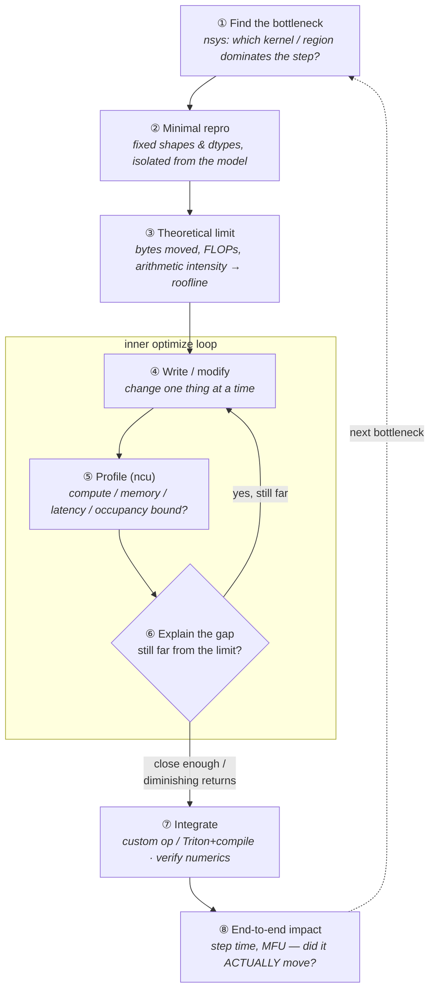

# Phase 1: How to Become a Kernel Performance Engineer — A Systematic Path

> The refined, resource-anchored version of `kernel-engineering.md`. Same philosophy
> (profiler-first, measurement-loop, Noetik-integrated), but with the fragmentation
> problem solved: a single named **spine** to walk, a graded **practice ladder** to
> bridge the beginner→advanced valley, and a **community feedback loop** so you don't
> stall solo.

---

## The problem this plan solves

CUDA learning material is bimodal. One half ("add two vectors", "here's `threadIdx`")
never gets you to a kernel anyone would ship. The other half (FlashAttention-3 with
WGMMA/TMA warp specialization, CUTLASS CuTe layout algebra) assumes you already think
in warps and tiles. The valley between them — *"I can write a correct kernel, why is it
10× slower than cuBLAS and what do I actually do about it?"* — is where almost everyone
gets stuck, and it's exactly the gap that separates a "PyTorch user" from a kernel engineer.

The fix is not "more tutorials." It is **one spine + deliberate practice + a feedback
loop**, all driven by a profiler. This document is that.

---

## The core mindset: kernel engineering is a measurement loop

A kernel engineer is not someone who memorized CUDA syntax. A kernel engineer can repeatedly run this loop:

> **Find the bottleneck → build a minimal repro → estimate the theoretical limit →
> write/modify the kernel → profile → explain the gap → integrate → measure end-to-end
> impact.**



Two loops, not one. The **inner loop** (④→⑤→⑥→④) is where you converge a single kernel
toward its roofline — profile, explain *why* there's a gap, change one thing, re-profile.
The **outer loop** (back to ①) is the judgment that separates a kernel engineer from a
kernel *writer*: after measuring real step-time impact, you re-profile the whole step and
attack the *next* dominant region — which may not be a kernel at all. Step ③ is the quiet
discriminator: if you can't state the theoretical limit, you can't tell "this kernel is done"
from "this kernel is still 5× off," and you'll either stop too early or grind forever.

Everything below serves that loop. The single most expensive mistake in this field is
optimizing a kernel that contributes 1% of wall-clock time. Your Noetik baseline (Phase 0)
tells you what's actually worth touching — if the dataloader is 40% of step time, *no
kernel will save the run*.

---

## What "good at CUDA kernels" means by the end of Phase 1

Unchanged from the original draft — this is the right bar:

1. Read an `nsys` timeline and name the 2–5 kernels that dominate a step.
2. Run `ncu` on one kernel and classify it: memory-bound, compute-bound, latency-bound,
   launch-bound, or occupancy/register-pressure-limited.
3. Write correct CUDA **and** Triton for: elementwise fusion, reductions, transpose/layout,
   softmax, LayerNorm/RMSNorm, tiled matmul, and one attention-adjacent op.
4. Compute expected bytes moved, FLOPs, arithmetic intensity, achieved bandwidth/TFLOP/s,
   and place a kernel on a roofline.
5. Integrate a custom kernel into PyTorch (Triton + `torch.compile`, or a C++/CUDA custom op).
6. Ship **one Noetik-relevant kernel** with before/after measurements and a blog-quality writeup.

---

## The Spine (read these, in this order — everything else is reference)

The antidote to fragmentation is refusing to read linearly across ten sources. Walk **one**
primary track; pull chapters from reference material only when a kernel forces you to.

| # | Resource | Role | How to use it |
|--:|----------|------|---------------|
| 1 | [**Programming Massively Parallel Processors (PMPP), 5th ed.**](https://www.sciencedirect.com/book/monograph/9780443439001/programming-massively-parallel-processors) (Hwu, Kirk, El Hajj) — *you already have the PDF in `phase-1/`* | **The textbook spine.** | Read Ch. 1–6 in weeks 1–4, then pull case-study chapters (reduction, convolution, matmul, sparse) as you hit each rung. Don't read it cover-to-cover. |
| 2 | [**GPU MODE lectures + Discord**](https://github.com/gpu-mode/lectures) (formerly CUDA MODE; [discord.gg/gpumode](https://discord.gg/gpumode), 21k+ members) | **The community spine + lecture series.** | Lectures 1–8 alongside PMPP. The Discord is where you get unstuck — this is your feedback loop. |
| 3 | [**Simon Boehm — "How to Optimize a CUDA Matmul Kernel for cuBLAS-like Performance"**](https://siboehm.com/articles/22/CUDA-MMM) | **The one worked example everyone cites.** Naive → ~95% of cuBLAS in 10 documented steps. | This *is* your weeks 7–8. It's the single best demonstration of the measurement loop end-to-end. Reproduce it on your own GPU; don't just read it. |
| 4 | [**CUDA C++ Programming Guide**](https://docs.nvidia.com/cuda/cuda-c-programming-guide/) | Canonical reference for the execution + memory model. | Reference, not a tutorial. Read programming model, hardware implementation, memory model, performance guidelines — then return as needed. |
| 5 | [**CUDA C++ Best Practices Guide**](https://docs.nvidia.com/cuda/cuda-c-best-practices-guide/) | Your **optimization checklist.** | Memory optimization, bandwidth, occupancy, execution config, instruction optimization. Treat as a literal checklist per kernel. |
| 6 | [**Nsight Systems docs**](https://docs.nvidia.com/nsight-systems/UserGuide/index.html) | Choose *which* kernel to touch. | Learn NVTX ranges + CLI + timeline reading. Application-level view. |
| 7 | [**Nsight Compute Profiling Guide**](https://docs.nvidia.com/nsight-compute/ProfilingGuide/index.html) | Diagnose *one* kernel. | Learn the metric sections, roofline chart, occupancy, memory workload, scheduler/warp-stall stats. |
| 8 | [**Triton docs + tutorials**](https://triton-lang.org/main/index.html) + [PyTorch user-defined Triton kernels w/ `torch.compile`](https://docs.pytorch.org/tutorials/recipes/torch_compile_user_defined_triton_kernel_tutorial.html) | Ship ML kernels fast — *after* the CUDA model is in your head. | Weeks 5+. Productivity layer, **not** a shortcut around understanding the machine. |
| 9 | [**PyTorch Custom C++/CUDA Operators**](https://docs.pytorch.org/tutorials/advanced/cpp_custom_ops.html) | Production integration. | Weeks 11–12. Covers `torch.library.opcheck`, `cpp_extension`, AOT vs. `load_inline`. |
| 10 | [**CUTLASS / CuTe quickstart**](https://docs.nvidia.com/cutlass/latest/media/docs/cpp/cute/00_quickstart.html) | Read professional GEMM/attention structure. | *After* you've written a tiled GEMM. Read to understand, not to reimplement. |

> ### How to read PMPP (don't read it cover-to-cover, first)
>
> The instinct to "lay a solid foundation" is right; the trap is reading all ~24 chapters
> with every exercise *before* you ever run a profiler. That delays the measure→profile→explain
> loop that **is** the skill, and the back half of the book is domain case studies that aren't
> on a kernel engineer's critical path. Two rules:
>
> **Rule 1 — interleave, don't serialize.** From chapter 1, run every concept through a real
> kernel + `nsys`/`ncu`. When you read the reduction chapter, your "exercise" is the three-version
> reduction rung in `cuda-kernel-lab`, profiled, with the 10-line bottleneck note. That's a
> strictly better exercise than the book's because it includes the profiler loop. Do [GPU
> Puzzles](https://github.com/srush/GPU-Puzzles) in Week 0 to pre-load the intuition.
>
> **Rule 2 — tier the chapters (5th ed., approximate):**
>
> | Tier | Chapters | Treatment |
> |---|---|---|
> | **Core — read deeply + do exercises** | Part I fundamentals: intro, data-parallel computing, multidim grids, compute architecture & scheduling, memory architecture & locality, performance considerations | The non-negotiable foundation. |
> | **Patterns — read + do as lab rungs** | reduction, prefix-sum/scan, convolution, histogram (atomics), merge | These *are* your kernel ladder — book + lab is the same work; fuse them. |
> | **Relevant — read, skim exercises** | sparse matrix, **deep learning**, tensor-core / modern-architecture chapters | Read for the model; exercises only if time allows. |
> | **Reference / skip exercises** | iterative MRI reconstruction, electrostatics, graph traversal, sorting, dynamic parallelism, MPI heterogeneous cluster | Read prose if curious; the MPI/cluster material is Phase 2 anyway. |
>
> Net: read Part I deeply **now**, pull pattern chapters just-in-time as you climb the kernel
> ladder, and treat the domain case studies as optional. The loop starts in Week 1, not Week 12.

**Deep-dive blogs (pull on demand, don't read upfront):**
- [**Lei Mao's Log Book**](https://leimao.github.io/) (NVIDIA engineer) — surgical posts on
  [matmul optimization](https://leimao.github.io/article/CUDA-Matrix-Multiplication-Optimization/),
  [reduction](https://leimao.github.io/blog/CUDA-Reduction/),
  [shared memory](https://leimao.github.io/blog/CUDA-Shared-Memory-Capacity/). One post per concept.
- [**Aleksa Gordić — "Inside NVIDIA GPUs: Anatomy of High-Performance Matmul Kernels"**](https://www.aleksagordic.com/) — PTX/SASS-level, the bridge from siboehm to CUTLASS.
- [**"Outperforming cuBLAS on H100: a Worklog"**](https://cudaforfun.substack.com/p/outperforming-cublas-on-h100-a-worklog) — the Hopper (WGMMA/TMA) sequel to siboehm. A *reading* target for late Phase 1 / Phase 7.
- [**wafer-ai / gpu-perf-engineering-resources**](https://github.com/wafer-ai/gpu-perf-engineering-resources) — a tiered meta-curriculum "from scratch to what frontier labs do." Use as a map when you want to go deeper on any one topic.
- [**GPU MODE resource-stream**](https://github.com/gpu-mode/resource-stream) — curated link firehose.

---

## The Practice Ladder (this is what bridges the valley)

Reading is necessary but insufficient. The reason you've found sources "too beginner or too
advanced" is that you've been reading, not *practicing at graded difficulty*. These platforms
are the missing middle — climb them in order:

| Rung | Platform | What it builds | Why it's placed here |
|--:|----------|----------------|----------------------|
| 1 | [**Sasha Rush — GPU Puzzles**](https://github.com/srush/GPU-Puzzles) | Raw parallel-thinking intuition (indexing, blocks, shared mem, reductions). | **No GPU needed, runs in Colab, ~a few hours.** The perfect on-ramp *before* CUDA C. Uses NUMBA but maps 1:1 to CUDA. Do this in Week 0. |
| 2 | [**Triton Puzzles**](https://github.com/gpu-mode/Triton-Puzzles) (GPU MODE) | Triton from first principles, up to flash-attention and quantized kernels. Runs on the Triton interpreter (no GPU). | Do alongside Week 5 when you start Triton. |
| 3 | [**LeetGPU**](https://leetgpu.com/) / [**Tensara**](https://tensara.org/) | Online judges — "LeetCode for kernels." Write, submit, get correctness + perf ranking. | Ongoing, ~2–3 problems/week. Spaced practice so skills stick. |
| 4 | [**KernelBench**](https://github.com/ScalingIntelligence/KernelBench) | 250 PyTorch→CUDA workloads in 4 difficulty levels (single op → fusion → full architectures). Source of the problems LeetGPU/Tensara use. | Pull Level-1/2 problems that resemble your Noetik kernels for targeted reps. |
| 5 | [**GPU MODE Kernel Leaderboard**](https://github.com/gpu-mode/kernelbot) ([gpumode.com](https://www.gpumode.com/), submit via [popcorn-cli](https://github.com/gpu-mode/popcorn-cli)) | Compete against the best humans **and** AI on real sponsored problems (60k+ submissions, 5 competitions). | Late Phase 1 once you can profile. Submitting a competitive kernel is a portfolio signal in itself. |

**Accountability harness — the [100 Days of CUDA / GPU challenge](https://github.com/hkproj/100-days-of-gpu):**
commit one kernel + a short note every day for 100 days, in a public repo. At 10–15 hrs/week
this maps to ~one substantive kernel every 2 days. The public log doubles as portfolio
evidence and as the raw material for your blog posts. Many people (cited in the GPU MODE
Discord) went from zero to flash-attention this way.

---

## The 12-Week Phase 1 Path (10–15 hrs/week)

Deliberately **profiler-first**. Each week pairs *spine reading* + *practice-ladder reps* +
*Noetik application*. Hours are tight — the "skippable if behind" tags tell you what to cut first.

### Week 0 — Intuition + harness (before any CUDA C)
- **Practice:** Finish [GPU Puzzles](https://github.com/srush/GPU-Puzzles) end-to-end (Colab, no GPU).
- **Spine:** PMPP Ch. 1–2; GPU MODE lecture 1.
- **Build:** the `cuda-kernel-lab` repo (structure below). Get `nvcc`, `nsys`, `ncu`, and a Triton+PyTorch env working on your RTX 4090.
- **Output:** repo skeleton + vector-add in CUDA *and* Triton, benchmarked against PyTorch.

### Week 1 — Profiling harness on real Noetik work
- **Spine:** Nsight Systems docs (NVTX ranges, CLI); Best Practices Guide (effective bandwidth).
- **Noetik:** Add NVTX ranges around dataloader / image-encoder fwd+bwd / decoder fwd+bwd / optimizer / all-reduce. Run `nsys`, export top CUDA kernels.
- **Output:** the **bottleneck table** (below). This decides everything downstream.

```
nsys profile --trace=cuda,nvtx,cublas,cudnn,osrt --sample=none -o noetik_step python train.py
```

| Kernel / region | % step time | Shape | dtype | Current impl | Bottleneck guess | Worth it? |
|---|--:|---|---|---|---|---|
| image patch embed | 8% | B,C,H,W | bf16 | PyTorch ops | memory/fusion | yes |
| decoder attention | 18% | var seq | bf16 | FlashAttn | layout/varlen | maybe |
| RMSNorm | 4% | B,S,H | bf16 | PyTorch | memory-bound | yes |
| all-reduce | 22% | buckets | bf16 | NCCL | comm | no → Phase 2 |

### Weeks 1–2 — Execution model & memory hierarchy *(do not start with FlashAttention)*
- **Spine:** PMPP Ch. 3–5; Best Practices Guide memory section.
- **Kernels (CUDA C++):** vector add → contiguous copy → strided copy → naive transpose → tiled shared-memory transpose.
- **For each:** bytes read/written? coalesced? threads/block? registers/thread? achieved GB/s? gap to peak? Build with `-lineinfo` for source mapping.
- **Practice:** LeetGPU/Tensara easy problems.
- **Do NOT yet:** WGMMA, TMA, beat cuBLAS, full attention.

### Weeks 3–4 — Reductions, occupancy, warp-level programming
- **Spine:** PMPP reduction chapter; [Lei Mao — CUDA Reduction](https://leimao.github.io/blog/CUDA-Reduction/); GPU MODE lectures on reductions.
- **Kernels:** sum reduction → row reduction → row max → row softmax → RMSNorm/LayerNorm forward. **Three versions each:** naive global → shared-memory block reduction → warp-shuffle.
- **Vocabulary you must own:** occupancy, active warps, register/shared-mem pressure, warp stalls, barrier stalls, long-scoreboard stalls, latency hiding.
- **The occupancy trap:** higher occupancy ≠ higher performance (Best Practices Guide says so explicitly). More occupancy can reduce registers → spills. The skill is the *sentence*: "this RMSNorm is memory-bound; achieved BW is 35% of peak because loads aren't vectorized and the reduction causes long-scoreboard stalls; raising occupancy didn't help because registers weren't the limiter."

### Weeks 5–6 — Fusion patterns that matter in ML *(CUDA connects to your job here)*
- **Spine:** [Triton tutorials](https://triton-lang.org/main/index.html) + [Triton Puzzles](https://github.com/gpu-mode/Triton-Puzzles); GPU MODE Triton lectures.
- **Kernels (start mixing in Triton):** bias+GELU, residual+RMSNorm, RMSNorm+cast, mask-fill+softmax, image normalize+patch flatten, RoPE + Q/K layout transform, varlen pack/unpack.
- **The lesson:** the highest-ROI beginner win is **fusing memory-bound ops**, not beating a library kernel. Candidate first Noetik kernels: *fused image normalize + patchify + positional encoding*, or *fused residual + RMSNorm*, or *varlen gene-sequence pack/unpack + mask gen*.

### Weeks 7–8 — Matmul, tensor cores, CUTLASS *(anchored on siboehm)*
- **Spine:** **Reproduce [Simon Boehm's matmul worklog](https://siboehm.com/articles/22/CUDA-MMM) on your 4090**, step by step. Then [Lei Mao matmul](https://leimao.github.io/article/CUDA-Matrix-Multiplication-Optimization/) and [Gordić's anatomy](https://www.aleksagordic.com/) for the SASS view.
- **Kernels:** naive GEMM → tiled shared-mem → register-blocked → (optional) WMMA tensor-core. Then run a [CUTLASS](https://docs.nvidia.com/cutlass/latest/media/docs/cpp/cute/00_quickstart.html) GEMM example + fused epilogue and read the structure.
- **Goal is NOT to beat cuBLAS.** It's to understand *why* cuBLAS/CUTLASS are shaped the way they are. Just understand what WGMMA/TMA solve (bulk multidim tile movement overlapped with compute) — reading target, not impl target.
- **Output:** writeup *"Why my tiled GEMM is 10× slower than cuBLAS, and what CUTLASS does differently."*

### Weeks 9–10 — Attention-*adjacent* kernels (not full FlashAttention)
- **Spine:** Read FlashAttention [v1](https://arxiv.org/abs/2205.14135) / [v2](https://arxiv.org/abs/2307.08691); skim [v3](https://arxiv.org/abs/2407.08608) as a *frontier reading target* (Hopper asynchrony, TMA, warp specialization, FP8).
- **Decompose** attention into pieces (QKV layout, RoPE, masking, softmax, KV-cache layout, varlen unpad/repad, output proj) and **optimize one piece** — not the whole thing.
- **Rule:** your first real Noetik kernel should be attention-*adjacent*, unless your profile *proves* attention is the bottleneck **and** FlashAttn/xFormers/vLLM don't handle your shape regime (variable-length gene sequences are a plausible such case).

| Candidate | Why good | Risk |
|---|---|---|
| Fused patchify+normalize+pos-embed | memory-bound, encoder-relevant | may be dataloader-bound |
| Fused RMSNorm+residual | easy to validate, decoder-useful | `torch.compile` may already fuse it |
| Varlen seq pack/unpack | cuts wasted attention work | shape complexity |
| RoPE + Q/K layout transform | attention-adjacent, useful | stride/layout care |

### Weeks 11–12 — Production integration + blog-quality proof *(the capstone)*
- **Spine:** [PyTorch Custom C++/CUDA Operators](https://docs.pytorch.org/tutorials/advanced/cpp_custom_ops.html) (`opcheck`, `cpp_extension`, `load_inline`) **or** Triton + `torch.compile`.
- **For ONE chosen kernel, produce all of:** PyTorch baseline → minimal fixed-shape repro → correctness test → CUDA and/or Triton impl → `ncu` before/after → end-to-end Noetik step-time measurement → failure analysis (what *didn't* improve and why) → blog post.
- **Stretch:** submit a version to the [GPU MODE leaderboard](https://www.gpumode.com/).

---

## The `cuda-kernel-lab` repo

```
cuda-kernel-lab/
  kernels/      vector_add.cu reduce.cu transpose.cu softmax.cu rmsnorm.cu matmul.cu
  triton/       softmax.py rmsnorm.py patch_embed.py
  benchmarks/   bench_cuda.py bench_triton.py bench_pytorch.py
  profiles/     nsys/ ncu/
  reports/      roofline_notes.md
```

Every kernel ships with: correctness test · microbenchmark · PyTorch baseline · CUDA version ·
Triton version (where apt) · `ncu` report · a 10-line note explaining the bottleneck.

After **every** kernel, write the note: *What was the theoretical bottleneck? What did `ncu`
say? What changed after optimizing? What still limits it? What would I try next?* — this habit
matters more than the kernels.

---

## What to measure for every kernel

```
Correctness:   max abs/rel error · fp32/fp16/bf16 behavior · shape edge cases · (non)contiguous
Microbench:    warmup iters · timed iters · p50/p90/p99 · cudaEvent timing · sync before wall-clock
Perf model:    bytes read · bytes written · FLOPs · arithmetic intensity · achieved GB/s & TFLOP/s · roofline class
ncu:           SM tput · DRAM tput · L2 hit rate · achieved occupancy · regs/thread · smem/block · warp-stall reasons · ld/st efficiency · launch overhead (if tiny)
End-to-end:    step time · encoder time · decoder time · GPU idle · MFU · memory footprint
```

A kernel that wins the microbenchmark but doesn't move step time is a *learning* win, not a
*production* win. Always report both.

---

## CUDA vs. Triton vs. CUTLASS — the decision rule

```
Write CUDA C++   → to understand the machine (warps, shared mem, occupancy, sync).
Write Triton     → to ship an ML kernel fast (once the mental model exists).
Read CUTLASS/CuTe→ to understand SOTA GEMM/attention structure (not to reimplement early).
```

| Need | Use |
|---|---|
| Learn warps, shared mem, occupancy, sync | CUDA C++ |
| Fuse elementwise/reduction ops in PyTorch fast | Triton |
| Package/test/autograd a custom op | PyTorch C++/CUDA custom op |
| Understand tensor-core GEMM, epilogues, layouts | CUTLASS/CuTe |
| Understand Hopper-era attention | FA-3 + CUTLASS/CuTe/TMA/WGMMA material |

Triton is a productivity layer, **not** a way to skip understanding the hardware.

---

## How to choose your first Noetik kernel

```
GOOD first kernel:
- in the top-10 kernels or top-5 model regions of your profile
- ≥ ~3–5% of step time
- not already a near-optimal cuBLAS/cuDNN call
- memory-bound or launch/fusion-bound
- simple correctness criteria
- stable shapes (or a few shape buckets)
- integrable without rewriting the model

AVOID as a first project:
- beating cuBLAS GEMM
- rewriting full FlashAttention
- a kernel that's <1% of wall time
- a backward kernel before proving forward value
- a kernel torch.compile already fuses
```

For Noetik's <1B multimodal model (high-res medical images + long gene sequences), look first
at: image preprocessing/patch-embedding fusion · RMSNorm/residual fusion in the decoder ·
varlen gene-sequence packing · RoPE + layout transform · attention mask/softmax special cases.
Remember the regime is *not* a generic frontier LLM — your real bottlenecks may be image I/O,
activation memory, PCIe pressure, or small-model comms, not SM utilization. **Let the profile
pick the kernel, not what sounds impressive.**

---

## The five traps (memorize these)

1. **Learning CUDA abstractly.** Learn it through kernels + profiler reports, never as theory.
2. **Chasing occupancy.** It hides latency; it is not the goal. NVIDIA says so directly.
3. **Optimizing the wrong layer.** If the dataloader is 40% of the step, no kernel helps.
4. **Trying to beat vendor libraries.** For GEMM/conv/standard attention: understand and *fuse around* them, don't outperform years of NVIDIA work.
5. **Not integrating.** A beautiful notebook kernel is nothing. Ship it into PyTorch, verify numerics, handle shapes/dtypes, prove end-to-end impact.

---

## Your first 7 days (copy-paste plan)

- **Day 1:** `cuda-kernel-lab` set up. Vector add in CUDA + Triton, benchmarked vs. PyTorch. Start [GPU Puzzles](https://github.com/srush/GPU-Puzzles).
- **Day 2:** Contiguous + strided copy. Measure achieved bandwidth. Finish GPU Puzzles.
- **Day 3:** Naive + tiled transpose. Run `ncu`, inspect memory efficiency. Join [GPU MODE Discord](https://discord.gg/gpumode).
- **Day 4:** Add NVTX ranges to one Noetik step (dataloader/encoder/decoder/optimizer/all-reduce).
- **Day 5:** Run `nsys` on one clean step. Export the top CUDA kernels.
- **Day 6:** Pick one kernel from the profile; build a minimal repro with representative shapes.
- **Day 7:** Write the one-pager: *"What I think the bottleneck is, and what I'll try first."*

That gets you out of passive tutorial mode immediately.

---

## The Phase 1 success artifact (the interview story)

> *"I profiled our multimodal training step with Nsight Systems and found that image patch
> embedding + positional encoding was a meaningful memory-bound region. I built a minimal
> repro, computed the expected memory traffic, confirmed with Nsight Compute that the baseline
> was bandwidth/launch-bound, wrote a fused Triton/CUDA kernel, validated numerics against
> PyTorch, integrated it into the training loop, and measured an end-to-end step-time
> improvement of X%. The microbenchmark improved Y%, but the production gain was lower because Z."*

That sentence — GPU architecture + profiling + implementation + integration + production
judgment — is the kernel-engineer signal the whole plan optimizes for.

---

## Gate to advance to Phase 2

- [ ] Comfortable reading CUTLASS source structure
- [ ] Can read an `ncu` report and name the bottleneck (compute / memory / latency / occupancy)
- [ ] Have a working custom kernel integrated into the Noetik training loop with a measured speedup
- [ ] Have shipped Blog posts #3 and #4 (Nsight findings + the chosen kernel writeup)
- [ ] Can write the "success artifact" paragraph above about a *real* kernel you shipped

---

### Source notes
Resource selection corroborated by the convergent canon in [wafer-ai's GPU perf-engineering
curriculum](https://github.com/wafer-ai/gpu-perf-engineering-resources), [GPU MODE](https://github.com/gpu-mode),
and practitioner consensus (siboehm, Lei Mao, Gordić). Practice platforms: [GPU Puzzles](https://github.com/srush/GPU-Puzzles),
[Triton Puzzles](https://github.com/gpu-mode/Triton-Puzzles), [LeetGPU](https://leetgpu.com/),
[Tensara](https://tensara.org/), [KernelBench](https://github.com/ScalingIntelligence/KernelBench),
[GPU MODE leaderboard](https://www.gpumode.com/), [100 Days of GPU](https://github.com/hkproj/100-days-of-gpu).
